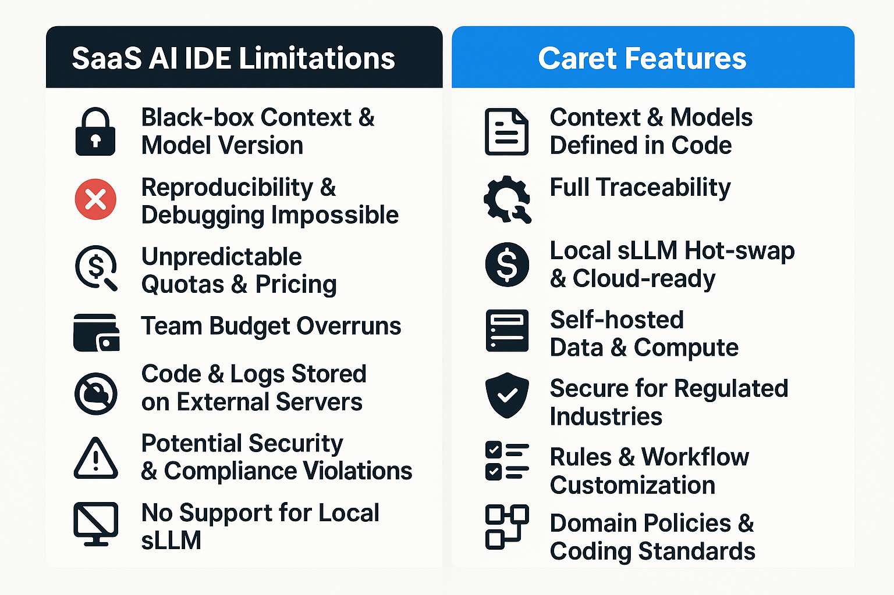

[Read this document in English](./README.en.md)

# 캐럿: 당신의 AI 개발 파트너
<div align="center">

</div>

Caret은 개발자와 AI 에이전트가 함께 성장하며 소프트웨어를 만들어나가는 차세대 개발 환경을 목표로 하는 VS Code 확장 프로그램입니다. AI와의 긴밀한 협력을 통해 개발 생산성을 높이고, 복잡한 문제를 해결하는 데 도움을 드립니다. ｡•ᴗ•｡💕

> **Note:** 이 프로젝트는 [Cline](https://github.com/cline/cline) 프로젝트의 포크 버전입니다. 원본 프로젝트의 훌륭한 기반 위에, AI 에이전트와의 더욱 깊은 상호작용과 지능적인 개발 지원 기능을 탐구하고 있습니다. 🌿

## 주요 목표 및 특징

**왜 Caret인가요?** 기존 AI 코딩 도구의 "블랙박스"에 답답함을 느끼셨나요? AI 에이전트를 내 방식대로 제어하고, 원하는 모델을 연결하며, 개발 워크플로우를 진정으로 맞춤화하고 싶으셨나요? Caret은 **개발자와 AI가 신뢰하는 동료로서 함께하는 경험**을 목표로 합니다. AI를 투명하게 이해하고, 자유롭게 확장하며, 최고의 동료처럼 함께 성장하는 환경을 제공합니다.

*   **개발자 주도 AI 오케스트레이션:** 불투명한 내부 로직 대신, **명확한 JSON 규칙(`.caretrules`, 퍼소나)**으로 AI의 행동을 직접 정의하고 제어하세요. AI가 어떻게 작동하는지 이해하고, 내 프로젝트와 스타일에 맞게 길들일 수 있습니다.
*   **워크플로우 맞춤 설정 (4+1 모드):** 정해진 틀을 넘어, **AI의 역할과 상호작용 방식을 직접 설계**하세요. 기본 제공되는 모드(Arch, Dev, Rule, Talk, Empty)를 수정하거나, 완전히 새로운 모드를 만들어 나만의 AI 개발 파트너를 구축할 수 있습니다.
*   **모델 선택의 자유 (로컬 LLM & 프라이버시):** 특정 벤더 종속 없이 **원하는 LLM을 자유롭게 연결**하세요. 상용 API는 물론, **로컬 sLLM을 활용**하여 비용, 보안, 성능 요구사항을 충족하고 **데이터 프라이버시를 확보**할 수 있습니다.
*   **AI와의 실질적 협업:** 단순 코드 생성을 넘어, 프로젝트 **맥락을 이해하고(RAG 목표)**, 개발자와 함께 문제를 해결하는 **지능적인 파트너**를 지향합니다. Caret은 AI의 가능성을 탐구하고 **AI와 효과적으로 협업하는 방법을 배우는 플랫폼**이 될 것입니다.
*   **함께 만드는 오픈소스 (Apache 2.0):** Caret은 AI 시대의 개발 방향을 함께 고민하고 만들어가는 **오픈소스 프로젝트**입니다. 투명하게 공유하고, 자유롭게 기여하며, 함께 발전시켜 나갑시다!

## 왜 Cursor / Windsurf 만으로는 부족할까요?
<div align="center">

</div>

| SaaS AI IDE 한계 | 실무 개발에서 꼭 통제해야 하는 이유 |
|-----------------|------------------------------------|
| **블랙박스 컨텍스트·모델 버전** | 재현·디버깅·회귀 테스트 불가 |
| **요금제·쿼터 변동** | 예산 예측 실패, 대규모 팀 비용 폭등 |
| **외부 서버에 코드·로그 저장** | 보안·규제(PII, 영업비밀) 위반 가능 |
| **VS Code 의존 엔드포인트 고정** | CLI·CI·다른 IDE와 파이프라인 통합 곤란 |
| **룰·워크플로 커스터마이징 제한** | 팀 코딩 규칙, 도메인 규제 반영 불가 |
| **로컬 sLLM 미지원** | 망 분리·저지연·저비용 환경 구축 불가 |
| **파일 안전성(텍스트 패치)** | 구조 손상·롤백 불가 |

> **Caret** 은 모델·인프라·정책을 *모두 코드로 선언*해 **완전한 통제권**을 제공합니다.

## 지원 모델

Caret은 **20개 제공자**에서 **105개 모델**을 지원하여, 여러분의 필요에 가장 적합한 도구를 선택할 자유를 제공합니다.

### 🔥 주요 제공자

- **Anthropic Claude** (6개 모델): Claude 3.7 Sonnet, Claude 3.5 Sonnet v2, Claude 3.5 Haiku 등 최신 고성능 모델
- **Google Gemini** (7개 모델): Gemini 2.5 Pro, Gemini 2.0 Flash, Gemini 1.5 Pro 등 빠른 응답과 무료 크레딧 제공
- **OpenAI Native** (13개 모델): O3, O1, GPT-4O, ChatGPT-4O Latest 등 최다 모델 지원
- **Qwen** (18개 모델): Qwen 2.5 Coder 시리즈, Qwen Plus, Qwen Max 등 다양한 크기의 모델
- **AWS Bedrock** (8개 모델): Amazon Nova 시리즈, Claude 모델 등 엔터프라이즈급 안정성
- **로컬 실행**: Ollama, LM Studio, VSCode LM을 통한 프라이버시 보장 로컬 모델

### 📚 상세 정보

전체 지원 모델 목록과 설정 방법은 **[지원 모델 가이드](./caret-docs/development/support-model-list.mdx)**를 참조하세요.

## 시작하기

Caret은 현재 활발히 개발 중이며, 여러분의 관심과 참여로 함께 만들어가는 프로젝트입니다! 꾸준히 발전하는 모습을 지켜봐 주세요! ☕

1.  **코드 저장소:** [aicoding-caret/caret](https://github.com/aicoding-caret/caret) 레파지토리에서 개발 진행 상황을 확인하실 수 있습니다. 코드를 직접 빌드하고 사용해보시려면 이 레파지토리를 Star ⭐ 하고 지켜봐 주세요.
2.  **설치 (향후):** 정식 배포 후에는 VS Code 마켓플레이스에서 "Caret"을 검색하여 설치할 수 있습니다. (준비 중)
3.  **설정 (설치 후):**
    *   제공되는 AI 에이전트 퍼소나를 꾸며보세요.
    *   프로젝트 루트에 `.caretrules` 파일을 생성하여 작업 모드와 규칙을 정의합니다.
    *   ARCH, DEV, RULE, TALK의 4가지 기본 모드와 비어있는 모드 하나를 더하여, 원하시는 작업에 최적화할 수 있습니다.
4.  **커뮤니티 (준비 중):** 최신 소식과 논의는 [AICoding-Caret Facebook 그룹](https://facebook.com/groups/aicoding-caret)에서 이루어질 예정입니다.
5.  **공식 웹사이트 (향후):** [caret.team](https://caret.team) (준비 중)

## 🔧 개발자를 위한 가이드

Caret 프로젝트에 기여하고 싶으신가요? 코드를 직접 빌드하고, AI와 협업하는 방법을 배우고 싶다면 아래 가이드를 따라주세요.

**가장 먼저, [🚀 신규 개발자 온보딩 가이드](./caret-docs/development/new-developer-guide.mdx)를 확인해주세요!** 이 가이드는 개발 환경 설정부터 추천 학습 경로, AI와의 협업 방법까지 모든 과정을 안내합니다.

## 기여하기 🤝

Caret은 오픈소스 프로젝트로, 여러분의 다양한 형태의 기여를 환영합니다!

### 🌟 기여 방식

| 기여 유형 | 설명 | 혜택 |
|-----------|------|------|
| **💻 코드 기여** | 기능 개발, 버그 수정, 문서 개선 | 서비스 크레딧 + GitHub 기여자 등재 |
| **🐛 버그 신고** | 이슈 리포팅, 재현 방법 제공 | 서비스 크레딧 |
| **💡 아이디어 제안** | 새로운 기능, 개선 사항 제안 | 서비스 크레딧 |
| **💰 금전적 기여** | 프로젝트 후원, 개발 지원 | 서비스 크레딧 + 특별 기여자 등재 |
| **📖 문서화** | 가이드 작성, 번역, 튜토리얼 | 서비스 크레딧 + 문서 기여자 등재 |

### 🎁 기여자 혜택

- **서비스 이용 크레딧**: 기여 규모에 따른 Caret 서비스 크레딧 제공
- **GitHub 기여자 등재**: 프로젝트 README와 릴리즈 노트에 이름 등재
- **서비스 페이지 등재**: 공식 웹사이트 기여자 페이지에 프로필 등재
- **우선 지원**: 새로운 기능 및 베타 버전 우선 접근

### 🚀 시작하는 방법

1. **이슈 확인**: [GitHub Issues](https://github.com/aicoding-caret/caret/issues)에서 기여할 수 있는 이슈 찾기
2. **토론 참여**: 기능 제안이나 질문을 Issues나 Discussions에서 공유
3. **코드 기여**: Fork → 개발 → Pull Request 과정으로 코드 기여
4. **문서 기여**: `caret-docs/` 폴더의 문서 개선이나 번역 작업

자세한 기여 가이드는 [CONTRIBUTING.md](./CONTRIBUTING.md)를 참조하세요.

## 빌드 및 패키징 🛠️

로컬 개발 환경을 설정하고 확장 프로그램을 빌드하려면 다음 단계를 따르세요.

### 1. 레파지토리 설정

Caret은 [Cline](https://github.com/cline/cline) 프로젝트의 **Fork 기반 아키텍처**를 채택하고 있습니다. Cline의 안정적인 코드베이스를 `src/` 디렉토리에 직접 포함하여, Caret만의 확장 기능을 `caret-src/`에서 개발하는 구조입니다.

1.  **Caret 레파지토리 클론**:
    ```bash
    git clone https://github.com/aicoding-caret/caret.git
    cd caret
    ```

2.  **아키텍처 구조 이해**:
    ```
    caret/
    ├── src/                    # Cline 원본 코드 (보존)
    │   ├── extension.ts        # Cline 메인 진입점
    │   └── core/              # Cline 핵심 로직
    ├── caret-src/             # Caret 확장 기능
    │   ├── extension.ts       # Caret 진입점 (src/ 모듈 활용)
    │   └── core/webview/      # Caret 전용 WebView Provider
    ├── caret-assets/          # Caret 에셋 관리
    │   ├── template_characters/ # AI 캐릭터 템플릿
    │   ├── rules/             # 기본 모드 및 룰 정의
    │   └── icons/             # 프로젝트 아이콘
    ├── caret-docs/            # Caret 전용 문서
    └── webview-ui/            # 프론트엔드 (Cline 빌드 시스템 활용)
        ├── src/components/    # Cline 원본 컴포넌트
        └── src/caret/         # Caret 전용 컴포넌트
    ```
    
    이 구조를 통해 **Cline의 강력한 기능을 그대로 활용**하면서, **Caret만의 고유한 기능을 안전하게 확장**할 수 있습니다.

### 2. 의존성 설치 (권장)

Caret 프로젝트의 모든 의존성을 가장 쉽게 설치하는 방법은 제공된 스크립트를 사용하는 것입니다.

```bash
# 모든 플랫폼에서 권장
npm run install:all
```

또는 Windows 환경에서는 아래 PowerShell 스크립트를 사용할 수도 있습니다.

```powershell
# Windows 사용자 권장
.\caret-release-build.ps1
```

이 스크립트들은 백엔드와 프론트엔드 의존성 설치, Protocol Buffer 컴파일까지 모든 필요한 단계를 자동으로 처리해줍니다.

> **중요**: 이 자동 설정 스크립트를 먼저 시도하시는 것을 강력히 권장합니다. 대부분의 경우 이 방법으로 충분합니다.

### 3. 수동 설정 (문제 발생 시)

만약 자동 설정 스크립트가 실패하거나 특정 단계를 직접 실행하고 싶을 경우, 아래의 수동 절차를 따르세요.

```bash
# 1. 의존성 설치
npm install
cd webview-ui && npm install && cd ..

# 2. Protocol Buffer 컴파일
npm run protos

# 3. TypeScript 컴파일 확인
npm run compile
```

### 4. 개발 빌드

확장 프로그램의 TypeScript 코드를 컴파일합니다:

```bash
# Protocol Buffer 컴파일 (필요시)
npm run protos

# TypeScript 컴파일
npm run compile
```

### 5. 개발 환경에서 실행

VS Code에서 `F5` 키를 눌러 디버깅 세션을 시작하면, 새로운 `[Extension Development Host]` 창에서 확장 프로그램을 테스트할 수 있습니다.

**Caret 실행 방법:**
- 확장 프로그램이 실행되면 VS Code의 **Primary Sidebar**에 **Caret 아이콘**이 추가됩니다.
- 이 아이콘을 클릭하여 Caret 웹뷰를 열고 사용을 시작할 수 있습니다.

**개발 모드 특징:**
- **Hot Reload**: `npm run watch` 명령어로 코드 변경 시 자동 컴파일
- **디버깅**: VS Code 디버거를 통한 백엔드 코드 디버깅 지원
- **로깅**: 개발 콘솔에서 상세한 디버그 로그 확인 가능

## 🧪 테스트 및 품질 관리

Caret은 **TDD(Test-Driven Development) 방법론**을 채택하여 높은 코드 품질을 유지합니다.

### 📊 전체 테스트 + 커버리지 실행

```bash
# 🌟 권장: 전체 테스트 + 커버리지 분석 (한번에)
npm run test:all; npm run caret:coverage

# 또는 백엔드 상세 커버리지까지 포함
npm run test:all; npm run test:backend:coverage; npm run caret:coverage
```

### 🎯 개별 테스트 실행

```bash
# 프론트엔드 테스트 (React 컴포넌트, UI 로직)
npm run test:webview

# 백엔드 단위 테스트 (개별 모듈, 함수)
npm run test:backend

# 백엔드 감시 모드 (개발 중 자동 실행)
npm run test:backend:watch

# 통합 테스트 (VSCode Extension 환경)
npm run test:integration
```

### 📈 커버리지 분석

```bash
# Caret 전용 코드 커버리지 분석 (파일별 상세)
npm run caret:coverage

# 백엔드 Vitest 커버리지 (라인별 상세)
npm run test:backend:coverage

# VSCode Extension 통합 커버리지
npm run test:coverage
```

### 🎯 테스트 현황 확인

위의 명령어들을 실행하면 현재 프로젝트의 테스트 통과율과 커버리지를 실시간으로 확인할 수 있습니다.

### 📋 TDD 원칙 및 커버리지 목표

Caret 프로젝트는 다음 TDD 원칙을 준수합니다:

1. **🔴 RED**: 실패하는 테스트를 먼저 작성
2. **🟢 GREEN**: 테스트를 통과하는 최소한의 코드 작성  
3. **🔄 REFACTOR**: 코드 품질 개선

#### 🎯 커버리지 목표 및 현실

- **🥕 Caret 신규 로직**: **100% 커버리지 필수** - 모든 새로운 기능과 비즈니스 로직은 테스트 우선 개발
- **🔗 기존 Re-export**: 일부 파일은 Cline 모듈의 단순 재내보내기로 별도 테스트 불필요
- **📦 Type 정의**: 인터페이스 정의만 포함한 파일은 런타임 로직이 없어 테스트 제외 가능

**새로운 기능 개발 시 반드시 테스트를 먼저 작성해야 합니다!**

자세한 테스트 가이드는 **[테스트 가이드](./caret-docs/development/testing-guide.mdx)**를 참조하세요.

### 6. VSIX 릴리즈 패키징 (로컬 빌드용)

개발된 확장 프로그램을 `.vsix` 파일로 패키징하여 로컬 설치 또는 배포 준비를 할 수 있습니다. Caret에서는 다음 두 가지 릴리즈 빌드 방법을 제공합니다.

#### 6-1. JavaScript 스크립트 방식 (모든 환경)

```bash
# 프로젝트 루트에서 실행
npm run package:release
```

이 명령어는 `node ./caret-scripts/package-release.js`를 실행하여 다음 작업을 수행합니다:
- `package.json`에서 버전을 읽어옵니다.
- 타임스탬프를 생성합니다.
- `output/` 디렉토리가 없으면 생성합니다.
- 이전 빌드 아티팩트(`webview-ui/build/`, `dist/`)를 정리합니다.
- 전체 클린 빌드를 실행합니다 (`npm run protos`, `npm run compile`, `npm run build:webview`).
- `vsce package` 명령을 사용하여 `output/caret-{version}-{YYYYMMDDHHMM}.vsix` 형식으로 패키징합니다.

#### 6-2. PowerShell 스크립트 방식 (Windows 환경)

```powershell
# 프로젝트 루트에서 실행
./caret-release-build.ps1
```

이 스크립트는 더 자세한 빌드 과정을 제공하며 다음과 같은 기능을 포함합니다:
- 색상 출력으로 가시성 높은 로그 제공
- 환경 확인 (Node.js, npm, vsce 설치 여부)
- 버전 정보 확인 및 업데이트 옵션
- 의존성 설치 통합
- 이전 빌드 정리 (선택적)
- 테스트 자동 실행 (선택적)
- 완전한 프로덕션 빌드 생성
- VS Code에 생성된 VSIX를 바로 설치하는 옵션

스크립트 실행 옵션:
```powershell
# 테스트 건너뛰기, 상세 로그, 출력 디렉토리 지정 예시
./caret-release-build.ps1 -SkipTests -Verbose -OutputDir "my-release"
```

생성된 `.vsix` 파일은 지정된 출력 디렉토리(기본값: `release/`)에서 찾을 수 있습니다.

## 테스트 및 품질 관리 🧪

Caret은 **100% 테스트 커버리지**(Caret 전용 코드 기준)와 **TDD(테스트 주도 개발)**를 목표로 하는 품질 우선 개발을 지향합니다. **모든 코드는 Git 푸시 전에 반드시 전체 테스트를 통과해야 합니다.**

### 테스트 실행

```bash
# ⭐ 권장: 전체 테스트 실행 (프론트엔드 + 백엔드)
# Git 푸시 전 반드시 이 명령어로 전체 테스트를 실행하여 통과 여부를 확인해야 합니다.
npm run test:all

# ⚠️ 주의: 과거 ESM 관련 이슈가 있었던 명령어
# 현재는 'npm run test:all'과 동일하게 동작하며 모든 테스트가 통과합니다.
# 하지만, 'npm run test:all' 사용을 우선적으로 권장합니다.
npm test

# 테스트 커버리지 확인 (자세한 내용은 테스팅 가이드 참조)
npm run test:coverage

# 테스트 watch 모드 (개발 시, 자세한 내용은 테스팅 가이드 참조)
npm run test:watch # 주로 백엔드 watch, 프론트엔드 watch는 테스팅 가이드 확인

# Caret 전용 코드 커버리지 상세 분석 (스크립트 활용)
node caret-scripts/caret-coverage-check.js
```

### 테스트 가이드

- **[Caret 테스트 가이드](./caret-docs/development/testing-guide.mdx)**: 전체 테스트 전략, 다양한 실행 방법, 작성 표준, TDD 방법론 등 **테스트에 관한 가장 상세하고 정확한 정보를 제공하는 핵심 문서입니다.**
- **[테스트 작성 표준](./caret-docs/development/test-writing-standards.mdx)**: (Deprecated될 수 있으며, 주요 내용은 테스트 가이드에 통합됨)
- **[TDD 가이드](./caret-docs/development/tdd-guide.mdx)**: (Deprecated될 수 있으며, 주요 내용은 테스트 가이드에 통합됨)

### 테스트 원칙

- **Caret 전용 코드 100% 커버리지**: `caret-src/`, `webview-ui/src/caret/` 디렉토리의 모든 코드는 100% 테스트 커버리지를 목표로 합니다.
- **TDD (Test-Driven Development) 방식**: Red-Green-Refactor 사이클을 따르는 테스트 주도 개발을 필수 원칙으로 합니다.
- **품질 우선 및 푸시 전 검증**: 테스트 실패 시 코드 변경 및 푸시를 금지하며, 근본 원인 해결을 원칙으로 합니다. `npm run test:all`을 통해 모든 테스트가 통과하는 것을 확인한 후에만 코드를 푸시합니다.

