# AI Message Sending and Receiving Flow Guide

**Date**: 2025-01-28  
**Author**: Alpha  
**Target**: Caret Developers  

## 📋 **Overview**

This document describes in detail the entire process of how users send messages to AI and receive responses in Caret. It covers the complete flow from Frontend → Backend → AI API → Backend → Frontend.

## 🎯 **Key Learning Objectives**

- Understand the overall architecture of AI message sending and receiving
- Identify the role and responsibilities of each layer
- Improve ability to identify problem points during debugging
- Understand necessary modifications when adding new AI modes

---

## 🏗️ **Overall Architecture Overview**

### **System Architecture Diagram**

```mermaid
graph TB
    User[👤 User] --> UI[🎨 WebView UI]
    UI --> Proto[📡 Protocol Buffers]
    Proto --> Backend[⚙️ Backend Task]
    Backend --> API[🤖 AI API]
    API --> Backend
    Backend --> Proto
    Proto --> UI
    UI --> User
    
    subgraph "Frontend Layer"
        UI
        ChatView[ChatView.tsx]
        ChatRow[ChatRow.tsx]
        StateContext[ExtensionStateContext]
    end
    
    subgraph "Communication Layer"
        Proto
        TaskService[TaskServiceClient]
        Messages[ExtensionMessage]
        ProtoConv[Proto Conversions]
    end
    
    subgraph "Backend Layer"
        Backend
        Task[Task.ts]
        SystemPrompt[SystemPrompt]
        WebviewProvider[WebviewProvider]
    end
    
    subgraph "AI Layer"
        API
        Claude[Claude API]
        OpenAI[OpenAI API]
        Gemini[Gemini API]
    end
```



### **Message Flow Sequence**

```mermaid
sequenceDiagram
    participant User as 👤 User
    participant ChatView as 🎨 ChatView
    participant TaskClient as 📡 TaskServiceClient
    participant WebviewProvider as 🔧 WebviewProvider
    participant Task as ⚙️ Task
    participant AI as 🤖 AI API
    participant ChatRow as 🖼️ ChatRow
    
    Note over User, ChatRow: 📤 Step 1: User Message Sending
    User->>ChatView: Input & Send Message
    ChatView->>TaskClient: handleSendMessage()
    TaskClient->>WebviewProvider: postMessage({type: "newTask"})
    WebviewProvider->>Task: startTask()
    
    Note over User, ChatRow: ⚙️ Step 2: Backend Processing
    Task->>Task: initiateTaskLoop()
    Task->>Task: generateSystemPrompt()
    Task->>AI: createMessage() - Start Streaming
    
    Note over User, ChatRow: 🤖 Step 3: AI Response Processing
    AI-->>Task: Streaming Response (including tool use)
    Task->>Task: presentAssistantMessage()
    Task->>Task: detect chatbot_mode_respond
    Task->>Task: ask("chatbot_mode_respond", response)
    
    Note over User, ChatRow: 📡 Step 4: State Transfer
    Task->>WebviewProvider: postStateToWebview()
    WebviewProvider->>ChatView: postMessage({type: "state"})
    ChatView->>ChatView: setClineMessages()
    
    Note over User, ChatRow: 🎨 Step 5: UI Update
    ChatView->>ChatView: useEffect - Detect message change
    ChatView->>ChatView: setClineAsk("chatbot_mode_respond")
    ChatView->>ChatRow: Render Message
    ChatRow->>ChatRow: renderAskMessage()
    ChatRow->>User: Display AI Response
    
    Note over User, ChatRow: 🔄 Step 6: User Feedback
    User->>ChatView: Input Feedback
    ChatView->>TaskClient: askResponse()
    TaskClient->>Task: handleWebviewAskResponse()
    Task->>Task: askResponse.resolve()
    Task->>Task: Prepare for next API call
```



### **State Management Flow**


---

## 📤 **Step 1: User Message Sending (Frontend → Backend)**

### **1.1 User Input Processing**

**File**: `webview-ui/src/components/chat/ChatView.tsx`

```typescript
// User inputs message and clicks send button
const handleSendMessage = useCallback(
    async (text: string, images: string[], files: string[]) => {
        if (messages.length === 0) {
            // Start new task
            await TaskServiceClient.newTask(
                NewTaskRequest.create({ text: messageToSend, images, files })
            )
        } else if (clineAsk) {
            // If AI is waiting for response in existing conversation
            switch (clineAsk) {
                case "followup":
                case "plan_mode_respond":
                case "chatbot_mode_respond":
                    await TaskServiceClient.askResponse(
                        AskResponseRequest.create({
                            responseType: "messageResponse",
                            text: messageToSend,
                            images,
                            files,
                        })
                    )
                    break
            }
        }
    },
    [messages.length, clineAsk]
)
```

### **1.2 Protocol Buffer Communication**

**File**: `webview-ui/src/services/TaskServiceClient.ts`

```typescript
// TaskServiceClient communicates with Backend via Protocol Buffer
export class TaskServiceClient {
    static async newTask(request: NewTaskRequest): Promise<void> {
        return vscode.postMessage({
            type: "newTask",
            request: NewTaskRequest.toBinary(request)
        })
    }
    
    static async askResponse(request: AskResponseRequest): Promise<void> {
        return vscode.postMessage({
            type: "askResponse", 
            request: AskResponseRequest.toBinary(request)
        })
    }
}
```

### **1.3 Backend Message Reception**

**File**: `src/core/webview/index.ts`

```typescript
// Extension receives WebView messages and passes them to Task
case "newTask":
    const newTaskRequest = NewTaskRequest.fromBinary(message.request)
    await task.startTask(
        newTaskRequest.text,
        newTaskRequest.images,
        newTaskRequest.files
    )
    break

case "askResponse":
    const askResponseRequest = AskResponseRequest.fromBinary(message.request)
    await task.handleWebviewAskResponse(
        askResponseRequest.responseType,
        askResponseRequest.text,
        askResponseRequest.images,
        askResponseRequest.files
    )
    break
```

---

## ⚙️ **Step 2: Backend Processing and AI API Call**

### **2.1 Message Processing in Task Class**

**File**: `src/core/task/index.ts`

```typescript
// Task.startTask() or Task.handleWebviewAskResponse() call
private async startTask(task?: string, images?: string[], files?: string[]): Promise<void> {
    // 1. Convert user message to UserContent
    const userContent: UserContent = [
        { type: "text", text: task || "" }
    ]
    
    // 2. Process image/file attachments
    if (images?.length) {
        userContent.push(...formatResponse.imageBlocks(images))
    }
    
    // 3. Start AI API request
    await this.initiateTaskLoop(userContent)
}
```

### **2.2 System Prompt Generation**

**File**: `caret-src/core/prompts/CaretSystemPrompt.ts`

```typescript
// Generate system prompt by mode
async generateFromJsonSections(
    cwd: string,
    supportsBrowserUse: boolean,
    mcpHub: any,
    browserSettings: any,
    isClaude4ModelFamily: boolean = false,
    mode: "chatbot" | "agent" = "agent",
): Promise<string> {
    // 1. Load base sections (including tool definitions)
    const baseSections = await this.assembler.loadBaseSections(mode)
    
    // 2. Generate dynamic sections (MCP, system info)
    const dynamicSections = await this.assembler.generateDynamicSections(cwd, mcpHub)
    
    // 3. Add conditional sections (browser, Claude4)
    const conditionalSections = await this.assembler.addConditionalSections(
        supportsBrowserUse, browserSettings, isClaude4ModelFamily, mode
    )
    
    // 4. Assemble final prompt
    return this.assembler.assembleFinalPrompt(allSections)
}
```

### **2.3 Tool Filtering (by Mode)**

**File**: `caret-src/core/prompts/JsonSectionAssembler.ts`

```typescript
// Chatbot mode: allow read-only tools + chatbot_mode_respond only
if (mode === "chatbot") {
    const readOnlyTools = [
        "read_file", 
        "search_files", 
        "list_files", 
        "list_code_definition_names", 
        "chatbot_mode_respond"  // 🔑 Key: include response tool
    ]
    if (!readOnlyTools.includes(toolName)) {
        continue // Exclude other tools
    }
}
```

### **2.4 AI API Call**

**File**: `src/core/task/index.ts`

```typescript
// Actual AI API call in recursivelyMakeClineRequests()
async *attemptApiRequest(previousApiReqIndex: number): ApiStream {
    // 1. Compose system prompt + conversation history
    const systemPrompt = await this.generateSystemPrompt()
    const messages = [
        { role: "system", content: systemPrompt },
        ...this.apiConversationHistory
    ]
    
    // 2. Call AI API (Claude, OpenAI, etc.)
    for await (const chunk of this.api.createMessage(messages)) {
        yield chunk
    }
}
```

---

## 🤖 **Step 3: AI Response Processing (Backend)**

### **3.1 Streaming Response Parsing**

**File**: `src/core/task/index.ts`

```typescript
// Parse AI response in real-time to detect tool calls
async presentAssistantMessage() {
    // 1. Parse streaming response to AssistantMessageContent
    this.assistantMessageContent = parseAssistantMessageV2(assistantMessage)
    
    // 2. Process tool use blocks
    for (const block of this.assistantMessageContent) {
        if (block.type === "tool_use") {
            switch (block.name) {
                case "chatbot_mode_respond": {
                    // Chatbot response processing (same as Plan mode)
                    const response = block.params.response
                    const sharedMessage = {
                        response: removeClosingTag("response", response),
                        options: parsePartialArrayString(removeClosingTag("options", optionsRaw)),
                    }
                    
                    // Wait for user response
                    let { text, images, files } = await this.ask(
                        "chatbot_mode_respond", 
                        JSON.stringify(sharedMessage), 
                        false
                    )
                    
                    // Process user feedback
                    pushToolResult(formatResponse.toolResult(`<user_message>\n${text}\n</user_message>`))
                    break
                }
            }
        }
    }
}
```

### **3.2 Ask Message Generation**

**File**: `src/core/task/index.ts`

```typescript
// When AI requests user response
async ask(
    type: ClineAsk,
    text?: string,
    partial?: boolean,
): Promise<{ response: ClineAskResponse; text?: string; images?: string[]; files?: string[] }> {
    // 1. Create ClineMessage
    const message: ClineMessage = {
        ts: Date.now(),
        type: "ask",
        ask: type,  // "chatbot_mode_respond"
        text: text, // AI response content
        partial: partial
    }
    
    // 2. Save message and send to WebView
    await this.addToClineMessages(message)
    await this.postStateToWebview()
    
    // 3. Wait for user response
    return new Promise((resolve) => {
        this.askResponse = resolve
    })
}
```

---

## 📡 **Step 4: Backend → Frontend State Transfer**

### **4.1 State Update**

**File**: `src/core/task/index.ts`

```typescript
// Send state to WebView
private async postStateToWebview(): Promise<void> {
    const state: ExtensionState = {
        version: this.context.extension.packageJSON.version,
        clineMessages: this.clineMessages,  // 🔑 Message array
        taskHistory: await this.getTaskHistory(),
        shouldShowAnnouncement: await this.getShouldShowAnnouncement()
    }
    
    await this.postMessageToWebview({
        type: "state",
        state: state
    })
}
```

### **4.2 Protocol Buffer Deserialization**

**File**: `webview-ui/src/context/ExtensionStateContext.tsx`

```typescript
// Receive Backend messages in WebView
useEffect(() => {
    const handleMessage = (event: MessageEvent) => {
        const message: ExtensionMessage = event.data
        
        switch (message.type) {
            case "state":
                // State update
                setClineMessages(message.state.clineMessages)
                setTaskHistory(message.state.taskHistory)
                break
        }
    }
    
    window.addEventListener("message", handleMessage)
    return () => window.removeEventListener("message", handleMessage)
}, [])
```

---

## 🎨 **Step 5: Frontend UI Update**

### **5.1 ChatView State Management**

**File**: `webview-ui/src/components/chat/ChatView.tsx`

```typescript
// Detect message changes and update UI state
useEffect(() => {
    const lastMessage = modifiedMessages.at(-1)
    
    if (lastMessage?.type === "ask") {
        switch (lastMessage.ask) {
            case "chatbot_mode_respond":
                setSendingDisabled(isPartial)        // Send button state
                setClineAsk("chatbot_mode_respond")   // Ask type setting
                setEnableButtons(false)               // Button active state
                break
        }
    }
}, [modifiedMessages])
```

### **5.2 ChatRow Message Rendering**

**File**: `webview-ui/src/components/chat/ChatRow.tsx`

```typescript
// Render message by Ask type
function renderAskMessage(message: ClineMessage) {
    switch (message.ask) {
        case "chatbot_mode_respond": {
            // Parse JSON to extract response content
            let response: string | undefined
            let options: string[] | undefined
            let selected: string | undefined
            
            try {
                const parsedMessage = JSON.parse(message.text || "{}") as ClinePlanModeResponse
                response = parsedMessage.response
                options = parsedMessage.options
                selected = parsedMessage.selected
            } catch (e) {
                response = message.text // Handle legacy messages
            }
            
            // Markdown rendering + option buttons
            return (
                <WithCopyButton textToCopy={response}>
                    <Markdown markdown={response} />
                    <OptionsButtons
                        options={options}
                        selected={selected}
                        isActive={isLast && lastModifiedMessage?.ask === "chatbot_mode_respond"}
                    />
                </WithCopyButton>
            )
        }
    }
}
```

---

## 🔄 **Step 6: User Response Processing (Frontend → Backend)**

### **6.1 User Input Transfer**

When the user inputs feedback on the AI response, it is sent back to the Backend following the same process as **Step 1**:

```typescript
// ChatView.tsx - handleSendMessage()
case "chatbot_mode_respond":
    await TaskServiceClient.askResponse(
        AskResponseRequest.create({
            responseType: "messageResponse",
            text: messageToSend,
            images,
            files,
        })
    )
```

### **6.2 User Response Processing in Backend**

**File**: `src/core/task/index.ts`

```typescript
// Task.handleWebviewAskResponse()
async handleWebviewAskResponse(askResponse: ClineAskResponse, text?: string, images?: string[], files?: string[]) {
    // 1. Resolve pending Promise
    if (this.askResponse) {
        this.askResponse({
            response: askResponse,
            text: text,
            images: images,
            files: files
        })
        this.askResponse = undefined
    }
}
```

---

## 🚨 **Key Debugging Points**

### **Things to check when issues occur**

1. **If AI does not respond**:
   - Is the tool included in the system prompt? (`JsonSectionAssembler.ts`)
   - Is the tool handling case implemented in the Backend? (`Task.ts`)

2. **If response is not displayed in UI**:
   - Is the corresponding Ask type case implemented in ChatRow? (`ChatRow.tsx`)
   - Is state management correct in ChatView? (`ChatView.tsx`)

3. **If an infinite loop occurs**:
   - Is the `didAlreadyUseTool` flag set in the Backend?
   - Is the loop termination condition correct in `recursivelyMakeClineRequests()`?

### **How to check logs**

```typescript
// Backend Logging
Logger.info(`[CHATBOT-MODE] Processing tool: ${block.name}`)

// Frontend Logging  
console.log("[ChatView] handleSendMessage - Sending message:", messageToSend)
```

---

## 📚 **Related Documents**

- [Caret Architecture Guide](./caret-architecture-and-implementation-guide.en.mdx)
- [Testing Guide](./testing-guide.en.mdx)
- [Frontend-Backend Interaction Patterns](./frontend-backend-interaction-patterns.en.mdx)
- [System Prompt Implementation](./system-prompt-implementation.en.mdx)

---

**Last Updated**: 2025-01-28  
**Reviewer**: Luke Yang 
