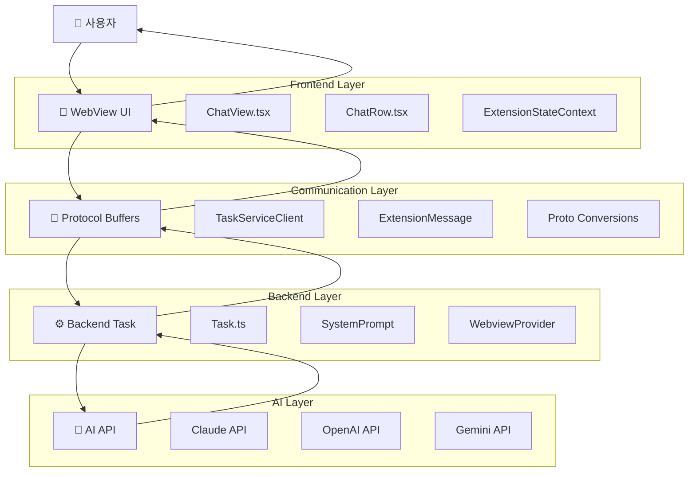
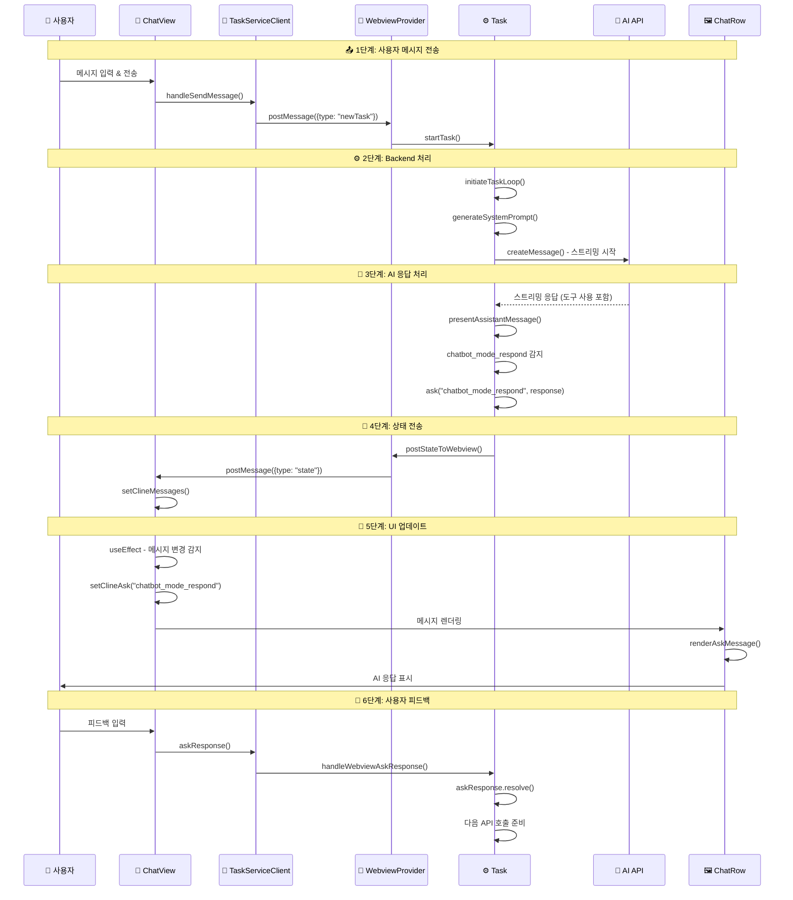
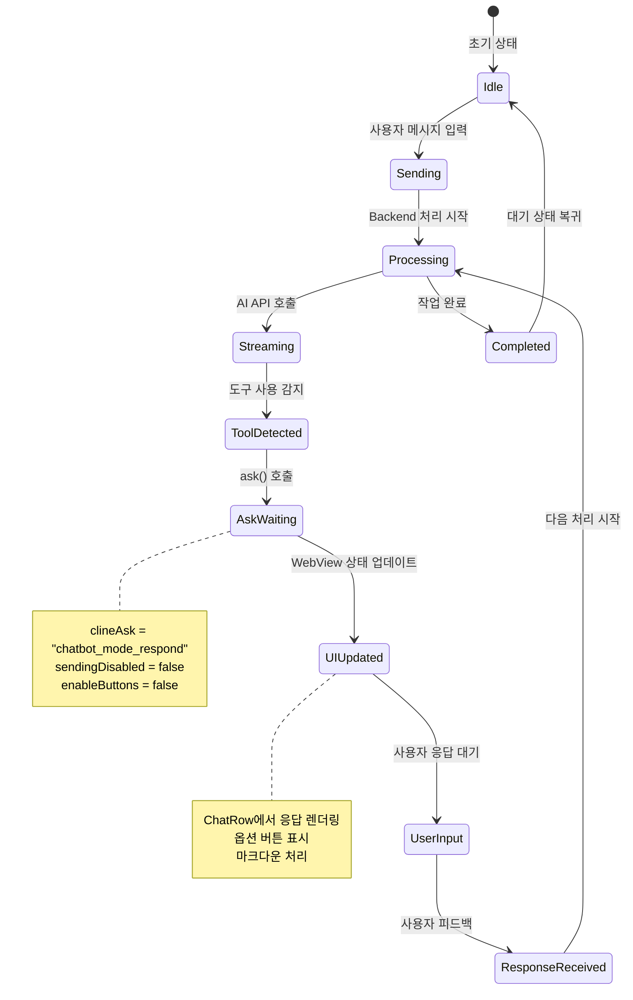

# AI 메시지 송수신 플로우 가이드

**작성일**: 2025-01-28  
**작성자**: Alpha  
**대상**: Caret 개발자  

## 📋 **개요**

이 문서는 Caret에서 사용자가 AI에게 메시지를 보내고 응답을 받는 전체 과정을 상세히 설명합니다. 
Frontend → Backend → AI API → Backend → Frontend의 완전한 플로우를 다룹니다.

## 🎯 **주요 학습 목표**

- AI 메시지 송수신의 전체 아키텍처 이해
- 각 계층별 역할과 책임 파악
- 디버깅 시 문제 지점 식별 능력 향상
- 새로운 AI 모드 추가 시 필요한 수정사항 이해

---

## 🏗️ **전체 아키텍처 개요**

### **시스템 구조도**



### **메시지 플로우 시퀀스**



### **상태 관리 플로우**



---

## 📤 **1단계: 사용자 메시지 전송 (Frontend → Backend)**

### **1.1 사용자 입력 처리**

**파일**: `webview-ui/src/components/chat/ChatView.tsx`

```typescript
// 사용자가 메시지 입력 후 전송 버튼 클릭
const handleSendMessage = useCallback(
    async (text: string, images: string[], files: string[]) => {
        if (messages.length === 0) {
            // 새로운 태스크 시작
            await TaskServiceClient.newTask(
                NewTaskRequest.create({ text: messageToSend, images, files })
            )
        } else if (clineAsk) {
            // 기존 대화에서 AI가 응답 대기 중인 경우
            switch (clineAsk) {
                case "followup":
                case "plan_mode_respond":
                case "chatbot_mode_respond":
                    await TaskServiceClient.askResponse(
                        AskResponseRequest.create({
                            responseType: "messageResponse",
                            text: messageToSend,
                            images,
                            files,
                        })
                    )
                    break
            }
        }
    },
    [messages.length, clineAsk]
)
```

### **1.2 Protocol Buffer 통신**

**파일**: `webview-ui/src/services/TaskServiceClient.ts`

```typescript
// TaskServiceClient가 Protocol Buffer를 통해 Backend와 통신
export class TaskServiceClient {
    static async newTask(request: NewTaskRequest): Promise<void> {
        return vscode.postMessage({
            type: "newTask",
            request: NewTaskRequest.toBinary(request)
        })
    }
    
    static async askResponse(request: AskResponseRequest): Promise<void> {
        return vscode.postMessage({
            type: "askResponse", 
            request: AskResponseRequest.toBinary(request)
        })
    }
}
```

### **1.3 Backend 메시지 수신**

**파일**: `src/core/webview/index.ts`

```typescript
// Extension이 WebView 메시지를 수신하고 Task로 전달
case "newTask":
    const newTaskRequest = NewTaskRequest.fromBinary(message.request)
    await task.startTask(
        newTaskRequest.text,
        newTaskRequest.images,
        newTaskRequest.files
    )
    break

case "askResponse":
    const askResponseRequest = AskResponseRequest.fromBinary(message.request)
    await task.handleWebviewAskResponse(
        askResponseRequest.responseType,
        askResponseRequest.text,
        askResponseRequest.images,
        askResponseRequest.files
    )
    break
```

---

## ⚙️ **2단계: Backend 처리 및 AI API 호출**

### **2.1 Task 클래스에서 메시지 처리**

**파일**: `src/core/task/index.ts`

```typescript
// Task.startTask() 또는 Task.handleWebviewAskResponse() 호출
private async startTask(task?: string, images?: string[], files?: string[]): Promise<void> {
    // 1. 사용자 메시지를 UserContent로 변환
    const userContent: UserContent = [
        { type: "text", text: task || "" }
    ]
    
    // 2. 이미지/파일 첨부 처리
    if (images?.length) {
        userContent.push(...formatResponse.imageBlocks(images))
    }
    
    // 3. AI API 요청 시작
    await this.initiateTaskLoop(userContent)
}
```

### **2.2 시스템 프롬프트 생성**

**파일**: `caret-src/core/prompts/CaretSystemPrompt.ts`

```typescript
// 모드별 시스템 프롬프트 생성
async generateFromJsonSections(
    cwd: string,
    supportsBrowserUse: boolean,
    mcpHub: any,
    browserSettings: any,
    isClaude4ModelFamily: boolean = false,
    mode: "chatbot" | "agent" = "agent",
): Promise<string> {
    // 1. 기본 섹션 로드 (도구 정의 포함)
    const baseSections = await this.assembler.loadBaseSections(mode)
    
    // 2. 동적 섹션 생성 (MCP, 시스템 정보)
    const dynamicSections = await this.assembler.generateDynamicSections(cwd, mcpHub)
    
    // 3. 조건부 섹션 추가 (브라우저, Claude4)
    const conditionalSections = await this.assembler.addConditionalSections(
        supportsBrowserUse, browserSettings, isClaude4ModelFamily, mode
    )
    
    // 4. 최종 프롬프트 조립
    return this.assembler.assembleFinalPrompt(allSections)
}
```

### **2.3 도구 필터링 (모드별)**

**파일**: `caret-src/core/prompts/JsonSectionAssembler.ts`

```typescript
// 챗봇 모드: 읽기 전용 도구 + chatbot_mode_respond만 허용
if (mode === "chatbot") {
    const readOnlyTools = [
        "read_file", 
        "search_files", 
        "list_files", 
        "list_code_definition_names", 
        "chatbot_mode_respond"  // 🔑 핵심: 응답 도구 포함
    ]
    if (!readOnlyTools.includes(toolName)) {
        continue // 다른 도구들은 제외
    }
}
```

### **2.4 AI API 호출**

**파일**: `src/core/task/index.ts`

```typescript
// recursivelyMakeClineRequests()에서 실제 AI API 호출
async *attemptApiRequest(previousApiReqIndex: number): ApiStream {
    // 1. 시스템 프롬프트 + 대화 히스토리 구성
    const systemPrompt = await this.generateSystemPrompt()
    const messages = [
        { role: "system", content: systemPrompt },
        ...this.apiConversationHistory
    ]
    
    // 2. AI API 호출 (Claude, OpenAI 등)
    for await (const chunk of this.api.createMessage(messages)) {
        yield chunk
    }
}
```

---

## 🤖 **3단계: AI 응답 처리 (Backend)**

### **3.1 스트리밍 응답 파싱**

**파일**: `src/core/task/index.ts`

```typescript
// AI 응답을 실시간으로 파싱하여 도구 호출 감지
async presentAssistantMessage() {
    // 1. 스트리밍 응답을 AssistantMessageContent로 파싱
    this.assistantMessageContent = parseAssistantMessageV2(assistantMessage)
    
    // 2. 도구 사용 블록 처리
    for (const block of this.assistantMessageContent) {
        if (block.type === "tool_use") {
            switch (block.name) {
                case "chatbot_mode_respond": {
                    // 챗봇 응답 처리 (Plan 모드와 동일)
                    const response = block.params.response
                    const sharedMessage = {
                        response: removeClosingTag("response", response),
                        options: parsePartialArrayString(removeClosingTag("options", optionsRaw)),
                    }
                    
                    // 사용자 응답 대기
                    let { text, images, files } = await this.ask(
                        "chatbot_mode_respond", 
                        JSON.stringify(sharedMessage), 
                        false
                    )
                    
                    // 사용자 피드백 처리
                    pushToolResult(formatResponse.toolResult(`<user_message>\n${text}\n</user_message>`))
                    break
                }
            }
        }
    }
}
```

### **3.2 Ask 메시지 생성**

**파일**: `src/core/task/index.ts`

```typescript
// AI가 사용자 응답을 요청할 때
async ask(
    type: ClineAsk,
    text?: string,
    partial?: boolean,
): Promise<{ response: ClineAskResponse; text?: string; images?: string[]; files?: string[] }> {
    // 1. ClineMessage 생성
    const message: ClineMessage = {
        ts: Date.now(),
        type: "ask",
        ask: type,  // "chatbot_mode_respond"
        text: text, // AI 응답 내용
        partial: partial
    }
    
    // 2. 메시지 저장 및 WebView로 전송
    await this.addToClineMessages(message)
    await this.postStateToWebview()
    
    // 3. 사용자 응답 대기
    return new Promise((resolve) => {
        this.askResponse = resolve
    })
}
```

---

## 📡 **4단계: Backend → Frontend 상태 전송**

### **4.1 상태 업데이트**

**파일**: `src/core/task/index.ts`

```typescript
// WebView로 상태 전송
private async postStateToWebview(): Promise<void> {
    const state: ExtensionState = {
        version: this.context.extension.packageJSON.version,
        clineMessages: this.clineMessages,  // 🔑 메시지 배열
        taskHistory: await this.getTaskHistory(),
        shouldShowAnnouncement: await this.getShouldShowAnnouncement()
    }
    
    await this.postMessageToWebview({
        type: "state",
        state: state
    })
}
```

### **4.2 Protocol Buffer 역직렬화**

**파일**: `webview-ui/src/context/ExtensionStateContext.tsx`

```typescript
// WebView에서 Backend 메시지 수신
useEffect(() => {
    const handleMessage = (event: MessageEvent) => {
        const message: ExtensionMessage = event.data
        
        switch (message.type) {
            case "state":
                // 상태 업데이트
                setClineMessages(message.state.clineMessages)
                setTaskHistory(message.state.taskHistory)
                break
        }
    }
    
    window.addEventListener("message", handleMessage)
    return () => window.removeEventListener("message", handleMessage)
}, [])
```

---

## 🎨 **5단계: Frontend UI 업데이트**

### **5.1 ChatView 상태 관리**

**파일**: `webview-ui/src/components/chat/ChatView.tsx`

```typescript
// 메시지 변경 감지 및 UI 상태 업데이트
useEffect(() => {
    const lastMessage = modifiedMessages.at(-1)
    
    if (lastMessage?.type === "ask") {
        switch (lastMessage.ask) {
            case "chatbot_mode_respond":
                setSendingDisabled(isPartial)        // 전송 버튼 상태
                setClineAsk("chatbot_mode_respond")   // Ask 타입 설정
                setEnableButtons(false)               // 버튼 활성화 상태
                break
        }
    }
}, [modifiedMessages])
```

### **5.2 ChatRow 메시지 렌더링**

**파일**: `webview-ui/src/components/chat/ChatRow.tsx`

```typescript
// Ask 타입별 메시지 렌더링
function renderAskMessage(message: ClineMessage) {
    switch (message.ask) {
        case "chatbot_mode_respond": {
            // JSON 파싱하여 응답 내용 추출
            let response: string | undefined
            let options: string[] | undefined
            let selected: string | undefined
            
            try {
                const parsedMessage = JSON.parse(message.text || "{}") as ClinePlanModeResponse
                response = parsedMessage.response
                options = parsedMessage.options
                selected = parsedMessage.selected
            } catch (e) {
                response = message.text // 레거시 메시지 처리
            }
            
            // 마크다운 렌더링 + 옵션 버튼
            return (
                <WithCopyButton textToCopy={response}>
                    <Markdown markdown={response} />
                    <OptionsButtons
                        options={options}
                        selected={selected}
                        isActive={isLast && lastModifiedMessage?.ask === "chatbot_mode_respond"}
                    />
                </WithCopyButton>
            )
        }
    }
}
```

---

## 🔄 **6단계: 사용자 응답 처리 (Frontend → Backend)**

### **6.1 사용자 입력 전송**

사용자가 AI 응답에 대해 피드백을 입력하면, **1단계**와 동일한 과정으로 다시 Backend로 전송됩니다:

```typescript
// ChatView.tsx - handleSendMessage()
case "chatbot_mode_respond":
    await TaskServiceClient.askResponse(
        AskResponseRequest.create({
            responseType: "messageResponse",
            text: messageToSend,
            images,
            files,
        })
    )
```

### **6.2 Backend에서 사용자 응답 처리**

**파일**: `src/core/task/index.ts`

```typescript
// Task.handleWebviewAskResponse()
async handleWebviewAskResponse(askResponse: ClineAskResponse, text?: string, images?: string[], files?: string[]) {
    // 1. 대기 중인 Promise 해결
    if (this.askResponse) {
        this.askResponse({
            response: askResponse,
            text: text,
            images: images,
            files: files
        })
        this.askResponse = undefined
    }
}
```

---

## 🚨 **주요 디버깅 포인트**

### **문제 발생 시 확인사항**

1. **AI가 응답하지 않는 경우**:
   - 시스템 프롬프트에 해당 도구가 포함되어 있는가? (`JsonSectionAssembler.ts`)
   - Backend에서 도구 처리 케이스가 구현되어 있는가? (`Task.ts`)

2. **응답이 UI에 표시되지 않는 경우**:
   - ChatRow에서 해당 Ask 타입 케이스가 구현되어 있는가? (`ChatRow.tsx`)
   - ChatView에서 상태 관리가 올바른가? (`ChatView.tsx`)

3. **무한 루프가 발생하는 경우**:
   - Backend에서 `didAlreadyUseTool` 플래그가 설정되는가?
   - `recursivelyMakeClineRequests()`에서 루프 종료 조건이 올바른가?

### **로깅 확인 방법**

```typescript
// Backend 로깅
Logger.info(`[CHATBOT-MODE] Processing tool: ${block.name}`)

// Frontend 로깅  
console.log("[ChatView] handleSendMessage - Sending message:", messageToSend)
```

---

## 📚 **관련 문서**

- [Caret 아키텍처 가이드](./caret-architecture-and-implementation-guide.mdx)
- [테스팅 가이드](./testing-guide.mdx)
- [Frontend-Backend 상호작용 패턴](./frontend-backend-interaction-patterns.mdx)
- [시스템 프롬프트 구현](./system-prompt-implementation.mdx)

---

**마지막 업데이트**: 2025-01-28  
**검토자**: Luke Yang 