# Caret Architecture and Implementation Guide

## Table of Contents

-   [Project Overview](#project-overview)
-   [Architecture Principles](#architecture-principles)
-   [Development Patterns](#development-patterns)
-   [Implementation Strategy](#implementation-strategy)
-   [Core Class Extension Guide](#core-class-extension-guide)
-   [Build System](#build-system)
-   [Development Workflow](#development-workflow)
-   [Quality Assurance](#quality-assurance)
-   [Cline Pattern Best Practices](#cline-pattern-best-practices)
-   [Message Flow Analysis](#message-flow-analysis)
-   [Frontend-Backend Interaction Patterns](#frontend-backend-interaction-patterns)
-   [Circular Message Prevention](#circular-message-prevention)

## 1. Overview

This document guides how the Caret project implements its unique features on top of Cline's stable foundation through a **Fork-based Architecture**. Caret directly includes the Cline codebase to maximize the utilization of existing functionalities, while selectively extending or replacing only necessary parts.

## 2. Fork-Based Architecture Principles

### 2.1. Direct Inclusion of Cline Code

Caret is a **Fork** of the [Cline](https://github.com/cline/cline) project, directly including Cline's entire codebase in the `src/` directory. This allows for:

-   Leveraging Cline's stable and proven functionalities as-is
-   Efficiently integrating upstream changes via Git merge
-   Maintaining a simple structure without complex submodule management or external dependencies

### 2.2. Minimal Extension Principle

Caret's extension code adheres to the following principles:

-   **Preservation of Cline Code**: `src/` and `webview-ui/` original files are modified as little as possible.
-   **Minimal Entry Point**: Utilize Cline modules through `caret-src/extension.ts`.
-   **Gradual Extension**: Implement only necessary features as Caret-specific.

### 2.3. Core Directory Structure

```
caret/
├── src/                      # Cline Original Code (Preserved)
│   ├── extension.ts          # Cline Main Entry Point
│   ├── core/                 # Cline Core Logic
│   │   ├── webview/          # WebviewProvider
│   │   ├── task/             # Task Management
│   │   └── prompts/          # Prompt System
│   ├── shared/               # Common Types/Utilities
│   └── api/                  # AI Providers
├── caret-src/                # Caret Extension Features (Minimal)
│   ├── extension.ts          # Caret Entry Point (utilizes src/ modules)
│   └── core/
│       └── webview/
│           └── CaretProvider.ts  # Extends Cline WebviewProvider
├── caret-assets/             # Caret-specific Assets
│   ├── template_characters/  # AI Character Templates
│   ├── rules/                # Default Modes and Rule Definitions
│   └── icons/                # Project Icons
├── caret-docs/               # Caret-specific Documentation
└── webview-ui/               # Frontend (utilizes Cline build system)
    ├── src/components/       # Cline Original Components (Preserved)
    ├── src/caret/            # Caret-specific Components
    ├── src/utils/            # Cline Utilities + Caret Additions
    └── src/locale/           # Caret Internationalization Support
```

## 3. Cline-Based Core Architecture Patterns

### 3.1. Task Execution System (Utilizing Cline Patterns)

Caret is built upon Cline's proven Task execution architecture:

```typescript
// caret-src/core/task/CaretTask.ts (Extends Cline Task)
import { Task } from "../../../src/core/task/Task"

export class CaretTask extends Task {
	// Utilizes Cline's core execution loop
	async initiateTaskLoop(userContent: UserContent, isNewTask: boolean) {
		while (!this.abort) {
			// 1. API Request and Stream Response (Cline Pattern)
			const stream = this.attemptApiRequest()

			// 2. Parse and Display Content Blocks (Cline Pattern)
			for await (const chunk of stream) {
				switch (chunk.type) {
					case "text":
						this.assistantMessageContent = parseAssistantMessageV2(chunk.text)
						await this.presentAssistantMessage()
						break
					case "tool_use":
						// Add Caret-specific tool execution logic
						await this.handleCaretToolExecution(chunk)
						break
				}
			}

			// 3. Wait for tool execution completion (Cline Pattern)
			await pWaitFor(() => this.userMessageContentReady)

			// 4. Continue loop with result (Cline Pattern)
			const recDidEndLoop = await this.recursivelyMakeClineRequests(this.userMessageContent)
		}
	}

	// Caret-specific tool execution logic
	private async handleCaretToolExecution(chunk: ToolBlock) {
		// Process Cline's default tools + Caret-specific tools
		if (this.isCaretSpecificTool(chunk.name)) {
			return await this.executeCaretTool(chunk)
		}

		// By default, use Cline's tool execution
		return await super.executeToolWithApproval(chunk)
	}
}
```

### 3.2. Message Streaming System (Utilizing Cline Patterns)

Utilizes Cline's real-time streaming architecture for stable message processing:

```typescript
// caret-src/core/webview/CaretProvider.ts
import { WebviewProvider } from "../../../src/core/webview/index"

export class CaretProvider extends WebviewProvider {
	// Utilizes Cline's streaming lock mechanism
	async presentAssistantMessage() {
		// Prevent race condition (Cline Pattern)
		if (this.presentAssistantMessageLocked) {
			this.presentAssistantMessageHasPendingUpdates = true
			return
		}
		this.presentAssistantMessageLocked = true

		try {
			// Process current content block (Cline Pattern)
			const block = this.assistantMessageContent[this.currentStreamingContentIndex]

			// Process by content type (Cline Pattern + Caret Extension)
			switch (block.type) {
				case "text":
					await this.say("text", content, undefined, block.partial)
					break
				case "tool_use":
					// Add Caret-specific tool display logic
					await this.handleCaretToolDisplay(block)
					break
				default:
					// Delegate to Cline's default processing
					await super.presentAssistantMessage()
			}

			// Move to next block (Cline Pattern)
			if (!block.partial) {
				this.currentStreamingContentIndex++
			}
		} finally {
			this.presentAssistantMessageLocked = false

			// Process pending updates (Cline Pattern)
			if (this.presentAssistantMessageHasPendingUpdates) {
				this.presentAssistantMessageHasPendingUpdates = false
				await this.presentAssistantMessage()
			}
		}
	}
}
```

### 3.3. API Request and Token Management (Utilizing Cline Patterns)

Utilizes Cline's proven token management and error handling system:

```typescript
// Extends Cline's API management pattern in CaretTask
export class CaretTask extends Task {
	async *attemptApiRequest(previousApiReqIndex: number): ApiStream {
		// 1. Wait for MCP server connection (Cline Pattern)
		await pWaitFor(() => this.controllerRef.deref()?.mcpHub?.isConnecting !== true)

		// 2. Context Window Management (Cline Pattern)
		const previousRequest = this.clineMessages[previousApiReqIndex]
		if (previousRequest?.text) {
			const { tokensIn, tokensOut } = JSON.parse(previousRequest.text || "{}")
			const totalTokens = (tokensIn || 0) + (tokensOut || 0)

			// Truncate conversation if context limit is approached (Cline Pattern)
			if (totalTokens >= maxAllowedSize) {
				this.conversationHistoryDeletedRange = this.contextManager.getNextTruncationRange(
					this.apiConversationHistory,
					this.conversationHistoryDeletedRange,
					totalTokens / 2 > maxAllowedSize ? "quarter" : "half",
				)
			}
		}

		// 3. Streaming with automatic retry (Cline Pattern)
		try {
			this.isWaitingForFirstChunk = true
			const firstChunk = await iterator.next()
			yield firstChunk.value
			this.isWaitingForFirstChunk = false

			// Stream remaining chunks
			yield* iterator
		} catch (error) {
			// 4. Add Caret-specific error handling
			if (this.isCaretSpecificError(error)) {
				yield* this.handleCaretApiError(error)
				return
			}

			// 5. Utilize Cline's default error handling
			if (isOpenRouter && !this.didAutomaticallyRetryFailedApiRequest) {
				await setTimeoutPromise(1000)
				this.didAutomaticallyRetryFailedApiRequest = true
				yield* this.attemptApiRequest(previousApiReqIndex)
				return
			}

			// 6. User retry request (Cline Pattern)
			const { response } = await this.ask("api_req_failed", this.formatErrorWithStatusCode(error))
			if (response === "yesButtonClicked") {
				await this.say("api_req_retried")
				yield* this.attemptApiRequest(previousApiReqIndex)
				return
			}
		}
	}
}
```

### 3.4. State Management Architecture (Utilizing Cline Patterns)

Caret state management is based on Cline's Controller ↔ ExtensionStateContext communication pattern:

```typescript
// caret-src/core/state/CaretStateManager.ts
import { Controller } from "../../../src/core/controller/index"

export class CaretStateManager extends Controller {
	// Utilizes Cline's multi-store pattern
	async initializeCaretState() {
		// Global State: Shared across all VSCode instances (Cline Pattern)
		const globalCaretSettings = await this.context.globalState.get("caret.settings", {})

		// Workspace State: Specific to the current workspace (Cline Pattern)
		const workspaceCaretData = await this.context.workspaceState.get("caret.workspace", {})

		// Secrets: Securely store sensitive information (Cline Pattern)
		const caretApiKeys = await this.context.secrets.get("caret.apiKeys")

		// Initialize Caret-specific state
		await this.setupCaretSpecificState(globalCaretSettings, workspaceCaretData)
	}

	// Utilizes Cline's inter-instance state synchronization pattern
	async syncCaretStateAcrossInstances() {
		// File-based storage (Cline Pattern)
		await this.saveCaretTaskHistory()

		// VSCode Global State API (Cline Pattern)
		await this.context.globalState.update("caret.lastSync", Date.now())

		// File change and settings update listeners (Cline Pattern)
		this.setupCaretStateListeners()
	}
}
```

### 3.5. Error Handling and Recovery System (Utilizing Cline Patterns)

Applies Cline's robust error handling patterns to Caret:

```typescript
// CaretTask Error Handling
export class CaretTask extends Task {
	async handleError(action: string, error: Error) {
		// 1. Check for task abandonment (Cline Pattern)
		if (this.abandoned) return

		// 2. Categorize Caret-specific errors
		const errorCategory = this.categorizeCaretError(error)

		// 3. Format error message (Cline Pattern)
		const errorString = `Error ${action}: ${error.message}`

		// 4. Display error to user (Cline Pattern)
		await this.say("error", errorString)

		// 5. Add error to tool result (Cline Pattern)
		pushToolResult(formatResponse.toolError(errorString))

		// 6. Resource cleanup (Cline Pattern + Caret Extension)
		await this.diffViewProvider.revertChanges()
		await this.browserSession.closeBrowser()
		await this.cleanupCaretResources() // Caret-specific cleanup
	}

	// Caret-specific error categorization system
	private categorizeCaretError(error: Error): CaretErrorCategory {
		if (error.message.includes("caret-specific")) {
			return CaretErrorCategory.CARET_FEATURE_ERROR
		}
		if (error.message.includes("api")) {
			return CaretErrorCategory.API_ERROR
		}
		return CaretErrorCategory.GENERAL_ERROR
	}

	// Caret-specific resource cleanup
	private async cleanupCaretResources() {
		// Caret-specific resource cleanup logic
		await this.caretLogger.flush()
		await this.caretStateManager.saveEmergencyState()
	}
}
```

## 4. Implementation Strategy

### 4.1. Backend Extension (caret-src)

**Purpose**: Add Caret-specific features while utilizing Cline's core functionalities.

**Implementation Method**:

1.  **Direct Utilization of Cline Modules**

    ```typescript
    // caret-src/extension.ts
    import { WebviewProvider } from "../src/core/webview/WebviewProvider"
    import { TaskManager } from "../src/core/task/TaskManager"

    // Directly import and utilize Cline modules
    export class CaretProvider extends WebviewProvider {
    	// Add/override only Caret-specific functionalities
    }
    ```

2.  **Extension via Class Inheritance**

    ```typescript
    // caret-src/core/webview/CaretProvider.ts
    import { WebviewProvider } from "../../../src/core/webview/WebviewProvider"

    export class CaretProvider extends WebviewProvider {
    	// Override existing methods
    	override async initialize(): Promise<void> {
    		await super.initialize()
    		// Caret-specific initialization logic
    		await this.initializeCaretFeatures()
    	}

    	// Add new methods
    	private async initializeCaretFeatures(): Promise<void> {
    		// Implement Caret-specific features
    	}
    }
    ```

### 4.2. Frontend Extension (webview-ui)

**Purpose**: Extend UI while utilizing Cline's React build system as-is.

**Implementation Method**:

1.  **Add Components**

    ```typescript
    // webview-ui/src/caret/CaretWelcome.tsx
    import React from 'react';
    import { useExtensionState } from '../context/ExtensionStateContext';

    export const CaretWelcome: React.FC = () => {
      const { state } = useExtensionState();

      return (
        <div className="caret-welcome">
          {/* Caret-specific welcome page */}
        </div>
      );
    };
    ```

2.  **Routing Branching**

    ```typescript
    // Modify webview-ui/src/App.tsx (if necessary)
    import { CaretWelcome } from './caret/CaretWelcome';

    function App() {
      const isCaretMode = /* Caret mode determination logic */;

      if (isCaretMode) {
        return <CaretWelcome />;
      }

      // Existing Cline UI
      return <ClineApp />;
    }
    ```

3.  **Add Utilities**
    ```typescript
    // webview-ui/src/utils/caret-i18n.ts
    // webview-ui/src/utils/caret-webview-logger.ts
    // Caret-specific utility functions
    ```

### 4.3. File Replacement (If Necessary)

**Principle**: Use only as a last resort, always create a backup.

**Implementation Method**:

1.  **Backup Original**

    ```bash
    # Backup original file with .cline extension
    cp webview-ui/src/components/Welcome.tsx webview-ui/src/components/Welcome-tsx.cline
    ```

2.  **Replace with Caret Version**

    ```typescript
    // webview-ui/src/components/Welcome.tsx (Replaced)
    // Implement Caret-specific Welcome component
    ```

3.  **Update Merging Guide**
    - Record replaced file information in `caret-docs/guides/upstream-merging.mdx`.

## 5. Core Class Extension Guide: CaretProvider Example

Caret's core `WebviewProvider` is based on Cline's `WebviewProvider`. When modifying it, adhere to the following principles.

### 5.1. Basic Principle: Minimal Extension via Inheritance

`CaretProvider` must `extends` `ClineWebviewProvider`. This enhances code reusability and facilitates following future Cline updates.

```typescript
// caret-src/core/webview/CaretProvider.ts
import { WebviewProvider as ClineWebviewProvider } from "../../../src/core/webview/index"

export class CaretProvider extends ClineWebviewProvider {
	// ... add only the necessary minimal logic ...
}
```

### 5.2. Resolution Procedure for Inheritance Constraints Due to `private` Members

If functionality modification is impossible due to `private` properties (e.g., `disposables`) of `ClineWebviewProvider`, follow these steps.

1.  **Avoid Excessive Reimplementation**: It is **strictly forbidden** to copy and reimplement large methods like `resolveWebviewView` entirely in `CaretProvider`. This is a major source of bugs.
2.  **Backup Original File (Safety Rule)**:
    -   Before creating a backup, check for existing backups: `Test-Path "src/core/webview/index-ts.cline"`
    -   Create only if no existing backup: `if (!(Test-Path "backup_path")) { Copy-Item "original" "backup" }`
    -   **Never overwrite existing backups**: The first backup is the most important original state.
3.  **Minimal Direct Modification**: Change the problematic `private` property to `protected` in the `src/core/webview/index.ts` file. This is a single-line modification, the safest and clearest solution.

    ```typescript
    // BEFORE
    private disposables: vscode.Disposable[] = [];

    // AFTER
    // CARET MODIFICATION: Allow child classes to access disposables for proper extension.
    protected disposables: vscode.Disposable[] = [];
    ```

4.  **Override in `CaretProvider`**: Now, safely use the `protected` member in `CaretProvider` to override necessary logic.

This procedure is the best way to write clean, maintainable code while adhering to the "Principle of Minimal Modification."

## 6. Build System

### 6.1. Integrated Build Process

Caret maximizes the utilization of Cline's existing build system:

```bash
# Compile Protocol Buffers
npm run protos

# Compile TypeScript (src/ + caret-src/ integrated)
npm run compile

# Build Webview UI (Vite)
cd webview-ui && npm run build
```

### 6.2. Build Configuration Optimization

-   **tsconfig.json**: Include `src/` and `caret-src/` paths.
-   **package.json**: Extend Cline scripts.
-   **vite.config.ts**: Add Caret component paths.

## 7. Development Workflow

### 7.1. New Feature Development

1.  **Requirement Analysis**: Check if existing Cline features can fulfill the requirement.
2.  **Implementation Method Decision**: Extension vs. Replacement vs. New Addition.
3.  **Minimal Implementation**: Reuse Cline modules as much as possible.
4.  **Testing and Logging**: Include tests and logging for all new features.

### 6.2. Upstream Merging

1.  **Check Cline Changes**.
2.  **Resolve Conflicts**: Primarily occur in the `src/` directory.
3.  **Verify Caret Feature Compatibility**.
4.  **Update Documentation**.

> **[Important] Key Changes Related to Merging Process**
>
> The project's core identifier has undergone a large-scale change from `cline` to `caret` (e.g., `proto.cline` → `proto.caret`, ID changes within `package.json`, etc.). Due to this, when merging future upstream (Cline) changes, widespread identifier conflicts that cannot be resolved by simple Git Merge may occur. When performing merge operations, it is crucial to be aware of this and proceed carefully to maintain identifier consistency.

## 8. Quality Assurance

### 8.1. Testing Strategy

-   **Cline Features**: Maintain original tests as-is.
-   **Caret Extensions**: Aim for 100% test coverage.
-   **Integration Tests**: Verify Cline-Caret interoperability.

### 8.2. Logging System (Extending Cline Patterns)

```typescript
// caret-src/utils/caret-logger.ts
import { Logger } from "../src/services/logging/Logger"

export class CaretLogger extends Logger {
	constructor(name: string) {
		super(`Caret.${name}`)
	}

	// Cline logging pattern + Caret context addition
	logWithContext(level: LogLevel, message: string, context?: any) {
		const caretContext = {
			...context,
			caretVersion: this.getCaretVersion(),
			timestamp: new Date().toISOString(),
		}

		super.log(level, message, caretContext)
	}
}

// Usage example
export const caretLogger = new CaretLogger("Core")
caretLogger.logWithContext("info", "Caret feature initialized", { feature: "welcome" })
```

## 9. Best Practices for Utilizing Cline Patterns

### 9.1. Streaming Processing Best Practices

-   **Locking Mechanism**: Use appropriate locks to prevent race conditions.
-   **Partial Updates**: Safely handle partial content during streaming.
-   **Error Recovery**: Robust recovery mechanisms for stream interruptions.

### 8.2. State Management Best Practices

-   **Multiple Stores**: Appropriate separation of Global/Workspace/Secrets.
-   **Instance Synchronization**: Maintain state consistency across multiple extension instances.
-   **Cache Management**: Appropriate caching strategies for performance.

### 8.3. API Management Best Practices

-   **Token Tracking**: Accurate monitoring of token usage.
-   **Context Management**: Ensure memory efficiency through automatic conversation truncation.
-   **Retry Logic**: Robust retry mechanisms for transient errors.

## 10. Message Flow Analysis and Circular Message Prevention

### 10.1. Understanding Cline Message System

Cline uses a **gRPC-based message system** for communication between the webview and the backend:

```
webview (React) ↔ gRPC ↔ Extension Host (Node.js)
```

**Core Components**:

-   **StateServiceClient**: webview → backend requests.
-   **subscribeToState**: backend → webview state transmission.
-   **postStateToWebview**: Broadcast state to all subscribers.

### 9.2. Circular Message Problem Pattern

**Problem Scenario**:

```
1. webview: Change setting → setChatSettings()
2. webview: updateSettings gRPC request
3. backend: updateSettings.ts execution → save setting
4. backend: postStateToWebview() call ⚠️
5. backend: Send new state to all subscribers
6. webview: Receive new state via subscription
7. webview: Call setState() → UI overwritten ❌
```

**Result**: The webview receives the setting it just changed, causing it to revert to its original state.

### 9.3. Circular Message Prevention Principles

#### **9.3.1. Mandatory Checklist for Modifying Cline Originals**

**Before modifying the message system**:

-   [ ] Fully understand and document the existing message flow.
-   [ ] Analyze the impact of changes on other subscribers.
-   [ ] Review the necessity of `postStateToWebview()` calls.
-   [ ] Review potential subscription timing issues.
-   [ ] Plan tests to prevent circular messages.

**Precautions during modification**:

```typescript
// ❌ Dangerous Pattern: Broadcast on every setting change
async function updateSettings(settings: ChatSettings) {
	await saveSettings(settings)
	await controller.postStateToWebview() // Circular message risk!
}

// ✅ Safe Pattern: Conditional broadcast
async function updateSettings(settings: ChatSettings, options?: UpdateOptions) {
	await saveSettings(settings)

	// Skip broadcast if request originated from webview
	if (!options?.skipBroadcast) {
		await controller.postStateToWebview()
	}
}
```

#### **9.3.2. Implementing Webview Protection Mechanism**

**Timing-based protection**:

```typescript
// webview-ui/src/context/ExtensionStateContext.tsx
const [pendingChanges, setPendingChanges] = useState<Set<string>>(new Set())

const setChatSettings = useCallback(
	(newSettings: ChatSettings) => {
		const changedKeys = getChangedKeys(chatSettings, newSettings)

		// Add changed keys to protection list
		setPendingChanges((prev) => new Set([...prev, ...changedKeys]))

		// Save settings
		vscode.postMessage({ type: "updateSettings", settings: newSettings })

		// Release protection after 1 second
		setTimeout(() => {
			setPendingChanges((prev) => {
				const newSet = new Set(prev)
				changedKeys.forEach((key) => newSet.delete(key))
				return newSet
			})
		}, 1000)
	},
	[chatSettings],
)

// Prevent updates for protected keys in subscription
useEffect(() => {
	const subscription = stateService.subscribeToState({
		onResponse: (response) => {
			const newState = response.state

			// Preserve existing values for protected keys
			const protectedState = { ...newState }
			pendingChanges.forEach((key) => {
				if (key in state && key in protectedState) {
					protectedState[key] = state[key]
				}
			})

			setState(protectedState)
		},
	})
}, [pendingChanges])
```

#### **9.3.3. Mandatory Message Flow Diagram Creation**

**Mandatory for webview ↔ backend interaction feature development**:

```mermaid
sequenceDiagram
    participant W as webview
    participant G as gRPC
    participant B as Backend
    participant S as StateService

    W->>G: updateSettings(newValue)
    G->>B: updateSettings.ts
    B->>B: saveToStorage()

    Note over B: ⚠️ Circular risk if postStateToWebview() is called here

    alt Prevent Circular Message
        B-->>S: skipBroadcast=true
    else Normal Case
        B->>S: postStateToWebview()
        S->>G: broadcastState()
        G->>W: subscription.onResponse()
        W->>W: setState() ⚠️ Overwrite risk
    end
```



### 9.4. Mandatory Real Environment Testing

#### **9.4.1. Extension Host Environment Verification**

**Test Environment vs. Real Environment**:

-   **Unit Tests**: Verify individual functions in a mocked environment.
-   **Integration Tests**: Verify the entire flow including actual gRPC communication ⭐
-   **E2E Tests**: Verify user scenarios in the actual Extension Host ⭐

**Mandatory Verification Items**:

```typescript
// Real environment test example
describe("UI Language Setting - Real Environment", () => {
	it("should maintain language change without reverting", async () => {
		// 1. Execute in Extension Host environment
		const extensionHost = await startExtensionHost()

		// 2. Change language
		await extensionHost.changeLanguage("ja")

		// 3. Wait for 1 second (subscription message processing)
		await delay(1000)

		// 4. Confirm language is maintained
		const currentLanguage = await extensionHost.getCurrentLanguage()
		expect(currentLanguage).toBe("ja")

		// 5. Confirm additional messages do not revert language
		await extensionHost.triggerStateUpdate()
		await delay(500)

		const finalLanguage = await extensionHost.getCurrentLanguage()
		expect(finalLanguage).toBe("ja") // Still maintains Japanese
	})
})
```

#### **9.4.2. Message Timing Verification**

**Measure Backend Response Speed**:

```typescript
// Measure actual gRPC message timing
describe("Message Timing Analysis", () => {
	it("should measure subscription response time", async () => {
		const startTime = performance.now()

		// Request setting change
		await stateService.updateSettings(newSettings)

		// Wait for subscription response
		await waitForSubscriptionResponse()

		const responseTime = performance.now() - startTime
		console.log(`Subscription response time: ${responseTime}ms`)

		// Verify protection mechanism can keep up with response speed
		expect(responseTime).toBeLessThan(500) // Within 0.5 seconds
	})
})
```

### 9.5. Development Methodology Improvement

#### **9.5.1. Systematizing Problem Analysis**

**Step-by-step approach**:

1.  **Record Symptoms**: Accurately record problems reported by users.
2.  **Formulate Hypotheses**: List multiple possible causes.
3.  **Explore Root Causes**: Analyze actual causes at the code level.
4.  **Identify Impact Scope**: Check related systems.
5.  **Prioritize Solutions**: Critical → High → Medium order.

#### **9.5.2. Enforcing Logging Standards**

**Adherence to Caret Logging System**:

```typescript
// ❌ Forbidden: Direct console.log usage
console.log("[DEBUG] Language changed:", newLanguage)

// ✅ Recommended: Use standard logger
// Backend
import { caretLogger } from "@/utils/caret-logger"
caretLogger.debug("Language changed", { newLanguage, previousLanguage })

// Frontend
import { caretWebviewLogger } from "@/caret/utils/webview-logger"
caretWebviewLogger.debug("Language changed", { newLanguage, previousLanguage })
```

**Set Appropriate Logging Levels**:

-   **debug**: Detailed information during development.
-   **info**: General operational status.
-   **warn**: Potential problem situations.
-   **error**: Actual errors occurred.

#### **9.5.3. Strengthening TDD Principles**

**Mandatory TDD for AI Assistants**:

-   [ ] Must respond with "I'll write tests first" when implementation is requested.
-   [ ] Must refuse implementation without tests and suggest TDD approach.
-   [ ] Must break down complex features into step-by-step TDD.

**Adherence to Red-Green-Refactor Cycle**:

```typescript
// RED: Write failing test
it("should prevent subscription from overriding user language change", () => {
	// Test to be written (not yet implemented)
	expect(userLanguageChange).not.toBeOverriddenBySubscription()
})

// GREEN: Minimal implementation to pass test
function preventSubscriptionOverride() {
	// Minimal implementation
	return true
}

// REFACTOR: Improve and optimize code
function preventSubscriptionOverride() {
	// Implement actual protection mechanism
	// Clean up and optimize code
}
```

## 11. Frontend-Backend Interaction Patterns

### 11.1. uiLanguage-Specific Update Pattern ✨ **Actually Implemented**

**Problem**: In ExtensionStateContext.tsx, `setChatSettings` sends all settings to the backend even if only `uiLanguage` changes, causing circular messages.

**Solution**: Create a separate `setUILanguage` function to update only a single field.

```typescript
// webview-ui/src/context/ExtensionStateContext.tsx
// CARET MODIFICATION: Separate function to update only UI language - prevents chatSettings conflict
setUILanguage: async (language: string) => {
    try {
        // Update only UI language (do not include other settings)
        await StateServiceClient.updateSettings(
            UpdateSettingsRequest.create({
                uiLanguage: language, // Update only this
            }),
        )

        // Update Frontend state
        setState((prevState) => ({
            ...prevState,
            uiLanguage: language,
            chatSettings: {
                ...prevState.chatSettings,
                uiLanguage: language,
            }
        }))

        console.log("[DEBUG] 🌐 setUILanguage completed:", language)
    } catch (error) {
        console.error("Failed to update UI language:", error)
        throw error
    }
},
```

**Key Improvements**:

-   ✅ **Send only single field**: Only `uiLanguage` is sent to the backend.
-   ✅ **Prevent circular messages**: Update only language instead of all settings.
-   ✅ **Improve user experience**: Immediate UI reflection, settings do not revert.

**📋 Standard Pattern Guide**: For detailed Frontend-Backend interaction patterns, refer to the [Frontend-Backend Interaction Standard Patterns Guide](./frontend-backend-interaction-patterns.en.mdx).

### 10.2. Minimal Data Transmission Principle

**Purpose**: Prevent circular messages due to unnecessary setting transmission.

**Principle**:

1.  **Prioritize Change Detection**: Identify only actually changed fields.
2.  **Selective Transmission**: Send only changed settings to the backend.
3.  **Immediate UI Update**: Optimistic update for user experience.
4.  **Rollback on Error**: Restore UI state if backend fails.

**Applicable to**:

-   `uiLanguage` changes
-   Individual `chatSettings` field changes
-   Partial `apiConfiguration` updates
-   Other setting changes

## 12. Circular Message Prevention

### 12.1. Circular Message Occurrence Mechanism

**Common Circular Message Pattern**:

```
1. webview: Change setting → setChatSettings({uiLanguage: "ja"})
2. webview: updateSettings gRPC request (includes all settings)
3. backend: updateSettings.ts execution
   - Recognizes all settings as updates
   - Line 86: Calls await controller.postStateToWebview()
4. backend: sendStateUpdate() → Sends new state to all subscribers
5. webview: Receives new state via subscription onResponse → Calls setState()
6. Result: UI is overwritten by the state sent from the backend ❌
```

### 11.2. Prevention Strategy

#### **11.2.1. Frontend Stage Prevention**

```typescript
// Send minimal data by detecting changes
const isLanguageOnlyChange = detectLanguageOnlyChange(previous, current)
if (isLanguageOnlyChange) {
	// Send only language (exclude other settings)
	await StateServiceClient.updateSettings({
		chatSettings: newChatSettings,
		// apiConfiguration, telemetrySetting, etc. excluded
	})
}
```

#### **11.2.2. Backend Stage Prevention**

```typescript
// src/core/controller/state/updateSettings.ts
export async function updateSettings(request: UpdateSettingsRequest): Promise<Empty> {
	// Save settings
	if (request.chatSettings) {
		await saveSettings(request.chatSettings)
	}

	// Skip broadcast if only uiLanguage changed
	const isLanguageOnlyUpdate = request.chatSettings && !request.apiConfiguration && !request.telemetrySetting

	if (!isLanguageOnlyUpdate) {
		// Broadcast only when all settings change
		await controller.postStateToWebview()
	}

	return Empty.create()
}
```

### 11.3. Development Checklist

**Mandatory checks when developing webview ↔ backend interaction features**:

-   [ ] **Change Detection**: Does it identify only actually changed fields?
-   [ ] **Minimal Transmission**: Is it not sending unchanged settings along?
-   [ ] **Broadcast Necessity**: Is `postStateToWebview()` call necessary in the backend?
-   [ ] **Subscription Protection**: Is the value changed by the webview not overwritten by itself?
-   [ ] **Timing Verification**: Does circularity not occur in the actual Extension Host environment?

### 11.4. Mandatory Message Flow Diagram

**Diagram creation is mandatory for all webview ↔ backend interaction features**:

```mermaid
sequenceDiagram
    participant W as webview
    participant G as gRPC
    participant B as Backend
    participant S as StateService

    Note over W: User changes language to Japanese

    W->>W: detectLanguageOnlyChange() = true
    W->>G: updateSettings(chatSettings only)
    G->>B: updateSettings.ts
    B->>B: saveToStorage(chatSettings)

    Note over B: isLanguageOnlyUpdate = true
    Note over B: Skip postStateToWebview() ✅

    B->>G: Empty response
    G->>W: Success

    Note over W: UI language remains Japanese ✅
```



---

**Purpose of this section**:

-   Prevent circular message issues in Cline's complex message system.
-   Mandate verification in actual Extension Host environment.
-   Establish systematic problem analysis and resolution methodologies.
-   Improve development process to prevent recurrence.
