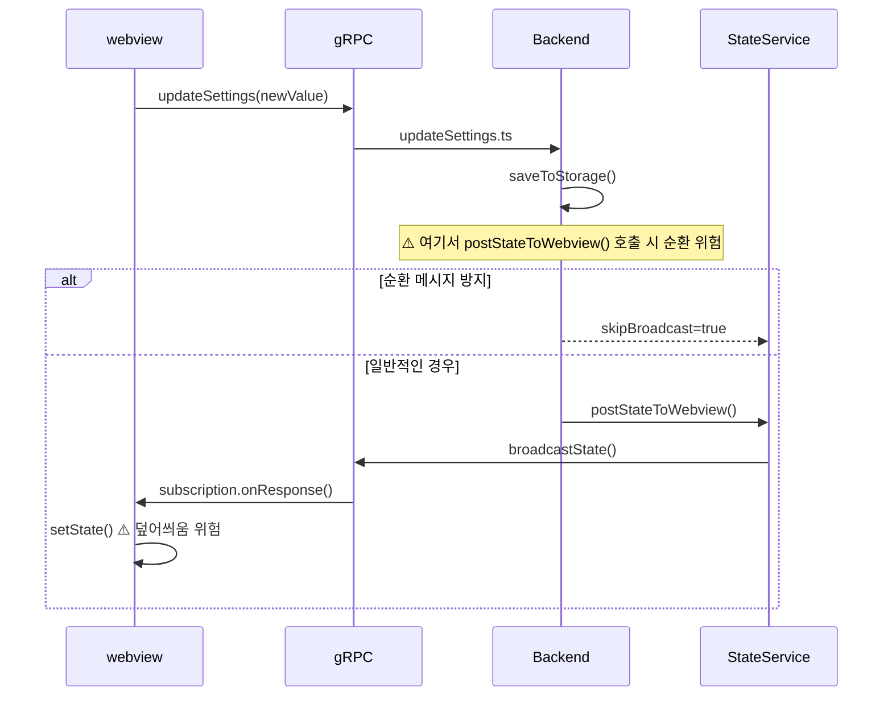
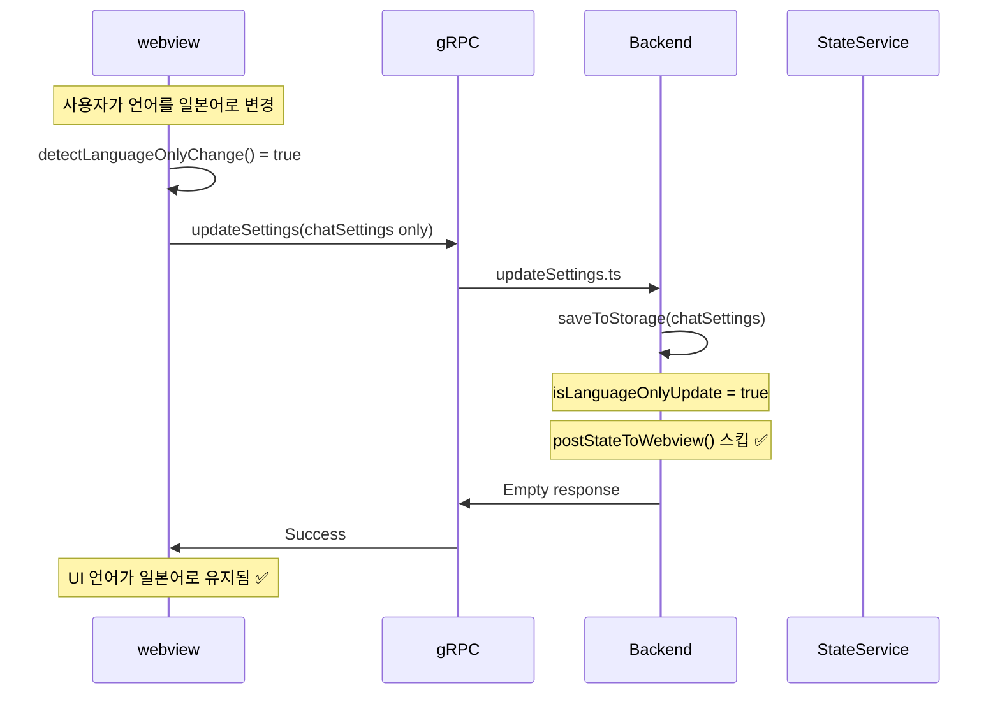

# Caret 아키텍처 및 구현 가이드

## Table of Contents

-   [Project Overview](#project-overview)
-   [Architecture Principles](#architecture-principles)
-   [Development Patterns](#development-patterns)
-   [Implementation Strategy](#implementation-strategy)
-   [Core Class Extension Guide](#core-class-extension-guide)
-   [Build System](#build-system)
-   [Development Workflow](#development-workflow)
-   [Quality Assurance](#quality-assurance)
-   [Cline Pattern Best Practices](#cline-pattern-best-practices)
-   [Message Flow Analysis](#message-flow-analysis)
-   [Frontend-Backend Interaction Patterns](#frontend-backend-interaction-patterns)
-   [Circular Message Prevention](#circular-message-prevention)

## 1. 개요

이 문서는 Caret 프로젝트가 **Fork 기반 아키텍처**를 통해 Cline의 안정적인 기반 위에서 고유의 기능을 구현하는 방법을 안내합니다. Caret은 Cline 코드베이스를 직접 포함하여 기존 기능을 최대한 활용하면서, 필요한 부분만 선택적으로 확장하거나 대체하는 전략을 채택합니다.

## 2. Fork 기반 아키텍처 원칙

### 2.1. Cline 코드 직접 포함

Caret은 [Cline](https://github.com/cline/cline) 프로젝트의 **Fork**로, Cline의 전체 코드베이스를 `src/` 디렉토리에 직접 포함합니다. 이를 통해:

-   Cline의 안정적이고 검증된 기능을 그대로 활용
-   업스트림 변경사항을 Git merge를 통해 효율적으로 통합
-   복잡한 서브모듈 관리나 외부 의존성 없이 단순한 구조 유지

### 2.2. 최소 확장 원칙

Caret의 확장 코드는 다음 원칙을 따릅니다:

-   **Cline 코드 보존**: `src/`, `webview-ui/` 원본 파일은 가능한 수정하지 않음
-   **최소 진입점**: `caret-src/extension.ts`를 통해 Cline 모듈 활용
-   **점진적 확장**: 필요한 기능만 Caret 전용으로 구현

### 2.3. 핵심 디렉토리 구조

```
caret/
├── src/                      # Cline 원본 코드 (보존)
│   ├── extension.ts          # Cline 메인 진입점
│   ├── core/                 # Cline 핵심 로직
│   │   ├── webview/          # WebviewProvider
│   │   ├── task/             # Task 관리
│   │   └── prompts/          # 프롬프트 시스템
│   ├── shared/               # 공통 타입/유틸리티
│   └── api/                  # AI 프로바이더들
├── caret-src/                # Caret 확장 기능 (최소한)
│   ├── extension.ts          # Caret 진입점 (src/ 모듈 활용)
│   └── core/
│       └── webview/
│           └── CaretProvider.ts  # Cline WebviewProvider 확장
├── caret-assets/             # Caret 전용 에셋
│   ├── template_characters/  # AI 캐릭터 템플릿
│   ├── rules/                # 기본 모드 및 룰 정의
│   └── icons/                # 프로젝트 아이콘
├── caret-docs/               # Caret 전용 문서
└── webview-ui/               # 프론트엔드 (Cline 빌드 시스템 활용)
    ├── src/components/       # Cline 원본 컴포넌트 (보존)
    ├── src/caret/            # Caret 전용 컴포넌트
    ├── src/utils/            # Cline 유틸리티 + Caret 추가
    └── src/locale/           # Caret 다국어 지원
```

## 3. Cline 기반 핵심 아키텍처 패턴

### 3.1. Task 실행 시스템 (Cline 패턴 활용)

Caret은 Cline의 검증된 Task 실행 아키텍처를 기반으로 구축됩니다:

```typescript
// caret-src/core/task/CaretTask.ts (Cline Task 확장)
import { Task } from "../../../src/core/task/Task"

export class CaretTask extends Task {
	// Cline의 핵심 실행 루프 활용
	async initiateTaskLoop(userContent: UserContent, isNewTask: boolean) {
		while (!this.abort) {
			// 1. API 요청 및 스트림 응답 (Cline 패턴)
			const stream = this.attemptApiRequest()

			// 2. 콘텐츠 블록 파싱 및 표시 (Cline 패턴)
			for await (const chunk of stream) {
				switch (chunk.type) {
					case "text":
						this.assistantMessageContent = parseAssistantMessageV2(chunk.text)
						await this.presentAssistantMessage()
						break
					case "tool_use":
						// Caret 고유 도구 실행 로직 추가
						await this.handleCaretToolExecution(chunk)
						break
				}
			}

			// 3. 도구 실행 완료 대기 (Cline 패턴)
			await pWaitFor(() => this.userMessageContentReady)

			// 4. 결과와 함께 루프 계속 (Cline 패턴)
			const recDidEndLoop = await this.recursivelyMakeClineRequests(this.userMessageContent)
		}
	}

	// Caret 고유 도구 실행 로직
	private async handleCaretToolExecution(chunk: ToolBlock) {
		// Cline의 기본 도구 + Caret 전용 도구 처리
		if (this.isCaretSpecificTool(chunk.name)) {
			return await this.executeCaretTool(chunk)
		}

		// 기본적으로는 Cline의 도구 실행 사용
		return await super.executeToolWithApproval(chunk)
	}
}
```

### 3.2. 메시지 스트리밍 시스템 (Cline 패턴)

Cline의 실시간 스트리밍 아키텍처를 활용하여 안정적인 메시지 처리:

```typescript
// caret-src/core/webview/CaretProvider.ts
import { WebviewProvider } from "../../../src/core/webview/index"

export class CaretProvider extends WebviewProvider {
	// Cline의 스트리밍 잠금 메커니즘 활용
	async presentAssistantMessage() {
		// Race condition 방지 (Cline 패턴)
		if (this.presentAssistantMessageLocked) {
			this.presentAssistantMessageHasPendingUpdates = true
			return
		}
		this.presentAssistantMessageLocked = true

		try {
			// 현재 콘텐츠 블록 처리 (Cline 패턴)
			const block = this.assistantMessageContent[this.currentStreamingContentIndex]

			// 콘텐츠 타입별 처리 (Cline 패턴 + Caret 확장)
			switch (block.type) {
				case "text":
					await this.say("text", content, undefined, block.partial)
					break
				case "tool_use":
					// Caret 전용 도구 표시 로직 추가
					await this.handleCaretToolDisplay(block)
					break
				default:
					// Cline 기본 처리 위임
					await super.presentAssistantMessage()
			}

			// 다음 블록으로 이동 (Cline 패턴)
			if (!block.partial) {
				this.currentStreamingContentIndex++
			}
		} finally {
			this.presentAssistantMessageLocked = false

			// 대기 중인 업데이트 처리 (Cline 패턴)
			if (this.presentAssistantMessageHasPendingUpdates) {
				this.presentAssistantMessageHasPendingUpdates = false
				await this.presentAssistantMessage()
			}
		}
	}
}
```

### 3.3. API 요청 및 토큰 관리 (Cline 패턴)

Cline의 검증된 토큰 관리와 에러 처리 시스템 활용:

```typescript
// CaretTask에서 Cline의 API 관리 패턴 확장
export class CaretTask extends Task {
	async *attemptApiRequest(previousApiReqIndex: number): ApiStream {
		// 1. MCP 서버 연결 대기 (Cline 패턴)
		await pWaitFor(() => this.controllerRef.deref()?.mcpHub?.isConnecting !== true)

		// 2. 컨텍스트 윈도우 관리 (Cline 패턴)
		const previousRequest = this.clineMessages[previousApiReqIndex]
		if (previousRequest?.text) {
			const { tokensIn, tokensOut } = JSON.parse(previousRequest.text || "{}")
			const totalTokens = (tokensIn || 0) + (tokensOut || 0)

			// 컨텍스트 한계 접근 시 대화 축약 (Cline 패턴)
			if (totalTokens >= maxAllowedSize) {
				this.conversationHistoryDeletedRange = this.contextManager.getNextTruncationRange(
					this.apiConversationHistory,
					this.conversationHistoryDeletedRange,
					totalTokens / 2 > maxAllowedSize ? "quarter" : "half",
				)
			}
		}

		// 3. 자동 재시도가 포함된 스트리밍 (Cline 패턴)
		try {
			this.isWaitingForFirstChunk = true
			const firstChunk = await iterator.next()
			yield firstChunk.value
			this.isWaitingForFirstChunk = false

			// 나머지 청크 스트리밍
			yield* iterator
		} catch (error) {
			// 4. Caret 고유 에러 처리 추가
			if (this.isCaretSpecificError(error)) {
				yield* this.handleCaretApiError(error)
				return
			}

			// 5. Cline 기본 에러 처리 활용
			if (isOpenRouter && !this.didAutomaticallyRetryFailedApiRequest) {
				await setTimeoutPromise(1000)
				this.didAutomaticallyRetryFailedApiRequest = true
				yield* this.attemptApiRequest(previousApiReqIndex)
				return
			}

			// 6. 사용자 재시도 요청 (Cline 패턴)
			const { response } = await this.ask("api_req_failed", this.formatErrorWithStatusCode(error))
			if (response === "yesButtonClicked") {
				await this.say("api_req_retried")
				yield* this.attemptApiRequest(previousApiReqIndex)
				return
			}
		}
	}
}
```

### 3.4. 상태 관리 아키텍처 (Cline 패턴)

Cline의 Controller ↔ ExtensionStateContext 통신 패턴을 기반으로 Caret 상태 관리:

```typescript
// caret-src/core/state/CaretStateManager.ts
import { Controller } from "../../../src/core/controller/index"

export class CaretStateManager extends Controller {
	// Cline의 다중 저장소 패턴 활용
	async initializeCaretState() {
		// Global State: 모든 VSCode 인스턴스에서 공유 (Cline 패턴)
		const globalCaretSettings = await this.context.globalState.get("caret.settings", {})

		// Workspace State: 현재 워크스페이스 전용 (Cline 패턴)
		const workspaceCaretData = await this.context.workspaceState.get("caret.workspace", {})

		// Secrets: 민감한 정보 안전 저장 (Cline 패턴)
		const caretApiKeys = await this.context.secrets.get("caret.apiKeys")

		// Caret 고유 상태 초기화
		await this.setupCaretSpecificState(globalCaretSettings, workspaceCaretData)
	}

	// Cline의 인스턴스 간 상태 동기화 패턴 활용
	async syncCaretStateAcrossInstances() {
		// 파일 기반 저장소 (Cline 패턴)
		await this.saveCaretTaskHistory()

		// VSCode 글로벌 상태 API (Cline 패턴)
		await this.context.globalState.update("caret.lastSync", Date.now())

		// 파일 변경 및 설정 업데이트 리스너 (Cline 패턴)
		this.setupCaretStateListeners()
	}
}
```

### 3.5. 에러 처리 및 복구 시스템 (Cline 패턴)

Cline의 견고한 에러 처리 패턴을 Caret에 적용:

```typescript
// CaretTask 에러 처리
export class CaretTask extends Task {
	async handleError(action: string, error: Error) {
		// 1. 작업 중단 확인 (Cline 패턴)
		if (this.abandoned) return

		// 2. Caret 고유 에러 분류
		const errorCategory = this.categorizeCaretError(error)

		// 3. 에러 메시지 포맷팅 (Cline 패턴)
		const errorString = `Error ${action}: ${error.message}`

		// 4. 사용자에게 에러 표시 (Cline 패턴)
		await this.say("error", errorString)

		// 5. 도구 결과에 에러 추가 (Cline 패턴)
		pushToolResult(formatResponse.toolError(errorString))

		// 6. 리소스 정리 (Cline 패턴 + Caret 확장)
		await this.diffViewProvider.revertChanges()
		await this.browserSession.closeBrowser()
		await this.cleanupCaretResources() // Caret 고유 정리
	}

	// Caret 고유 에러 분류 시스템
	private categorizeCaretError(error: Error): CaretErrorCategory {
		if (error.message.includes("caret-specific")) {
			return CaretErrorCategory.CARET_FEATURE_ERROR
		}
		if (error.message.includes("api")) {
			return CaretErrorCategory.API_ERROR
		}
		return CaretErrorCategory.GENERAL_ERROR
	}

	// Caret 전용 리소스 정리
	private async cleanupCaretResources() {
		// Caret 고유 리소스 정리 로직
		await this.caretLogger.flush()
		await this.caretStateManager.saveEmergencyState()
	}
}
```

## 4. 구현 전략

### 4.1. 백엔드 확장 (caret-src)

**목적**: Cline의 핵심 기능을 활용하면서 Caret 고유 기능 추가

**구현 방식**:

1. **Cline 모듈 직접 활용**

    ```typescript
    // caret-src/extension.ts
    import { WebviewProvider } from "../src/core/webview/WebviewProvider"
    import { TaskManager } from "../src/core/task/TaskManager"

    // Cline 모듈을 직접 import하여 활용
    export class CaretProvider extends WebviewProvider {
    	// Caret 고유 기능만 추가/오버라이드
    }
    ```

2. **클래스 상속을 통한 확장**

    ```typescript
    // caret-src/core/webview/CaretProvider.ts
    import { WebviewProvider } from "../../../src/core/webview/WebviewProvider"

    export class CaretProvider extends WebviewProvider {
    	// 기존 메서드 오버라이드
    	override async initialize(): Promise<void> {
    		await super.initialize()
    		// Caret 전용 초기화 로직
    		await this.initializeCaretFeatures()
    	}

    	// 새로운 메서드 추가
    	private async initializeCaretFeatures(): Promise<void> {
    		// Caret 고유 기능 구현
    	}
    }
    ```

### 4.2. 프론트엔드 확장 (webview-ui)

**목적**: Cline의 React 빌드 시스템을 그대로 활용하면서 UI 확장

**구현 방식**:

1. **컴포넌트 추가**

    ```typescript
    // webview-ui/src/caret/CaretWelcome.tsx
    import React from 'react';
    import { useExtensionState } from '../context/ExtensionStateContext';

    export const CaretWelcome: React.FC = () => {
      const { state } = useExtensionState();

      return (
        <div className="caret-welcome">
          {/* Caret 전용 웰컴 페이지 */}
        </div>
      );
    };
    ```

2. **라우팅 분기**

    ```typescript
    // webview-ui/src/App.tsx 수정 (필요시)
    import { CaretWelcome } from './caret/CaretWelcome';

    function App() {
      const isCaretMode = /* Caret 모드 판별 로직 */;

      if (isCaretMode) {
        return <CaretWelcome />;
      }

      // 기존 Cline UI
      return <ClineApp />;
    }
    ```

3. **유틸리티 추가**
    ```typescript
    // webview-ui/src/utils/caret-i18n.ts
    // webview-ui/src/utils/caret-webview-logger.ts
    // Caret 전용 유틸리티 함수들
    ```

### 4.3. 필요시 파일 교체

**원칙**: 최후의 수단으로만 사용, 반드시 백업 생성

**구현 방식**:

1. **원본 백업**

    ```bash
    # 원본 파일을 .cline 확장자로 백업
    cp webview-ui/src/components/Welcome.tsx webview-ui/src/components/Welcome-tsx.cline
    ```

2. **Caret 버전으로 교체**

    ```typescript
    // webview-ui/src/components/Welcome.tsx (교체됨)
    // Caret 전용 Welcome 컴포넌트 구현
    ```

3. **머징 가이드 업데이트**
    - `caret-docs/guides/upstream-merging.md`에 교체 파일 정보 기록

## 5. 핵심 클래스 확장 가이드: CaretProvider 예시

Caret의 핵심 `WebviewProvider`는 Cline의 `WebviewProvider`를 기반으로 합니다. 이를 수정할 때는 다음 원칙을 따릅니다.

### 5.1. 기본 원칙: 상속을 통한 최소 확장

`CaretProvider`는 `ClineWebviewProvider`를 `extends` 해야 합니다. 이는 코드 재사용성을 높이고, 향후 Cline의 업데이트를 따라가기 위함입니다.

```typescript
// caret-src/core/webview/CaretProvider.ts
import { WebviewProvider as ClineWebviewProvider } from "../../../src/core/webview/index"

export class CaretProvider extends ClineWebviewProvider {
	// ... 필요한 최소한의 로직만 추가 ...
}
```

### 5.2. `private` 멤버로 인한 상속 제약 발생 시 해결 절차

만약 `ClineWebviewProvider`의 `private` 속성(예: `disposables`) 때문에 기능 수정이 불가능하다면, 다음 절차를 따릅니다.

1.  **무리한 재구현 금지**: `CaretProvider`에서 `resolveWebviewView`와 같은 거대한 메소드를 통째로 복사하여 재구현하는 것은 **엄격히 금지**됩니다. 이는 버그 발생의 주요 원인이 됩니다.
2.  **원본 파일 백업**: `src/core/webview/index.ts` 파일의 백업(`index-ts.cline`)을 생성합니다.
3.  **최소한의 직접 수정**: `src/core/webview/index.ts` 파일에서 문제가 되는 `private` 속성을 `protected`로 변경합니다. 이는 단 한 줄의 수정으로, 가장 안전하고 명확한 해결책입니다.

    ```typescript
    // BEFORE
    private disposables: vscode.Disposable[] = [];

    // AFTER
    // CARET MODIFICATION: Allow child classes to access disposables for proper extension.
    protected disposables: vscode.Disposable[] = [];
    ```

4.  **`CaretProvider`에서 오버라이딩**: 이제 `CaretProvider`에서 `protected`가 된 멤버를 안전하게 사용하여 필요한 로직을 오버라이드합니다.

이 절차는 "최소 수정의 원칙"을 지키면서, 동시에 깨끗하고 유지보수 가능한 코드를 작성하는 최선의 방법입니다.

## 6. 빌드 시스템

### 6.1. 통합 빌드 프로세스

Caret은 Cline의 기존 빌드 시스템을 최대한 활용:

```bash
# Protocol Buffer 컴파일
npm run protos

# TypeScript 컴파일 (src/ + caret-src/ 통합)
npm run compile

# Webview UI 빌드 (Vite)
cd webview-ui && npm run build
```

### 6.2. 빌드 설정 최적화

-   **tsconfig.json**: `src/`와 `caret-src/` 경로 포함
-   **package.json**: Cline 스크립트 확장
-   **vite.config.ts**: Caret 컴포넌트 경로 추가

## 7. 개발 워크플로우

### 7.1. 새 기능 개발

1. **요구사항 분석**: Cline 기존 기능으로 충족 가능한지 확인
2. **구현 방식 결정**: 확장 vs 교체 vs 신규 추가
3. **최소 구현**: 가능한 Cline 모듈 재사용
4. **테스트 및 로깅**: 모든 새 기능에 테스트와 로깅 포함

### 6.2. 업스트림 머징

1. **Cline 변경사항 확인**
2. **충돌 해결**: 주로 `src/` 디렉토리에서 발생
3. **Caret 기능 호환성 검증**
4. **문서 업데이트**

## 8. 품질 관리

### 8.1. 테스트 전략

-   **Cline 기능**: 원본 테스트 그대로 유지
-   **Caret 확장**: 100% 테스트 커버리지 목표
-   **통합 테스트**: Cline-Caret 연동 검증

### 8.2. 로깅 시스템 (Cline 패턴 확장)

```typescript
// caret-src/utils/caret-logger.ts
import { Logger } from "../src/services/logging/Logger"

export class CaretLogger extends Logger {
	constructor(name: string) {
		super(`Caret.${name}`)
	}

	// Cline 로깅 패턴 + Caret 컨텍스트 추가
	logWithContext(level: LogLevel, message: string, context?: any) {
		const caretContext = {
			...context,
			caretVersion: this.getCaretVersion(),
			timestamp: new Date().toISOString(),
		}

		super.log(level, message, caretContext)
	}
}

// 사용 예시
export const caretLogger = new CaretLogger("Core")
caretLogger.logWithContext("info", "Caret feature initialized", { feature: "welcome" })
```

## 9. Cline 패턴 활용 모범 사례

### 9.1. 스트리밍 처리 모범 사례

-   **잠금 메커니즘**: race condition 방지를 위한 적절한 잠금 사용
-   **부분 업데이트**: 스트리밍 중 부분 콘텐츠 안전 처리
-   **에러 복구**: 스트림 중단 시 적절한 복구 메커니즘

### 8.2. 상태 관리 모범 사례

-   **다중 저장소**: Global/Workspace/Secrets 적절한 분리 사용
-   **인스턴스 동기화**: 여러 확장 인스턴스 간 상태 일관성 유지
-   **캐시 관리**: 성능을 위한 적절한 캐싱 전략

### 8.3. API 관리 모범 사례

-   **토큰 추적**: 정확한 토큰 사용량 모니터링
-   **컨텍스트 관리**: 자동 대화 축약으로 메모리 효율성 확보
-   **재시도 로직**: 일시적 오류에 대한 견고한 재시도 메커니즘

## 10. 메시지 플로우 분석 및 순환 메시지 방지

### 10.1. Cline 메시지 시스템 이해

Cline은 **gRPC 기반 메시지 시스템**을 사용하여 webview와 백엔드 간 통신:

```
webview (React) ↔ gRPC ↔ Extension Host (Node.js)
```

**핵심 컴포넌트**:

-   **StateServiceClient**: webview → 백엔드 요청
-   **subscribeToState**: 백엔드 → webview 상태 전송
-   **postStateToWebview**: 모든 구독자에게 state 브로드캐스트

### 9.2. 순환 메시지 문제 패턴

**문제 시나리오**:

```
1. webview: 설정 변경 → setChatSettings()
2. webview: updateSettings gRPC 요청
3. 백엔드: updateSettings.ts 실행 → 설정 저장
4. 백엔드: postStateToWebview() 호출 ⚠️
5. 백엔드: 모든 구독자에게 새 state 전송
6. webview: subscription으로 새 state 받음
7. webview: setState() 호출 → UI 덮어씌움 ❌
```

**결과**: webview가 자신이 변경한 설정을 다시 받아서 원래대로 되돌아감

### 9.3. 순환 메시지 방지 원칙

#### **9.3.1. Cline 원본 수정 시 필수 체크리스트**

**메시지 시스템 수정 전**:

-   [ ] 기존 메시지 플로우 완전 이해 및 문서화
-   [ ] 변경 사항이 다른 구독자에게 미치는 영향 분석
-   [ ] `postStateToWebview()` 호출 필요성 검토
-   [ ] subscription 타이밍 이슈 가능성 검토
-   [ ] 순환 메시지 방지 테스트 계획 수립

**수정 시 주의사항**:

```typescript
// ❌ 위험한 패턴: 모든 설정 변경 시 브로드캐스트
async function updateSettings(settings: ChatSettings) {
	await saveSettings(settings)
	await controller.postStateToWebview() // 순환 메시지 위험!
}

// ✅ 안전한 패턴: 조건부 브로드캐스트
async function updateSettings(settings: ChatSettings, options?: UpdateOptions) {
	await saveSettings(settings)

	// webview 발신 요청인 경우 브로드캐스트 생략
	if (!options?.skipBroadcast) {
		await controller.postStateToWebview()
	}
}
```

#### **9.3.2. webview 보호 메커니즘 구현**

**타이밍 기반 보호**:

```typescript
// webview-ui/src/context/ExtensionStateContext.tsx
const [pendingChanges, setPendingChanges] = useState<Set<string>>(new Set())

const setChatSettings = useCallback(
	(newSettings: ChatSettings) => {
		const changedKeys = getChangedKeys(chatSettings, newSettings)

		// 변경된 키들을 보호 목록에 추가
		setPendingChanges((prev) => new Set([...prev, ...changedKeys]))

		// 설정 저장
		vscode.postMessage({ type: "updateSettings", settings: newSettings })

		// 1초 후 보호 해제
		setTimeout(() => {
			setPendingChanges((prev) => {
				const newSet = new Set(prev)
				changedKeys.forEach((key) => newSet.delete(key))
				return newSet
			})
		}, 1000)
	},
	[chatSettings],
)

// subscription에서 보호된 키는 업데이트 방지
useEffect(() => {
	const subscription = stateService.subscribeToState({
		onResponse: (response) => {
			const newState = response.state

			// 보호된 키들은 기존 값 유지
			const protectedState = { ...newState }
			pendingChanges.forEach((key) => {
				if (key in state && key in protectedState) {
					protectedState[key] = state[key]
				}
			})

			setState(protectedState)
		},
	})
}, [pendingChanges])
```

#### **9.3.3. 메시지 플로우 다이어그램 작성 의무화**

**webview ↔ 백엔드 상호작용 기능 개발 시 필수**:



### 9.4. 실제 환경 테스트 필수화

#### **9.4.1. Extension Host 환경 검증**

**테스트 환경 vs 실제 환경**:

-   **단위 테스트**: 모킹된 환경에서 개별 함수 검증
-   **통합 테스트**: 실제 gRPC 통신 포함 전체 플로우 검증 ⭐
-   **E2E 테스트**: 실제 Extension Host에서 사용자 시나리오 검증 ⭐

**필수 검증 항목**:

```typescript
// 실제 환경 테스트 예시
describe("UI Language Setting - Real Environment", () => {
	it("should maintain language change without reverting", async () => {
		// 1. Extension Host 환경에서 실행
		const extensionHost = await startExtensionHost()

		// 2. 언어 변경
		await extensionHost.changeLanguage("ja")

		// 3. 1초 대기 (subscription 메시지 처리)
		await delay(1000)

		// 4. 언어가 유지되는지 확인
		const currentLanguage = await extensionHost.getCurrentLanguage()
		expect(currentLanguage).toBe("ja")

		// 5. 추가 메시지가 언어를 되돌리지 않는지 확인
		await extensionHost.triggerStateUpdate()
		await delay(500)

		const finalLanguage = await extensionHost.getCurrentLanguage()
		expect(finalLanguage).toBe("ja") // 여전히 일본어 유지
	})
})
```

#### **9.4.2. 메시지 타이밍 검증**

**백엔드 응답 속도 측정**:

```typescript
// 실제 gRPC 메시지 타이밍 측정
describe("Message Timing Analysis", () => {
	it("should measure subscription response time", async () => {
		const startTime = performance.now()

		// 설정 변경 요청
		await stateService.updateSettings(newSettings)

		// subscription 응답 대기
		await waitForSubscriptionResponse()

		const responseTime = performance.now() - startTime
		console.log(`Subscription response time: ${responseTime}ms`)

		// 보호 메커니즘이 응답 속도를 따라잡을 수 있는지 검증
		expect(responseTime).toBeLessThan(500) // 0.5초 이내
	})
})
```

### 9.5. 개발 방법론 개선

#### **9.5.1. 문제 분석 체계화**

**단계별 접근 방식**:

1. **증상 기록**: 사용자가 보고한 문제 정확히 기록
2. **가설 수립**: 가능한 원인들을 여러 개 나열
3. **근본 원인 탐색**: 코드 레벨에서 실제 원인 분석
4. **영향 범위 파악**: 연관된 시스템들 확인
5. **해결 방안 우선순위**: Critical → High → Medium 순서

#### **9.5.2. 로깅 표준 강제**

**Caret 로깅 시스템 준수**:

```typescript
// ❌ 금지: 직접 console.log 사용
console.log("[DEBUG] Language changed:", newLanguage)

// ✅ 권장: 표준 로거 사용
// 백엔드
import { caretLogger } from "@/utils/caret-logger"
caretLogger.debug("Language changed", { newLanguage, previousLanguage })

// 프론트엔드
import { caretWebviewLogger } from "@/caret/utils/webview-logger"
caretWebviewLogger.debug("Language changed", { newLanguage, previousLanguage })
```

**로깅 레벨 적절히 설정**:

-   **debug**: 개발 시 상세 정보
-   **info**: 일반적인 동작 상황
-   **warn**: 잠재적 문제 상황
-   **error**: 실제 오류 발생

#### **9.5.3. TDD 원칙 강화**

**AI 어시스턴트 TDD 의무화**:

-   [ ] 구현 요청 시 "테스트부터 작성하겠습니다" 응답 필수
-   [ ] 테스트 없는 구현 거부 및 TDD 접근 제안 필수
-   [ ] 복잡한 기능은 단계별 TDD로 분해 필수

**Red-Green-Refactor 사이클 준수**:

```typescript
// RED: 실패하는 테스트 작성
it("should prevent subscription from overriding user language change", () => {
	// 테스트 작성 (아직 구현 안됨)
	expect(userLanguageChange).not.toBeOverriddenBySubscription()
})

// GREEN: 최소한의 구현으로 테스트 통과
function preventSubscriptionOverride() {
	// 최소한의 구현
	return true
}

// REFACTOR: 코드 개선 및 최적화
function preventSubscriptionOverride() {
	// 실제 보호 메커니즘 구현
	// 코드 정리 및 최적화
}
```

## 11. Frontend-Backend Interaction Patterns

### 11.1. uiLanguage 전용 업데이트 패턴 ✨ **실제 구현됨**

**문제**: ExtensionStateContext.tsx에서 `setChatSettings`가 uiLanguage만 변경되어도 모든 설정을 백엔드로 전송하여 순환 메시지 발생

**해결**: 별도의 `setUILanguage` 함수 생성으로 단일 필드만 업데이트

```typescript
// webview-ui/src/context/ExtensionStateContext.tsx
// CARET MODIFICATION: UI 언어만 업데이트하는 별도 함수 - chatSettings 충돌 방지
setUILanguage: async (language: string) => {
    try {
        // UI 언어만 업데이트 (다른 설정 포함하지 않음)
        await StateServiceClient.updateSettings(
            UpdateSettingsRequest.create({
                uiLanguage: language, // 오직 이것만 업데이트
            }),
        )

        // Frontend 상태 업데이트
        setState((prevState) => ({
            ...prevState,
            uiLanguage: language,
            chatSettings: {
                ...prevState.chatSettings,
                uiLanguage: language,
            }
        }))

        console.log("[DEBUG] 🌐 setUILanguage completed:", language)
    } catch (error) {
        console.error("Failed to update UI language:", error)
        throw error
    }
},
```

**핵심 개선점**:

-   ✅ **단일 필드만 전송**: `uiLanguage`만 백엔드로 전송
-   ✅ **순환 메시지 방지**: 전체 설정 업데이트 대신 언어만 업데이트
-   ✅ **사용자 경험 개선**: 즉시 UI 반영, 설정 되돌아가지 않음

**📋 표준 패턴 가이드**: 자세한 Frontend-Backend 상호작용 패턴은 [Frontend-Backend 상호작용 표준 패턴 가이드](./frontend-backend-interaction-patterns.mdx)를 참조하세요.

### 10.2. 최소 데이터 전송 원칙

**목적**: 불필요한 설정 전송으로 인한 순환 메시지 방지

**원칙**:

1. **변경 감지 우선**: 실제 변경된 필드만 식별
2. **선택적 전송**: 변경된 설정만 백엔드로 전송
3. **즉시 UI 업데이트**: 사용자 경험을 위한 optimistic update
4. **오류 시 롤백**: 백엔드 실패 시 UI 상태 복원

**적용 대상**:

-   uiLanguage 변경
-   chatSettings 개별 필드 변경
-   apiConfiguration 부분 업데이트
-   기타 설정 변경

## 12. Circular Message Prevention

### 12.1. 순환 메시지 발생 메커니즘

**일반적인 순환 메시지 패턴**:

```
1. webview: 설정 변경 → setChatSettings({uiLanguage: "ja"})
2. webview: updateSettings gRPC 요청 (모든 설정 포함)
3. 백엔드: updateSettings.ts 실행
   - 모든 설정을 업데이트로 인식
   - Line 86: await controller.postStateToWebview() 호출
4. 백엔드: sendStateUpdate() → 모든 구독자에게 새 state 전송
5. webview: subscription onResponse 받음 → setState() 호출
6. 결과: 백엔드가 보낸 state로 UI 덮어씌워짐 ❌
```

### 11.2. 방지 전략

#### **11.2.1. Frontend 단계 방지**

```typescript
// 변경 감지로 최소 데이터만 전송
const isLanguageOnlyChange = detectLanguageOnlyChange(previous, current)
if (isLanguageOnlyChange) {
	// 언어만 전송 (다른 설정 제외)
	await StateServiceClient.updateSettings({
		chatSettings: newChatSettings,
		// apiConfiguration, telemetrySetting 등 제외
	})
}
```

#### **11.2.2. Backend 단계 방지**

```typescript
// src/core/controller/state/updateSettings.ts
export async function updateSettings(request: UpdateSettingsRequest): Promise<Empty> {
	// 설정 저장
	if (request.chatSettings) {
		await saveSettings(request.chatSettings)
	}

	// uiLanguage만 변경된 경우 브로드캐스트 스킵
	const isLanguageOnlyUpdate = request.chatSettings && !request.apiConfiguration && !request.telemetrySetting

	if (!isLanguageOnlyUpdate) {
		// 전체 설정 변경 시에만 브로드캐스트
		await controller.postStateToWebview()
	}

	return Empty.create()
}
```

### 11.3. 개발 체크리스트

**webview ↔ 백엔드 상호작용 기능 개발 시 필수 확인사항**:

-   [ ] **변경 감지**: 실제 변경된 필드만 식별하는가?
-   [ ] **최소 전송**: 변경되지 않은 설정도 함께 전송하고 있지 않은가?
-   [ ] **브로드캐스트 필요성**: 백엔드에서 postStateToWebview() 호출이 필요한가?
-   [ ] **subscription 보호**: webview에서 자신이 변경한 값이 덮어씌워지지 않는가?
-   [ ] **타이밍 검증**: 실제 Extension Host 환경에서 순환이 발생하지 않는가?

### 11.4. 메시지 플로우 다이어그램 의무화

**모든 webview ↔ 백엔드 상호작용 기능은 다이어그램 작성 필수**:



---

**이 섹션의 목적**:

-   Cline의 복잡한 메시지 시스템에서 순환 메시지 문제 방지
-   실제 Extension Host 환경에서의 검증 의무화
-   체계적인 문제 분석 및 해결 방법론 확립
-   재발 방지를 위한 개발 프로세스 개선

</file_content>

Now that you have the latest state of the file, try the operation again with fewer, more precise SEARCH blocks. For large files especially, it may be prudent to try to limit yourself to <5 SEARCH/REPLACE blocks at a time, then wait for the user to respond with the result of the operation before following up with another replace_in_file call to make additional edits.
(If you run into this error 3 times in a row, you may use the write_to_file tool as a fallback.)

</error><environment_details>
# VSCode Visible Files
caret-docs/development/caret-architecture-and-implementation-guide.mdx

# VSCode Open Tabs

caret-docs/development/caret-architecture-and-implementation-guide.mdx

# Current Time

2025. 6.  24. 오후 8:04:50 (Asia/Seoul, UTC+9:00)

# Context Window Usage

242,993 / 1,048.576K tokens used (23%)

# Current Mode

ACT MODE
</environment_details>
