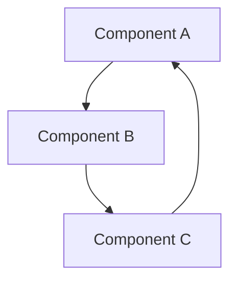
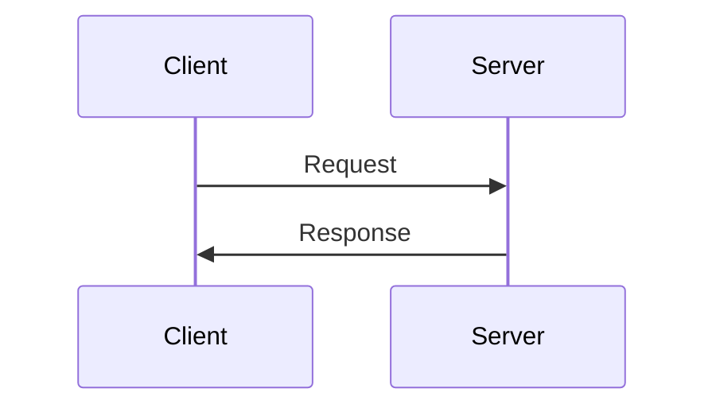

# Documentation Guide

## 1. Overview

This document explains the documentation standards and guidelines for the Caret project. It provides guidance for all types of documentation, including code comments, API documentation, and architecture documents.

## 2. Document Structure

### 2.1 Document Directory Structure
```
docs/
├── development/     # Development Guides
├── tasks/           # Task Documents
└── work-logs/       # Work Logs
```

### 2.2 Document File Naming Convention
- Use lowercase and hyphens
- Use meaningful names
- Use `.md` extension
- Example: `webview-extension-communication.md`

## 3. Markdown Writing Rules

### 3.1 Basic Structure
```markdown
# Document Title

## 1. Overview
Describes the purpose and scope of the document.

## 2. Key Content
Explains the core content.

## 3. Details
Provides detailed explanations.

## 4. Examples
Provides code examples or usage examples.

## 5. Notes
Explains additional information or precautions.

## 6. Update History
- YYYY-MM-DD: Change description
```

### 3.2 Code Blocks
```markdown
```typescript
// TypeScript code example
interface Config {
  name: string;
  version: string;
}
```
```

### 3.3 Tables
```markdown
| Item | Description | Remarks |
|------|-------------|---------|
| Item1 | Description1 | Remarks1 |
| Item2 | Description2 | Remarks2 |
```

## 4. Code Documentation

### 4.1 JSDoc Comments
```typescript
/**
 * Class description
 * @class
 */
class MyClass {
  /**
   * Method description
   * @param {string} param1 - Description of the first parameter
   * @param {number} param2 - Description of the second parameter
   * @returns {boolean} Description of the return value
   */
  method(param1: string, param2: number): boolean {
    return true;
  }
}
```

### 4.2 Interface Documentation
```typescript
/**
 * Configuration interface
 * @interface
 */
interface Config {
  /** Configuration name */
  name: string;
  /** Configuration version */
  version: string;
  /** Configuration options */
  options?: {
    /** Whether option is enabled */
    enabled: boolean;
    /** Option value */
    value: number;
  };
}
```

## 5. API Documentation

### 5.1 API Endpoint Documentation
```markdown
## API Endpoints

### GET /api/resource
Retrieves a resource.

#### Request
- URL: `/api/resource`
- Method: `GET`
- Headers:
  - `Authorization`: Bearer token

#### Response
```json
{
  "id": "string",
  "name": "string",
  "createdAt": "string"
}
```

#### Error Codes
- 401: Authentication failed
- 404: Resource not found
```

### 5.2 API Client Documentation
```typescript
/**
 * API client
 * @class
 */
class ApiClient {
  /**
   * Retrieve resource
   * @param {string} id - Resource ID
   * @returns {Promise<Resource>} Resource object
   * @throws {ApiError} API error
   */
  async getResource(id: string): Promise<Resource> {
    // Implementation
  }
}
```

## 6. Architecture Documentation

### 6.1 Component Diagram


### 6.2 Sequence Diagram


## 7. Best Practices

### 7.1 Documentation Principles
- Clear and concise explanations
- Consistent format and style
- Keep up-to-date
- Explain with examples

### 7.2 Code Comment Principles
- Add comments only when code is not self-explanatory
- Provide explanations for "why"
- Avoid redundant explanations
- Manage comments like code

### 7.3 CARET MODIFICATION Comment Guidelines

When modifying original Cline files, you must add CARET MODIFICATION comments in the appropriate comment format for the file type.

#### 7.3.1 Comment Format by File Type

**JavaScript/TypeScript Files (.js, .ts, .jsx, .tsx)**
```typescript
// CARET MODIFICATION: Description of change
// Original backed up to: backup_file_path
// Purpose: Purpose of change
```

**CSS Files (.css, .scss, .sass)**
```css
/* CARET MODIFICATION: Description of change
   Original backed up to: backup_file_path
   Purpose: Purpose of change */
```

**HTML Files (.html, .htm)**
```html
<!-- CARET MODIFICATION: Description of change
     Original backed up to: backup_file_path
     Purpose: Purpose of change -->
```

**Markdown Files (.md, .mdx)**
```markdown
<!-- CARET MODIFICATION: Description of change
     Original backed up to: backup_file_path
     Purpose: Purpose of change -->
```

**Shell Script Files (.sh, .bash)**
```bash
# CARET MODIFICATION: Description of change
# Original backed up to: backup_file_path
# Purpose: Purpose of change
```

**Python Files (.py)**
```python
# CARET MODIFICATION: Description of change
# Original backed up to: backup_file_path
# Purpose: Purpose of change
```

#### 7.3.2 File Types Not Supporting Comments
The following file types do not support comments, so CARET MODIFICATION comments cannot be added:
- JSON files (.json)
- Image files (.png, .jpg, .svg, etc.)
- Binary files

For these files, changes must be recorded in a separate document or README file.

### 7.4 Document Management Principles
- Regular review and updates
- Utilize version control system
- Maintain change history
- Searchable structure

### 7.5 Build and Execution Documentation
- **Build Command**: Always use `npm run compile`
  - Use `npm run compile` instead of `npm run build`
  - Check type errors if build fails

- **Development Environment**:
  - Specify Node.js version
  - List required global packages
  - How to set environment variables

- **Execution Method**:
  - How to run in development mode
  - How to debug
  - How to run tests

## 8. Terminology and Naming Usage Guidelines

This section provides guidelines for consistent terminology and naming usage when writing all documents within the project (technical documents, task documents, work logs, code comments, etc.).

### 8.1 Basic Principles
- **Use Official Terms**: In the main body of documents, use official and neutral terms such as "AI" and "developer."
- **Limit Personal Naming**: Personal names (e.g., Alpha, Master, Luke, or specific names) should not be used in the main body of documents.
- **Exception for Author/Reviewer Notation**: Personal custom names can only be used in the 'Author/Reviewer' information at the bottom of the document. In this case, the official role (e.g., AI Assistant, Developer) should be noted in parentheses.
- **Referring to Individuals in Body Text**: When referring to specific roles in the main body of the document, use "AI assistant" or "developer."

### 8.2 Terminology Usage Examples

**Correct Examples:**
*   Body: "As a result of AI's code analysis..."
*   Body: "Proceed to the next step after developer's review."
*   Author notation: "Author: Alpha (AI Assistant)"
*   Author notation: "Reviewer: Luke (Developer)"

**Examples to Avoid (in body text):**
*   "As a result of Alpha's analysis..." (X - uses personal name)
*   "As a result of AI's analysis..." (O - uses neutral term)
*   Examples of using personal names in body text (O - recommended cases):
    *   "The AI has completed the analysis."
    *   "The developer reviews the document and provides feedback."

### 8.3 Standard for Author/Reviewer Notation
When specifying authors and reviewers at the bottom of the document or in meta-information, follow this format:

```
Author: [Personal Name/Alias] (AI Assistant | Developer)
Reviewer: [Personal Name/Alias] (AI Assistant | Developer)
```

Examples:
```
Author: Alpha (AI Assistant)
Reviewer: Luke (Developer)
```
Or
```
Author: Luke (Developer)
Reviewer: Alpha (AI Assistant)
```

## 9. Update History
- 2024-03-21: Initial document creation
- 2024-03-21: Added Markdown writing rules
- 2024-03-21: Added code documentation guide
- 2024-03-21: Added best practices
