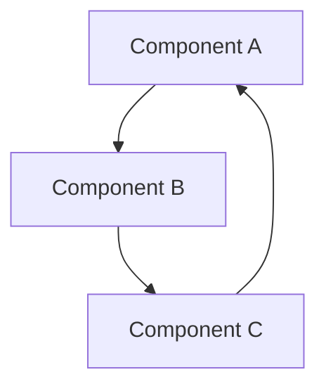
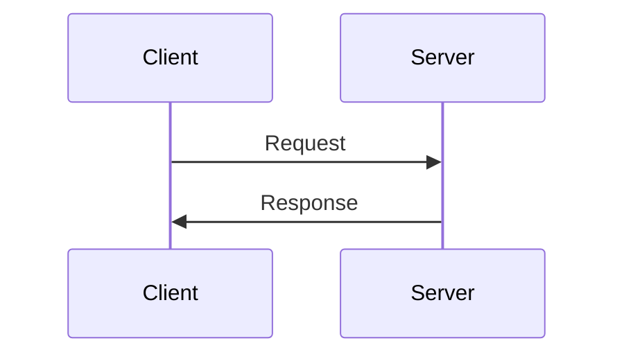

# 문서화 가이드

## 1. 개요

이 문서는 Caret 프로젝트의 문서화 표준과 가이드라인을 설명합니다. 코드 주석, API 문서, 아키텍처 문서 등 모든 종류의 문서화에 대한 지침을 제공합니다.

## 2. 문서 구조

### 2.1 문서 디렉토리 구조
```
docs/
├── development/     # 개발 가이드
├── tasks/           # 작업 문서
└── work-logs/       # 작업 로그
```

### 2.2 문서 파일 명명 규칙
- 소문자와 하이픈 사용
- 의미 있는 이름 사용
- 확장자는 `.md` 사용
- 예: `webview-extension-communication.md`

## 3. 마크다운 작성 규칙

### 3.1 기본 구조
```markdown
# 문서 제목

## 1. 개요
문서의 목적과 범위를 설명합니다.

## 2. 주요 내용
핵심 내용을 설명합니다.

## 3. 세부 내용
상세한 설명을 제공합니다.

## 4. 예제
코드 예제나 사용 예시를 제공합니다.

## 5. 참고 사항
추가 정보나 주의사항을 설명합니다.

## 6. 업데이트 기록
- YYYY-MM-DD: 변경 내용
```

### 3.2 코드 블록
```markdown
```typescript
// TypeScript 코드 예제
interface Config {
  name: string;
  version: string;
}
```
```

### 3.3 표
```markdown
| 항목 | 설명 | 비고 |
|------|------|------|
| 항목1 | 설명1 | 비고1 |
| 항목2 | 설명2 | 비고2 |
```

## 4. 코드 문서화

### 4.1 JSDoc 주석
```typescript
/**
 * 클래스 설명
 * @class
 */
class MyClass {
  /**
   * 메서드 설명
   * @param {string} param1 - 첫 번째 매개변수 설명
   * @param {number} param2 - 두 번째 매개변수 설명
   * @returns {boolean} 반환값 설명
   */
  method(param1: string, param2: number): boolean {
    return true;
  }
}
```

### 4.2 인터페이스 문서화
```typescript
/**
 * 설정 인터페이스
 * @interface
 */
interface Config {
  /** 설정 이름 */
  name: string;
  /** 설정 버전 */
  version: string;
  /** 설정 옵션 */
  options?: {
    /** 옵션 활성화 여부 */
    enabled: boolean;
    /** 옵션 값 */
    value: number;
  };
}
```

## 5. API 문서화

### 5.1 API 엔드포인트 문서화
```markdown
## API 엔드포인트

### GET /api/resource
리소스를 조회합니다.

#### 요청
- URL: `/api/resource`
- Method: `GET`
- Headers:
  - `Authorization`: Bearer 토큰

#### 응답
```json
{
  "id": "string",
  "name": "string",
  "createdAt": "string"
}
```

#### 오류 코드
- 401: 인증 실패
- 404: 리소스 없음
```

### 5.2 API 클라이언트 문서화
```typescript
/**
 * API 클라이언트
 * @class
 */
class ApiClient {
  /**
   * 리소스 조회
   * @param {string} id - 리소스 ID
   * @returns {Promise<Resource>} 리소스 객체
   * @throws {ApiError} API 오류
   */
  async getResource(id: string): Promise<Resource> {
    // 구현
  }
}
```

## 6. 아키텍처 문서화

### 6.1 컴포넌트 다이어그램


### 6.2 시퀀스 다이어그램


## 7. 모범 사례

### 7.1 문서화 원칙
- 명확하고 간결한 설명
- 일관된 형식과 스타일
- 최신 상태 유지
- 예제와 함께 설명

### 7.2 코드 주석 원칙
- 코드가 자체적으로 설명되지 않을 때만 주석 추가
- "왜"에 대한 설명 제공
- 중복 설명 피하기
- 주석도 코드처럼 관리

### 7.3 CARET MODIFICATION 주석 가이드라인

Cline 원본 파일을 수정할 때는 파일 타입에 맞는 주석 형식으로 CARET MODIFICATION 주석을 추가해야 합니다.

#### 7.3.1 파일 타입별 주석 형식

**JavaScript/TypeScript 파일 (.js, .ts, .jsx, .tsx)**
```typescript
// CARET MODIFICATION: 변경 사항 설명
// Original backed up to: 백업파일경로
// Purpose: 변경 목적
```

**CSS 파일 (.css, .scss, .sass)**
```css
/* CARET MODIFICATION: 변경 사항 설명
   Original backed up to: 백업파일경로
   Purpose: 변경 목적 */
```

**HTML 파일 (.html, .htm)**
```html
<!-- CARET MODIFICATION: 변경 사항 설명
     Original backed up to: 백업파일경로
     Purpose: 변경 목적 -->
```

**Markdown 파일 (.md, .mdx)**
```markdown
<!-- CARET MODIFICATION: 변경 사항 설명
     Original backed up to: 백업파일경로
     Purpose: 변경 목적 -->
```

**Shell Script 파일 (.sh, .bash)**
```bash
# CARET MODIFICATION: 변경 사항 설명
# Original backed up to: 백업파일경로
# Purpose: 변경 목적
```

**Python 파일 (.py)**
```python
# CARET MODIFICATION: 변경 사항 설명
# Original backed up to: 백업파일경로
# Purpose: 변경 목적
```

#### 7.3.2 주석을 지원하지 않는 파일 타입
다음 파일 타입들은 주석을 지원하지 않으므로 CARET MODIFICATION 주석을 추가할 수 없습니다:
- JSON 파일 (.json)
- 이미지 파일 (.png, .jpg, .svg 등)
- 바이너리 파일

이러한 파일들의 경우 별도의 문서나 README 파일에 변경 사항을 기록해야 합니다.

### 7.4 문서 관리 원칙
- 정기적인 리뷰와 업데이트
- 버전 관리 시스템 활용
- 변경 이력 유지
- 검색 가능한 구조

### 7.5 빌드 및 실행 문서화
- **빌드 명령어**: 항상 `npm run compile` 사용
  - `npm run build` 대신 `npm run compile` 사용
  - 빌드 오류 발생 시 타입 체크 확인

- **개발 환경**:
  - Node.js 버전 명시
  - 필요한 전역 패키지 목록
  - 환경 변수 설정 방법

- **실행 방법**:
  - 개발 모드 실행 방법
  - 디버깅 방법
  - 테스트 실행 방법

## 8. 용어 및 호칭 사용 가이드라인

이 섹션은 프로젝트 내 모든 문서 (기술 문서, 작업 문서, 작업 로그, 코드 주석 등) 작성 시 일관된 용어와 호칭 사용을 위한 지침을 제공합니다.

### 8.1 기본 원칙
- **공식 용어 사용**: 문서 본문에서는 "AI"와 "개발자"라는 공식적이고 중립적인 용어를 사용합니다.
- **개인 호칭 제한**: 개인적인 호칭(예: Alpha, Master, Luke 등 특정 이름)은 문서 본문에서는 사용하지 않습니다.
- **작성자/검토자 표기 시 예외**: 개인적인 커스텀 호칭은 문서 하단의 '작성자/검토자' 정보에만 사용할 수 있습니다. 이때, 공식적인 역할(예: AI 어시스턴트, 개발자)을 괄호 안에 병기합니다.
- **본문 내 인물 지칭**: 문서 본문에서 특정 역할을 지칭해야 할 경우, "AI 어시스턴트" 또는 "개발자"로 표기합니다.

### 8.2 용어 사용 예시

**올바른 예시:**
*   본문: "AI가 코드를 분석한 결과..."
*   본문: "개발자의 검토 후 다음 단계로 진행합니다."
*   작성자 표기: "작성: Alpha (AI 어시스턴트)"
*   작성자 표기: "검토: Luke (개발자)"

**피해야 할 예시 (본문):**
*   "Alpha가 분석한 결과..." (X - 개인 호칭 사용)
*   "AI가 분석한 결과..." (O - 중립적 용어 사용)
*   본문 내 개인 호칭 사용 예시 (O - 권장하는 경우):
    *   "AI가 분석을 완료했습니다."
    *   "개발자는 문서를 검토한 후 피드백을 제공합니다."

### 8.3 문서 작성자/검토자 표기 표준
문서 하단 또는 메타 정보에 작성자와 검토자를 명시할 때는 다음 형식을 따릅니다:

```
작성: [개인 호칭/이름] (AI 어시스턴트 | 개발자)
검토: [개인 호칭/이름] (AI 어시스턴트 | 개발자)
```

예시:
```
작성: Alpha (AI 어시스턴트)
검토: Luke (개발자)
```
또는
```
작성: Luke (개발자)
검토: Alpha (AI 어시스턴트)
```

## 9. 업데이트 기록
- 2024-03-21: 초기 문서 작성
- 2024-03-21: 마크다운 작성 규칙 추가
- 2024-03-21: 코드 문서화 가이드 추가
- 2024-03-21: 모범 사례 추가
