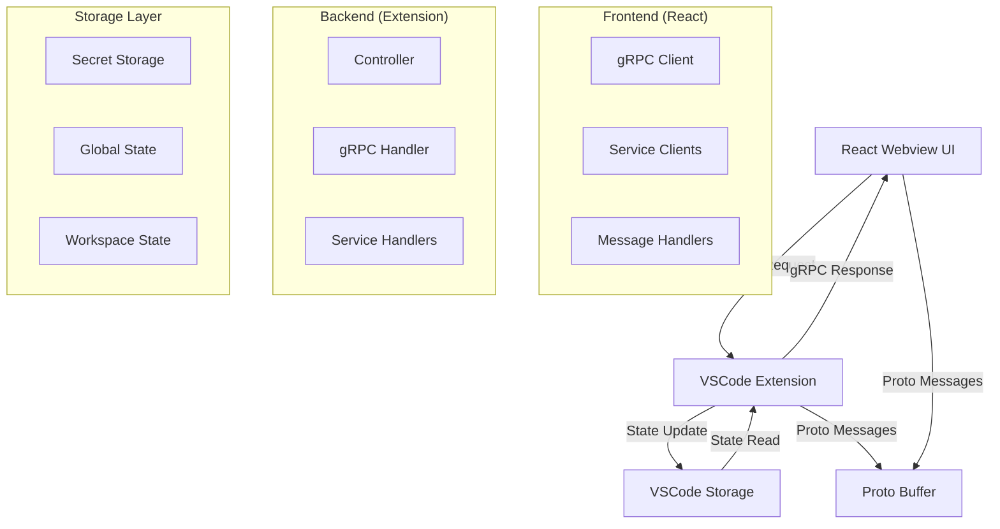

# Cline/Caret Message Processing Architecture Guide

## 1. Overview

Cline uses a **gRPC-based message processing architecture** to handle communication between the frontend (React Webview) and the backend (VSCode Extension). This document systematically analyzes Cline's message processing structure and explains the patterns to follow during Caret development.

## 2. Overall Architecture



## 3. Message Processing Layers

### 3.1 Frontend (React Webview)

#### gRPC Client Creation

```typescript
// webview-ui/src/services/grpc-client-base.ts
export function createGrpcClient<T extends ProtoService>(service: T): GrpcClientType<T> {
	// Supports Unary and Streaming methods
	// Automatic type inference and Proto conversion
}
```

#### Using Service Clients

```typescript
// Example: Update API Configuration
import { ModelsServiceClient } from "@/services/grpc-client"
import { UpdateApiConfigurationRequest } from "@shared/proto/models"

await ModelsServiceClient.updateApiConfigurationProto(
	UpdateApiConfigurationRequest.create({
		apiConfiguration: convertApiConfigurationToProto(apiConfig),
	}),
)
```

#### Streaming Subscription

```typescript
// Example: Subscribe to state changes
StateServiceClient.subscribeToState(EmptyRequest.create({}), {
	onResponse: (response) => {
		// Process state update
		setExtensionState(response)
	},
	onError: (error) => console.error("State subscription error:", error),
	onComplete: () => console.log("State subscription completed"),
})
```

### 3.2 Backend (VSCode Extension)

#### Controller Message Processing

```typescript
// src/core/controller/index.ts
async handleWebviewMessage(message: WebviewMessage) {
    switch (message.type) {
        case "grpc_request": {
            if (message.grpc_request) {
                await handleGrpcRequest(this, message.grpc_request)
            }
            break
        }
        case "grpc_request_cancel": {
            if (message.grpc_request_cancel) {
                await handleGrpcRequestCancel(this, message.grpc_request_cancel)
            }
            break
        }
        // Legacy message types...
    }
}
```

#### gRPC Handler

```typescript
// src/core/controller/grpc-handler.ts
export async function handleGrpcRequest(
	controller: Controller,
	request: {
		service: string
		method: string
		message: any
		request_id: string
		is_streaming?: boolean
	},
) {
	// Route to service-specific handler
	// Handle Unary vs Streaming
	// Error handling and response transmission
}
```

#### Service Handler Registration

```typescript
// src/core/controller/grpc-service-config.ts
const serviceHandlers = {
	"caret.ModelsService": {
		requestHandler: async (controller, method, message) => {
			// Handle Unary requests
		},
		streamingHandler: async (controller, method, message, responseStream) => {
			// Handle Streaming requests
		},
	},
}
```

### 3.3 Storage Layer

#### API Configuration Storage

```typescript
// src/core/storage/state.ts
export async function updateApiConfiguration(context: vscode.ExtensionContext, apiConfiguration: ApiConfiguration) {
	// Secret Storage: API keys
	await storeSecret(context, "geminiApiKey", apiConfiguration.geminiApiKey)

	// Workspace State: Settings values
	await updateWorkspaceState(context, "apiProvider", apiConfiguration.apiProvider)

	// Global State: Global settings
	await updateGlobalState(context, "userInfo", userInfo)
}
```

## 4. Message Type Classification

### 4.1 Current Message Types (WebviewMessage)

#### Legacy Messages (Directly Processed)

```typescript
type LegacyMessageTypes =
	| "authStateChanged"
	| "fetchUserCreditsData"
	| "fetchMcpMarketplace"
	| "telemetrySetting"
	| "clearAllTaskHistory"
	| "openExternalLink"
	| "notifyCaretAccount"
```

#### gRPC Messages (Delegated to gRPC Handler)

```typescript
type GrpcMessageTypes =
	| "grpc_request" // All gRPC requests
	| "grpc_request_cancel" // gRPC request cancellation
```

### 4.2 gRPC Service Classification

#### Core Services

-   **StateService**: Manages overall Extension state.
-   **ModelsService**: Manages API Configuration and models.
-   **TaskService**: Manages task creation, execution, and response processing.
-   **UiService**: Manages UI events and subscriptions.
-   **FileService**: Manages file system operations.
-   **McpService**: Manages MCP servers.

## 5. Communication Patterns

### 5.1 Unary Pattern (Request-Response)

```typescript
// Frontend
const response = await ModelsServiceClient.updateApiConfigurationProto(request)

// Backend
async function updateApiConfigurationProto(controller, request) {
	await updateApiConfiguration(controller.context, request.apiConfiguration)
	return Empty.create({})
}
```

### 5.2 Streaming Pattern (Subscription-Stream)

```typescript
// Frontend
const unsubscribe = StateServiceClient.subscribeToState(request, {
	onResponse: (state) => setExtensionState(state),
	onError: (error) => console.error(error),
	onComplete: () => console.log("Completed"),
})

// Backend
async function subscribeToState(controller, request, responseStream) {
	// Call responseStream on each state change
	sendStateUpdate(responseStream)
}
```

### 5.3 Event-Based Pattern

```typescript
// Event triggered in Backend
export async function sendStateUpdate(state: ExtensionState) {
	// Send state to all active subscribers
	activeStateSubscriptions.forEach((stream) => {
		stream(state, false) // Continue stream
	})
}
```

## 6. Development Guidelines

### 6.1 When Adding New Features

#### ❌ Incorrect Method (Adding Legacy Messages)

```typescript
// Add new type to WebviewMessage (not recommended)
type: "newFeature"

// Directly process in Controller (not recommended)
case "newFeature": {
    await handleNewFeature(message.data)
    break
}
```

#### ✅ Correct Method (Using gRPC Service)

```typescript
// 1. Proto Definition
service NewFeatureService {
    rpc processNewFeature(NewFeatureRequest) returns (NewFeatureResponse);
}

// 2. Register Service Handler
"caret.NewFeatureService": {
    requestHandler: async (controller, method, message) => {
        return await processNewFeature(controller, message)
    }
}

// 3. Use in Frontend
await NewFeatureServiceClient.processNewFeature(request)
```

### 6.2 State Management Patterns

#### Read-Only State

```typescript
// State subscription via gRPC
const { extensionState } = useExtensionState()
```

#### State Change

```typescript
// State update via gRPC
await StateServiceClient.updateSettings(request)
```

### 6.3 Error Handling

#### Frontend

```typescript
try {
	const response = await ServiceClient.method(request)
	// Handle success
} catch (error) {
	console.error("gRPC Error:", error.message)
	// Display error UI
}
```

#### Backend

```typescript
async function serviceMethod(controller, request) {
	try {
		// Business logic
		return response
	} catch (error) {
		// Errors are automatically handled by gRPC Handler
		throw error
	}
}
```

## 7. Migration Guide

### 7.1 From Legacy Messages to gRPC

#### Before (Legacy)

```typescript
// Frontend
vscode.postMessage({ type: "apiConfiguration", apiConfiguration })

// Backend
case "apiConfiguration": {
    await updateApiConfiguration(message.apiConfiguration)
    break
}
```

#### After (gRPC)

```typescript
// Frontend
await ModelsServiceClient.updateApiConfigurationProto(
	UpdateApiConfigurationRequest.create({
		apiConfiguration: convertApiConfigurationToProto(apiConfig),
	}),
)

// Backend is automatically handled by gRPC Handler
```

### 7.2 Precautions for Caret Extension

1.  **Preserve Cline Originals**: gRPC services use Cline originals.
2.  **Caret Extension**: Add new gRPC services if necessary.
3.  **Type Safety**: Ensure type safety through Proto definitions.
4.  **Testing**: Verify gRPC flow in E2E tests.

## 8. Performance and Optimization

### 8.1 Streaming Optimization

-   Prevent unnecessary subscriptions.
-   Unsubscribe on component unmount.
-   Prevent excessive updates through debouncing.

### 8.2 Memory Management

-   Automatic cleanup via gRPC request registry.
-   Proper termination of streaming connections.
-   Prevent memory leaks.

## 9. Debugging Guide

### 9.1 gRPC Message Tracking

```typescript
// Log gRPC messages in development mode
console.log("[gRPC Request]", service, method, message)
console.log("[gRPC Response]", response)
```

### 9.2 State Synchronization Check

```typescript
// Track state changes
useEffect(() => {
	console.log("[State Update]", extensionState)
}, [extensionState])
```

## 10. Conclusion

Cline's gRPC-based message processing architecture offers:

-   **Type Safety**: Strong typing support through Proto Buffer.
-   **Extensibility**: Easy to add new services.
-   **Performance**: Real-time updates through streaming.
-   **Maintainability**: Clear service separation and responsibility distribution.

During Caret development, it is recommended to follow this pattern to **maximize the utilization of existing gRPC services** and add new services only when necessary.
