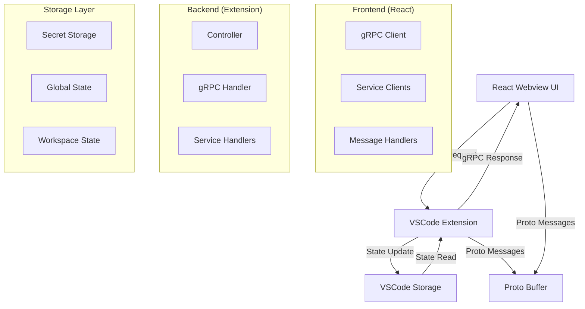

# Cline/Caret 메시지 처리 아키텍처 가이드

## 1. 개요

Cline은 **gRPC 기반의 메시지 처리 아키텍처**를 사용하여 프론트엔드(React Webview)와 백엔드(VSCode Extension) 간의 통신을 처리합니다. 이 문서는 Cline의 메시지 처리 구조를 체계적으로 분석하고, Caret 개발 시 따라야 할 패턴을 설명합니다.

## 2. 전체 아키텍처



## 3. 메시지 처리 레이어

### 3.1 프론트엔드 (React Webview)

#### gRPC Client 생성

```typescript
// webview-ui/src/services/grpc-client-base.ts
export function createGrpcClient<T extends ProtoService>(service: T): GrpcClientType<T> {
	// Unary 및 Streaming 메서드 지원
	// 자동 타입 추론 및 Proto 변환
}
```

#### 서비스 클라이언트 사용

```typescript
// 예: API Configuration 업데이트
import { ModelsServiceClient } from "@/services/grpc-client"
import { UpdateApiConfigurationRequest } from "@shared/proto/models"

await ModelsServiceClient.updateApiConfigurationProto(
	UpdateApiConfigurationRequest.create({
		apiConfiguration: convertApiConfigurationToProto(apiConfig),
	}),
)
```

#### 스트리밍 구독

```typescript
// 예: 상태 변경 구독
StateServiceClient.subscribeToState(EmptyRequest.create({}), {
	onResponse: (response) => {
		// 상태 업데이트 처리
		setExtensionState(response)
	},
	onError: (error) => console.error("State subscription error:", error),
	onComplete: () => console.log("State subscription completed"),
})
```

### 3.2 백엔드 (VSCode Extension)

#### Controller 메시지 처리

```typescript
// src/core/controller/index.ts
async handleWebviewMessage(message: WebviewMessage) {
    switch (message.type) {
        case "grpc_request": {
            if (message.grpc_request) {
                await handleGrpcRequest(this, message.grpc_request)
            }
            break
        }
        case "grpc_request_cancel": {
            if (message.grpc_request_cancel) {
                await handleGrpcRequestCancel(this, message.grpc_request_cancel)
            }
            break
        }
        // 레거시 메시지 타입들...
    }
}
```

#### gRPC Handler

```typescript
// src/core/controller/grpc-handler.ts
export async function handleGrpcRequest(
	controller: Controller,
	request: {
		service: string
		method: string
		message: any
		request_id: string
		is_streaming?: boolean
	},
) {
	// 서비스별 핸들러 라우팅
	// Unary vs Streaming 처리
	// 에러 처리 및 응답 전송
}
```

#### 서비스 핸들러 등록

```typescript
// src/core/controller/grpc-service-config.ts
const serviceHandlers = {
	"caret.ModelsService": {
		requestHandler: async (controller, method, message) => {
			// Unary 요청 처리
		},
		streamingHandler: async (controller, method, message, responseStream) => {
			// Streaming 요청 처리
		},
	},
}
```

### 3.3 저장소 레이어

#### API Configuration 저장

```typescript
// src/core/storage/state.ts
export async function updateApiConfiguration(context: vscode.ExtensionContext, apiConfiguration: ApiConfiguration) {
	// Secret Storage: API 키들
	await storeSecret(context, "geminiApiKey", apiConfiguration.geminiApiKey)

	// Workspace State: 설정값들
	await updateWorkspaceState(context, "apiProvider", apiConfiguration.apiProvider)

	// Global State: 전역 설정들
	await updateGlobalState(context, "userInfo", userInfo)
}
```

## 4. 메시지 타입 분류

### 4.1 현재 메시지 타입 (WebviewMessage)

#### 레거시 메시지 (직접 처리)

```typescript
type LegacyMessageTypes =
	| "authStateChanged"
	| "fetchUserCreditsData"
	| "fetchMcpMarketplace"
	| "telemetrySetting"
	| "clearAllTaskHistory"
	| "openExternalLink"
	| "notifyCaretAccount"
```

#### gRPC 메시지 (gRPC Handler 위임)

```typescript
type GrpcMessageTypes =
	| "grpc_request" // 모든 gRPC 요청
	| "grpc_request_cancel" // gRPC 요청 취소
```

### 4.2 gRPC 서비스 분류

#### 핵심 서비스들

-   **StateService**: 전체 Extension 상태 관리
-   **ModelsService**: API Configuration 및 모델 관리
-   **TaskService**: 작업 생성, 실행, 응답 처리
-   **UiService**: UI 이벤트 및 구독 관리
-   **FileService**: 파일 시스템 작업
-   **McpService**: MCP 서버 관리

## 5. 통신 패턴

### 5.1 Unary 패턴 (요청-응답)

```typescript
// 프론트엔드
const response = await ModelsServiceClient.updateApiConfigurationProto(request)

// 백엔드
async function updateApiConfigurationProto(controller, request) {
	await updateApiConfiguration(controller.context, request.apiConfiguration)
	return Empty.create({})
}
```

### 5.2 Streaming 패턴 (구독-스트림)

```typescript
// 프론트엔드
const unsubscribe = StateServiceClient.subscribeToState(request, {
	onResponse: (state) => setExtensionState(state),
	onError: (error) => console.error(error),
	onComplete: () => console.log("완료"),
})

// 백엔드
async function subscribeToState(controller, request, responseStream) {
	// 상태 변경 시마다 responseStream 호출
	sendStateUpdate(responseStream)
}
```

### 5.3 이벤트 기반 패턴

```typescript
// 백엔드에서 이벤트 발생
export async function sendStateUpdate(state: ExtensionState) {
	// 모든 활성 구독자에게 상태 전송
	activeStateSubscriptions.forEach((stream) => {
		stream(state, false) // 스트림 계속
	})
}
```

## 6. 개발 가이드라인

### 6.1 새로운 기능 추가 시

#### ❌ 잘못된 방법 (레거시 메시지 추가)

```typescript
// WebviewMessage에 새 타입 추가 (권장하지 않음)
type: "newFeature"

// Controller에서 직접 처리 (권장하지 않음)
case "newFeature": {
    await handleNewFeature(message.data)
    break
}
```

#### ✅ 올바른 방법 (gRPC 서비스 사용)

```typescript
// 1. Proto 정의
service NewFeatureService {
    rpc processNewFeature(NewFeatureRequest) returns (NewFeatureResponse);
}

// 2. 서비스 핸들러 등록
"caret.NewFeatureService": {
    requestHandler: async (controller, method, message) => {
        return await processNewFeature(controller, message)
    }
}

// 3. 프론트엔드에서 사용
await NewFeatureServiceClient.processNewFeature(request)
```

### 6.2 상태 관리 패턴

#### 읽기 전용 상태

```typescript
// gRPC를 통한 상태 구독
const { extensionState } = useExtensionState()
```

#### 상태 변경

```typescript
// gRPC를 통한 상태 업데이트
await StateServiceClient.updateSettings(request)
```

### 6.3 에러 처리

#### 프론트엔드

```typescript
try {
	const response = await ServiceClient.method(request)
	// 성공 처리
} catch (error) {
	console.error("gRPC 에러:", error.message)
	// 에러 UI 표시
}
```

#### 백엔드

```typescript
async function serviceMethod(controller, request) {
	try {
		// 비즈니스 로직
		return response
	} catch (error) {
		// 에러는 gRPC Handler가 자동으로 처리
		throw error
	}
}
```

## 7. 마이그레이션 가이드

### 7.1 레거시 메시지에서 gRPC로

#### Before (레거시)

```typescript
// 프론트엔드
vscode.postMessage({ type: "apiConfiguration", apiConfiguration })

// 백엔드
case "apiConfiguration": {
    await updateApiConfiguration(message.apiConfiguration)
    break
}
```

#### After (gRPC)

```typescript
// 프론트엔드
await ModelsServiceClient.updateApiConfigurationProto(
	UpdateApiConfigurationRequest.create({
		apiConfiguration: convertApiConfigurationToProto(apiConfig),
	}),
)

// 백엔드는 자동으로 gRPC Handler가 처리
```

### 7.2 Caret 확장 시 주의사항

1. **Cline 원본 유지**: gRPC 서비스는 Cline 원본 사용
2. **Caret 확장**: 필요시 새로운 gRPC 서비스 추가
3. **타입 안전성**: Proto 정의를 통한 타입 안전성 확보
4. **테스트**: E2E 테스트에서 gRPC 플로우 검증

## 8. 성능 및 최적화

### 8.1 스트리밍 최적화

-   불필요한 구독 방지
-   컴포넌트 언마운트 시 구독 해제
-   디바운싱을 통한 과도한 업데이트 방지

### 8.2 메모리 관리

-   gRPC 요청 레지스트리를 통한 자동 정리
-   스트리밍 연결의 적절한 종료
-   메모리 누수 방지

## 9. 디버깅 가이드

### 9.1 gRPC 메시지 추적

```typescript
// 개발 모드에서 gRPC 메시지 로깅
console.log("[gRPC Request]", service, method, message)
console.log("[gRPC Response]", response)
```

### 9.2 상태 동기화 확인

```typescript
// 상태 변경 추적
useEffect(() => {
	console.log("[State Update]", extensionState)
}, [extensionState])
```

## 10. 결론

Cline의 gRPC 기반 메시지 처리 아키텍처는:

-   **타입 안전성**: Proto Buffer를 통한 강타입 지원
-   **확장성**: 새로운 서비스 쉽게 추가 가능
-   **성능**: 스트리밍을 통한 실시간 업데이트
-   **유지보수성**: 명확한 서비스 분리와 책임 분담

Caret 개발 시에는 이 패턴을 따라 **기존 gRPC 서비스를 최대한 활용**하고, 필요한 경우에만 새로운 서비스를 추가하는 것을 권장합니다.
