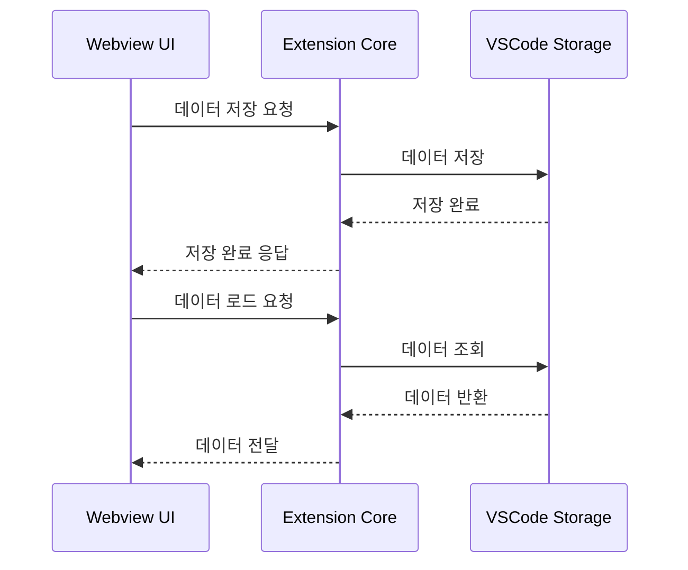

# UI ↔ Storage 흐름 가이드 (Core)

## 1. 개요

이 문서는 Caret의 UI와 Storage 간의 데이터 흐름을 설명합니다. Extension의 코어 컴포넌트에서 데이터를 저장하고 로드하는 방법을 다룹니다.

## 2. 데이터 흐름 구조

### 2.1 기본 흐름


### 2.2 컴포넌트 구조
```
src/
└── core/
    ├── storage/
    │   ├── StorageManager.ts
    │   └── types.ts
    └── webview/
        ├── CaretProvider.ts
        └── messageHandlers.ts
```

## 3. Storage Manager

### 3.1 기본 구현
```typescript
// src/core/storage/StorageManager.ts
export class StorageManager {
  constructor(private context: vscode.ExtensionContext) {}

  // 데이터 저장
  async set(key: string, value: any): Promise<void> {
    await this.context.globalState.update(key, value);
  }

  // 데이터 로드
  async get<T>(key: string): Promise<T | undefined> {
    return this.context.globalState.get<T>(key);
  }

  // 데이터 삭제
  async delete(key: string): Promise<void> {
    await this.context.globalState.update(key, undefined);
  }
}
```

### 3.2 확장 구현
```typescript
// src/core/storage/StorageManager.ts
export class StorageManager {
  // ... 기본 구현 ...

  // 객체 저장
  async setObject<T extends object>(key: string, value: T): Promise<void> {
    await this.set(key, JSON.stringify(value));
  }

  // 객체 로드
  async getObject<T extends object>(key: string): Promise<T | undefined> {
    const data = await this.get<string>(key);
    return data ? JSON.parse(data) : undefined;
  }

  // 배열 저장
  async setArray<T>(key: string, value: T[]): Promise<void> {
    await this.setObject(key, value);
  }

  // 배열 로드
  async getArray<T>(key: string): Promise<T[] | undefined> {
    return this.getObject<T[]>(key);
  }
}
```

## 4. 메시지 처리

### 4.1 메시지 타입
```typescript
// src/core/webview/types.ts
export interface StorageMessage {
  type: 'storage';
  action: 'set' | 'get' | 'delete';
  key: string;
  value?: any;
}

export interface StorageResponse {
  type: 'storage';
  action: 'set' | 'get' | 'delete';
  key: string;
  value?: any;
  error?: string;
}
```

### 4.2 메시지 핸들러
```typescript
// src/core/webview/messageHandlers.ts
export class StorageMessageHandler {
  constructor(private storageManager: StorageManager) {}

  async handleMessage(message: StorageMessage): Promise<StorageResponse> {
    try {
      switch (message.action) {
        case 'set':
          await this.storageManager.set(message.key, message.value);
          return { type: 'storage', action: 'set', key: message.key };

        case 'get':
          const value = await this.storageManager.get(message.key);
          return { type: 'storage', action: 'get', key: message.key, value };

        case 'delete':
          await this.storageManager.delete(message.key);
          return { type: 'storage', action: 'delete', key: message.key };

        default:
          throw new Error(`Unknown action: ${message.action}`);
      }
    } catch (error) {
      return {
        type: 'storage',
        action: message.action,
        key: message.key,
        error: error.message
      };
    }
  }
}
```

## 5. 데이터 동기화

### 5.1 상태 관리
```typescript
// src/core/webview/CaretProvider.ts
export class CaretProvider {
  private storageManager: StorageManager;
  private messageHandler: StorageMessageHandler;

  constructor(context: vscode.ExtensionContext) {
    this.storageManager = new StorageManager(context);
    this.messageHandler = new StorageMessageHandler(this.storageManager);
  }

  // 메시지 처리
  async handleMessage(message: any): Promise<void> {
    if (message.type === 'storage') {
      const response = await this.messageHandler.handleMessage(message);
      this.webviewPanel.webview.postMessage(response);
    }
  }
}
```

### 5.2 상태 업데이트
```typescript
// src/core/webview/CaretProvider.ts
export class CaretProvider {
  // ... 이전 구현 ...

  // 상태 업데이트
  async updateState(key: string, value: any): Promise<void> {
    await this.storageManager.set(key, value);
    this.webviewPanel.webview.postMessage({
      type: 'state',
      key,
      value
    });
  }
}
```

## 6. 모범 사례

### 6.1 데이터 저장 원칙
- 적절한 데이터 구조화
- 효율적인 저장소 사용
- 오류 처리
- 동시성 고려

### 6.2 성능 최적화
- 필요한 데이터만 저장
- 주기적인 데이터 정리
- 캐싱 전략
- 배치 처리

### 6.3 보안 고려사항
- 민감 정보 암호화
- 접근 제어
- 데이터 검증
- 오류 로깅

## 7. 업데이트 기록
- 2024-03-21: 초기 문서 작성
- 2024-03-21: Storage Manager 구현 추가
- 2024-03-21: 메시지 처리 로직 추가
- 2024-03-21: 모범 사례 추가
