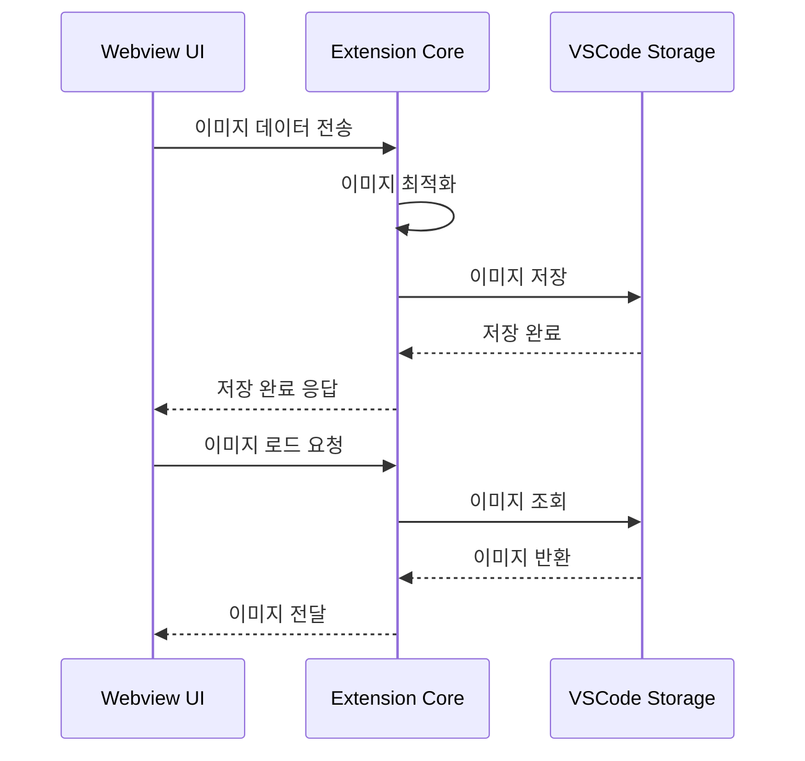

# UI ↔ Storage 흐름 가이드 (Image)

## 1. 개요

이 문서는 Caret의 UI와 Storage 간의 이미지 데이터 흐름을 설명합니다. 이미지 데이터의 저장, 로드, 변환 및 최적화 방법을 다룹니다.

## 2. 이미지 데이터 흐름

### 2.1 기본 흐름


### 2.2 이미지 처리 컴포넌트
```
src/
└── core/
    └── storage/
        ├── ImageManager.ts
        └── imageUtils.ts
```

## 3. 이미지 관리자

### 3.1 기본 구현
```typescript
// src/core/storage/ImageManager.ts
export class ImageManager {
  constructor(
    private context: vscode.ExtensionContext,
    private storageManager: StorageManager
  ) {}

  // 이미지 저장
  async saveImage(key: string, imageData: string): Promise<void> {
    const optimizedImage = await this.optimizeImage(imageData);
    await this.storageManager.set(key, optimizedImage);
  }

  // 이미지 로드
  async loadImage(key: string): Promise<string | undefined> {
    return this.storageManager.get<string>(key);
  }

  // 이미지 삭제
  async deleteImage(key: string): Promise<void> {
    await this.storageManager.delete(key);
  }
}
```

### 3.2 이미지 최적화
```typescript
// src/core/storage/ImageManager.ts
export class ImageManager {
  // ... 기본 구현 ...

  // 이미지 최적화
  private async optimizeImage(imageData: string): Promise<string> {
    // Base64 데이터 추출
    const base64Data = imageData.split(',')[1];
    
    // 이미지 크기 조정
    const resizedImage = await this.resizeImage(base64Data);
    
    // 이미지 품질 조정
    const optimizedImage = await this.compressImage(resizedImage);
    
    return `data:image/jpeg;base64,${optimizedImage}`;
  }

  // 이미지 크기 조정
  private async resizeImage(base64Data: string): Promise<string> {
    // 이미지 크기 조정 로직
    return base64Data;
  }

  // 이미지 압축
  private async compressImage(base64Data: string): Promise<string> {
    // 이미지 압축 로직
    return base64Data;
  }
}
```

## 4. 이미지 유틸리티

### 4.1 이미지 변환
```typescript
// src/core/storage/imageUtils.ts
export class ImageUtils {
  // Base64를 Blob으로 변환
  static base64ToBlob(base64: string): Blob {
    const byteString = atob(base64.split(',')[1]);
    const mimeString = base64.split(',')[0].split(':')[1].split(';')[0];
    
    const ab = new ArrayBuffer(byteString.length);
    const ia = new Uint8Array(ab);
    
    for (let i = 0; i < byteString.length; i++) {
      ia[i] = byteString.charCodeAt(i);
    }
    
    return new Blob([ab], { type: mimeString });
  }

  // Blob을 Base64로 변환
  static async blobToBase64(blob: Blob): Promise<string> {
    return new Promise((resolve, reject) => {
      const reader = new FileReader();
      reader.onloadend = () => resolve(reader.result as string);
      reader.onerror = reject;
      reader.readAsDataURL(blob);
    });
  }
}
```

### 4.2 이미지 검증
```typescript
// src/core/storage/imageUtils.ts
export class ImageUtils {
  // ... 이전 구현 ...

  // 이미지 형식 검증
  static isValidImageFormat(base64: string): boolean {
    const mimeType = base64.split(',')[0].split(':')[1].split(';')[0];
    return ['image/jpeg', 'image/png', 'image/gif'].includes(mimeType);
  }

  // 이미지 크기 검증
  static isValidImageSize(base64: string, maxSizeMB: number): boolean {
    const base64Data = base64.split(',')[1];
    const sizeInBytes = Math.ceil((base64Data.length * 3) / 4);
    const sizeInMB = sizeInBytes / (1024 * 1024);
    return sizeInMB <= maxSizeMB;
  }
}
```

## 5. 메시지 처리

### 5.1 이미지 메시지 타입
```typescript
// src/core/webview/types.ts
export interface ImageMessage {
  type: 'image';
  action: 'save' | 'load' | 'delete';
  key: string;
  data?: string;
}

export interface ImageResponse {
  type: 'image';
  action: 'save' | 'load' | 'delete';
  key: string;
  data?: string;
  error?: string;
}
```

### 5.2 이미지 메시지 핸들러
```typescript
// src/core/webview/messageHandlers.ts
export class ImageMessageHandler {
  constructor(private imageManager: ImageManager) {}

  async handleMessage(message: ImageMessage): Promise<ImageResponse> {
    try {
      switch (message.action) {
        case 'save':
          if (!message.data) throw new Error('Image data is required');
          await this.imageManager.saveImage(message.key, message.data);
          return { type: 'image', action: 'save', key: message.key };

        case 'load':
          const data = await this.imageManager.loadImage(message.key);
          return { type: 'image', action: 'load', key: message.key, data };

        case 'delete':
          await this.imageManager.deleteImage(message.key);
          return { type: 'image', action: 'delete', key: message.key };

        default:
          throw new Error(`Unknown action: ${message.action}`);
      }
    } catch (error) {
      return {
        type: 'image',
        action: message.action,
        key: message.key,
        error: error.message
      };
    }
  }
}
```

## 6. 모범 사례

### 6.1 이미지 처리 원칙
- 적절한 이미지 크기 사용
- 이미지 형식 최적화
- 메모리 사용 최소화
- 비동기 처리 활용

### 6.2 성능 최적화
- 이미지 크기 제한
- 이미지 캐싱
- 지연 로딩
- 배치 처리

### 6.3 보안 고려사항
- 이미지 형식 검증
- 이미지 크기 제한
- 악성 코드 검사
- 접근 제어

## 7. 업데이트 기록
- 2024-03-21: 초기 문서 작성
- 2024-03-21: 이미지 관리자 구현 추가
- 2024-03-21: 이미지 유틸리티 추가
- 2024-03-21: 모범 사례 추가
