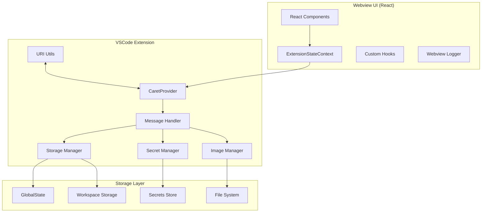
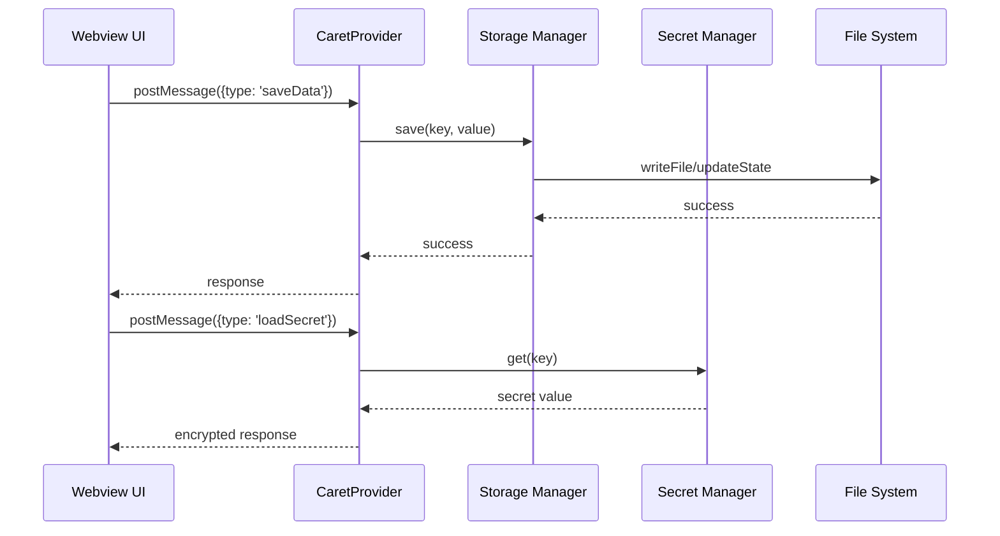

# UI ↔ Storage Flow Integration Guide

## 1. Overview

This document describes the complete data flow between Caret's UI and Storage. It covers all interactions between the frontend (React Webview) and backend (VSCode Extension), including data storage, loading, secret management, image processing, and URI conversion.

## 2. Overall Architecture

### 2.1 System Architecture Diagram



### 2.2 Data Flow



## 3. Webview UI Layer

### 3.1 ExtensionStateContext Implementation

Actual implementation location: `webview-ui/src/context/ExtensionStateContext.tsx`

```typescript
interface ExtensionStateContextType {
  // Data state
  data: Record<string, any>;
  isReady: boolean;

  // Action functions
  saveData: (key: string, value: any) => Promise<void>;
  loadData: (key: string) => Promise<any>;
  saveSecret: (key: string, value: string) => Promise<void>;
  loadSecret: (key: string) => Promise<string | undefined>;
  saveImage: (imageData: string) => Promise<string>;

  // UI state
  theme: string;
  language: string;
  settings: Record<string, any>;
}

export const ExtensionStateContext = createContext<ExtensionStateContextType | null>(null);

const ExtensionStateProvider: React.FC<{ children: React.ReactNode }> = ({ children }) => {
  const [data, setData] = useState<Record<string, any>>({});
  const [isReady, setIsReady] = useState(false);

  // Save data
  const saveData = useCallback(async (key: string, value: any) => {
    try {
      await vscode.postMessage({
        type: 'saveData',
        key,
        value
      });
      setData(prev => ({ ...prev, [key]: value }));
    } catch (error) {
      console.error('Data save failed:', error);
      throw error;
    }
  }, []);

  // Load data
  const loadData = useCallback(async (key: string) => {
    try {
      const response = await vscode.postMessage({
        type: 'loadData',
        key
      });
      return response.value;
    } catch (error) {
      console.error('Data load failed:', error);
      throw error;
    }
  }, []);

  return (
    <ExtensionStateContext.Provider value={{
      data,
      isReady,
      saveData,
      loadData,
      saveSecret,
      loadSecret,
      saveImage,
      theme: 'dark',
      language: 'en', // Changed to 'en' for English documentation context
      settings: {}
    }}>
      {children}
    </ExtensionStateContext.Provider>
  );
};
```

## 4. Extension Layer

### 4.1 CaretProvider Message Handling

Actual implementation location: `caret-src/core/webview/CaretProvider.ts`

```typescript
export class CaretProvider extends WebviewProvider {
	private storageManager: StorageManager
	private secretManager: SecretManager

	constructor(context: vscode.ExtensionContext) {
		super(context)
		this.storageManager = new StorageManager(context)
		this.secretManager = new SecretManager(context)
	}

	protected async handleWebviewMessage(message: any): Promise<any> {
		try {
			switch (message.type) {
				case "saveData":
					return await this.handleSaveData(message)
				case "loadData":
					return await this.handleLoadData(message)
				case "saveSecret":
					return await this.handleSaveSecret(message)
				case "loadSecret":
					return await this.handleLoadSecret(message)
				default:
					throw new Error(`Unknown message type: ${message.type}`)
			}
		} catch (error) {
			caretLogger.error(`Message handling failed: ${error.message}`, "CaretProvider")
			return { type: "error", error: error.message }
		}
	}

	private async handleSaveData(message: any): Promise<any> {
		const { key, value } = message
		await this.storageManager.save(key, value)
		caretLogger.info(`Data saved: ${key}`, "Storage")
		return { type: "saveDataResponse", success: true }
	}

	private async handleLoadData(message: any): Promise<any> {
		const { key } = message
		const value = await this.storageManager.load(key)
		caretLogger.info(`Data loaded: ${key}`, "Storage")
		return { type: "loadDataResponse", value }
	}
}
```

## 5. Security Considerations

### 5.1 Data Security

-   Secret data must always use VSCode's secret storage.
-   Sensitive information should be stored encrypted.
-   Verify file system access permissions.

## 6. Best Practices

### 6.1 Data Storage

-   Large data should be split and stored in chunks.
-   Validate data before saving.
-   Implement rollback on save failure.

## 7. Update History

-   2025-06-21: All UI-to-storage-flow documents integrated and rewritten as a complete guide (.md → .mdx conversion)
-   2025-07-07: Translated to English.
