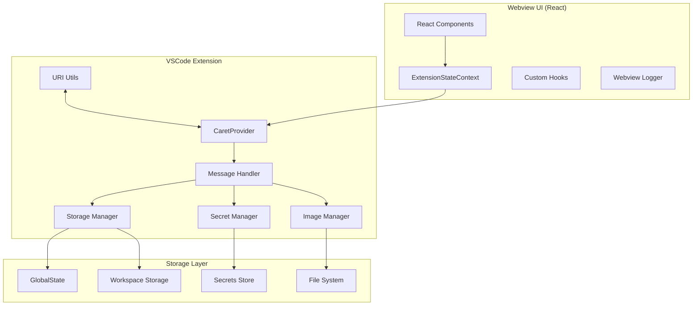
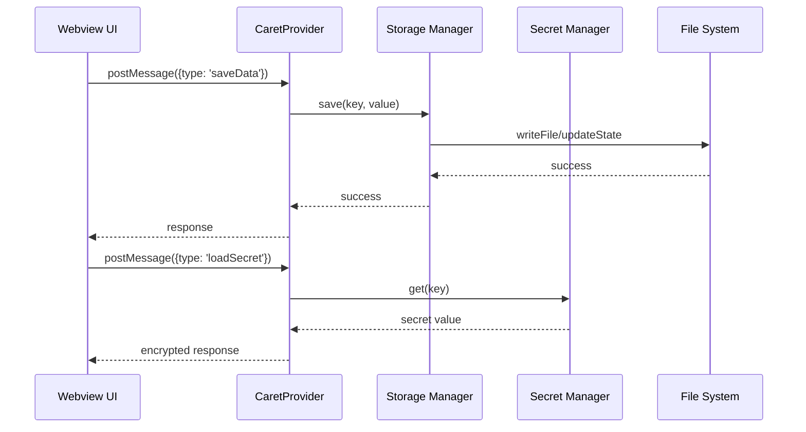

# UI ↔ Storage 흐름 통합 가이드

## 1. 개요

이 문서는 Caret의 UI와 Storage 간의 완전한 데이터 흐름을 설명합니다. 프론트엔드(React Webview)와 백엔드(VSCode Extension) 간의 데이터 저장, 로드, 시크릿 관리, 이미지 처리, URI 변환 등의 모든 상호작용을 다룹니다.

## 2. 전체 아키텍처

### 2.1 시스템 구조도



### 2.2 데이터 흐름



## 3. Webview UI Layer

### 3.1 ExtensionStateContext 구현

실제 구현 위치: `webview-ui/src/context/ExtensionStateContext.tsx`

```typescript
interface ExtensionStateContextType {
  // 데이터 상태
  data: Record<string, any>;
  isReady: boolean;

  // 액션 함수들
  saveData: (key: string, value: any) => Promise<void>;
  loadData: (key: string) => Promise<any>;
  saveSecret: (key: string, value: string) => Promise<void>;
  loadSecret: (key: string) => Promise<string | undefined>;
  saveImage: (imageData: string) => Promise<string>;

  // UI 상태
  theme: string;
  language: string;
  settings: Record<string, any>;
}

export const ExtensionStateContext = createContext<ExtensionStateContextType | null>(null);

const ExtensionStateProvider: React.FC<{ children: React.ReactNode }> = ({ children }) => {
  const [data, setData] = useState<Record<string, any>>({});
  const [isReady, setIsReady] = useState(false);

  // 데이터 저장
  const saveData = useCallback(async (key: string, value: any) => {
    try {
      await vscode.postMessage({
        type: 'saveData',
        key,
        value
      });
      setData(prev => ({ ...prev, [key]: value }));
    } catch (error) {
      console.error('Data save failed:', error);
      throw error;
    }
  }, []);

  // 데이터 로드
  const loadData = useCallback(async (key: string) => {
    try {
      const response = await vscode.postMessage({
        type: 'loadData',
        key
      });
      return response.value;
    } catch (error) {
      console.error('Data load failed:', error);
      throw error;
    }
  }, []);

  return (
    <ExtensionStateContext.Provider value={{
      data,
      isReady,
      saveData,
      loadData,
      saveSecret,
      loadSecret,
      saveImage,
      theme: 'dark',
      language: 'ko',
      settings: {}
    }}>
      {children}
    </ExtensionStateContext.Provider>
  );
};
```

## 4. Extension Layer

### 4.1 CaretProvider 메시지 처리

실제 구현 위치: `caret-src/core/webview/CaretProvider.ts`

```typescript
export class CaretProvider extends WebviewProvider {
	private storageManager: StorageManager
	private secretManager: SecretManager

	constructor(context: vscode.ExtensionContext) {
		super(context)
		this.storageManager = new StorageManager(context)
		this.secretManager = new SecretManager(context)
	}

	protected async handleWebviewMessage(message: any): Promise<any> {
		try {
			switch (message.type) {
				case "saveData":
					return await this.handleSaveData(message)
				case "loadData":
					return await this.handleLoadData(message)
				case "saveSecret":
					return await this.handleSaveSecret(message)
				case "loadSecret":
					return await this.handleLoadSecret(message)
				default:
					throw new Error(`Unknown message type: ${message.type}`)
			}
		} catch (error) {
			caretLogger.error(`Message handling failed: ${error.message}`, "CaretProvider")
			return { type: "error", error: error.message }
		}
	}

	private async handleSaveData(message: any): Promise<any> {
		const { key, value } = message
		await this.storageManager.save(key, value)
		caretLogger.info(`Data saved: ${key}`, "Storage")
		return { type: "saveDataResponse", success: true }
	}

	private async handleLoadData(message: any): Promise<any> {
		const { key } = message
		const value = await this.storageManager.load(key)
		caretLogger.info(`Data loaded: ${key}`, "Storage")
		return { type: "loadDataResponse", value }
	}
}
```

## 5. 보안 고려사항

### 5.1 데이터 보안

-   시크릿 데이터는 반드시 VSCode의 시크릿 저장소 사용
-   민감한 정보는 암호화하여 저장
-   파일 시스템 접근 권한 검증

## 6. 모범 사례

### 6.1 데이터 저장

-   큰 데이터는 청크 단위로 분할하여 저장
-   저장 전 데이터 유효성 검증
-   저장 실패 시 롤백 처리

## 7. 업데이트 기록

-   2025-06-21: 모든 UI-to-storage-flow 문서들을 통합하여 완전한 가이드로 재작성 (.md → .mdx 변환)
