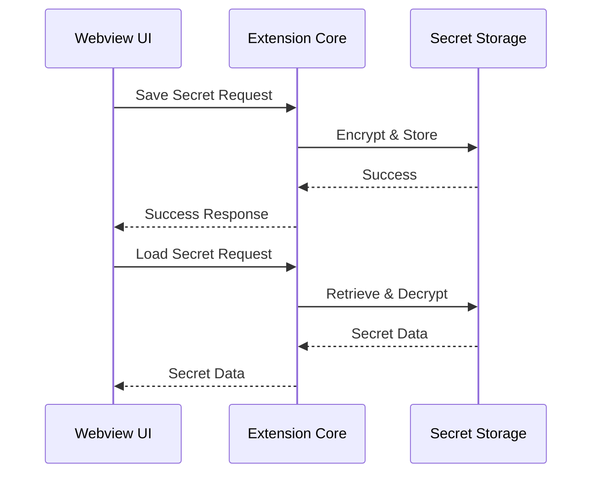

# UI ↔ Storage 흐름 가이드 (Secret)

## 1. 개요

이 문서는 Caret의 Secret 데이터 관리 기능을 설명합니다. API 키, 토큰 등 민감한 정보의 안전한 저장과 관리를 위한 기능들을 다룹니다.

## 2. Secret 데이터 흐름

### 2.1 기본 흐름


### 2.2 컴포넌트 구조
```
src/
└── core/
    └── storage/
        ├── secretManager.ts
        ├── secretTypes.ts
        └── encryption.ts
```

## 3. Secret Manager

### 3.1 기본 구현
```typescript
// src/core/storage/secretManager.ts
export class SecretManager {
  constructor(private context: vscode.ExtensionContext) {}

  // Secret 저장
  async storeSecret(key: string, value: string): Promise<void> {
    await this.context.secrets.store(key, value);
  }

  // Secret 로드
  async getSecret(key: string): Promise<string | undefined> {
    return this.context.secrets.get(key);
  }

  // Secret 삭제
  async deleteSecret(key: string): Promise<void> {
    await this.context.secrets.delete(key);
  }
}
```

### 3.2 암호화 기능
```typescript
// src/core/storage/encryption.ts
export class SecretEncryption {
  private static readonly ALGORITHM = 'AES-GCM';
  private static readonly KEY_LENGTH = 256;
  private static readonly IV_LENGTH = 12;

  // 암호화
  static async encrypt(value: string, key: string): Promise<string> {
    const cryptoKey = await this.getCryptoKey(key);
    const iv = crypto.getRandomValues(new Uint8Array(this.IV_LENGTH));
    const encoded = new TextEncoder().encode(value);
    
    const encrypted = await crypto.subtle.encrypt(
      { name: this.ALGORITHM, iv },
      cryptoKey,
      encoded
    );

    const result = new Uint8Array(iv.length + encrypted.byteLength);
    result.set(iv);
    result.set(new Uint8Array(encrypted), iv.length);

    return btoa(String.fromCharCode(...result));
  }

  // 복호화
  static async decrypt(encrypted: string, key: string): Promise<string> {
    const cryptoKey = await this.getCryptoKey(key);
    const data = Uint8Array.from(atob(encrypted), c => c.charCodeAt(0));
    
    const iv = data.slice(0, this.IV_LENGTH);
    const encryptedData = data.slice(this.IV_LENGTH);

    const decrypted = await crypto.subtle.decrypt(
      { name: this.ALGORITHM, iv },
      cryptoKey,
      encryptedData
    );

    return new TextDecoder().decode(decrypted);
  }

  private static async getCryptoKey(key: string): Promise<CryptoKey> {
    const keyData = new TextEncoder().encode(key);
    return crypto.subtle.importKey(
      'raw',
      keyData,
      { name: this.ALGORITHM, length: this.KEY_LENGTH },
      false,
      ['encrypt', 'decrypt']
    );
  }
}
```

## 4. Secret 타입 관리

### 4.1 타입 정의
```typescript
// src/core/storage/secretTypes.ts
export interface SecretKey {
  id: string;
  description: string;
  required: boolean;
  validation?: (value: string) => boolean;
}

export const SECRET_KEYS: Record<string, SecretKey> = {
  API_KEY: {
    id: 'apiKey',
    description: 'API Key for external services',
    required: true,
    validation: (value) => value.length >= 32
  },
  OPENAI_API_KEY: {
    id: 'openaiApiKey',
    description: 'OpenAI API Key',
    required: true,
    validation: (value) => value.startsWith('sk-')
  }
};
```

### 4.2 타입 사용
```typescript
// src/core/storage/secretManager.ts
export class SecretManager {
  // ... 이전 구현 ...

  // 타입 기반 Secret 저장
  async storeTypedSecret(key: SecretKey, value: string): Promise<void> {
    if (key.validation && !key.validation(value)) {
      throw new Error(`Invalid value for secret key: ${key.id}`);
    }
    await this.storeSecret(key.id, value);
  }

  // 타입 기반 Secret 로드
  async getTypedSecret(key: SecretKey): Promise<string | undefined> {
    return this.getSecret(key.id);
  }
}
```

## 5. Secret 검증

### 5.1 기본 검증
```typescript
// src/core/storage/secretManager.ts
export class SecretManager {
  // ... 이전 구현 ...

  // Secret 존재 여부 확인
  async hasSecret(key: string): Promise<boolean> {
    const value = await this.getSecret(key);
    return value !== undefined;
  }

  // 필수 Secret 검증
  async validateRequiredSecrets(): Promise<void> {
    const missingKeys = Object.entries(SECRET_KEYS)
      .filter(([_, key]) => key.required)
      .filter(async ([_, key]) => !(await this.hasSecret(key.id)));

    if (missingKeys.length > 0) {
      throw new Error(`Missing required secrets: ${missingKeys.map(([_, key]) => key.id).join(', ')}`);
    }
  }
}
```

### 5.2 고급 검증
```typescript
// src/core/storage/secretManager.ts
export class SecretManager {
  // ... 이전 구현 ...

  // Secret 유효성 검사
  async validateSecret(key: string, value: string): Promise<boolean> {
    const secretKey = Object.values(SECRET_KEYS).find(k => k.id === key);
    if (!secretKey) return true;
    if (!secretKey.validation) return true;
    return secretKey.validation(value);
  }

  // 모든 Secret 검증
  async validateAllSecrets(): Promise<void> {
    for (const [_, key] of Object.entries(SECRET_KEYS)) {
      const value = await this.getSecret(key.id);
      if (value && key.validation && !key.validation(value)) {
        throw new Error(`Invalid value for secret key: ${key.id}`);
      }
    }
  }
}
```

## 6. 모범 사례

### 6.1 보안 원칙
- 민감 정보는 반드시 Secret Storage 사용
- 암호화 키 안전한 관리
- 접근 제어 구현
- 정기적인 키 순환

### 6.2 에러 처리
- 암호화/복호화 실패 처리
- 유효성 검사 실패 처리
- 누락된 Secret 처리
- 오류 로깅

### 6.3 성능 최적화
- 필요한 Secret만 로드
- 캐싱 전략
- 배치 처리
- 비동기 처리

## 7. 업데이트 기록
- 2024-03-21: 초기 문서 작성
- 2024-03-21: Secret Manager 구현 추가
- 2024-03-21: 암호화 기능 추가
- 2024-03-21: 타입 관리 추가
- 2024-03-21: 검증 기능 추가
- 2024-03-21: 모범 사례 추가 