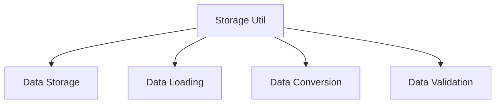

# UI ↔ Storage 흐름 가이드 (Storage Util)

## 1. 개요

이 문서는 Caret의 Storage 유틸리티 기능을 설명합니다. 데이터 저장, 로드, 변환 및 관리를 위한 유틸리티 함수들을 다룹니다.

## 2. Storage 유틸리티 구조

### 2.1 기본 구조


### 2.2 유틸리티 컴포넌트
```
src/
└── core/
    └── storage/
        ├── storageUtil.ts
        └── types.ts
```

## 3. 데이터 저장 유틸리티

### 3.1 기본 저장 함수
```typescript
// src/core/storage/storageUtil.ts
export class StorageUtil {
  constructor(private context: vscode.ExtensionContext) {}

  // 일반 데이터 저장
  async set<T>(key: string, value: T): Promise<void> {
    await this.context.globalState.update(key, value);
  }

  // 객체 저장
  async setObject<T extends object>(key: string, value: T): Promise<void> {
    await this.set(key, JSON.stringify(value));
  }

  // 배열 저장
  async setArray<T>(key: string, value: T[]): Promise<void> {
    await this.setObject(key, value);
  }
}
```

### 3.2 특수 데이터 저장
```typescript
// src/core/storage/storageUtil.ts
export class StorageUtil {
  // ... 기본 저장 함수 ...

  // 날짜 저장
  async setDate(key: string, date: Date): Promise<void> {
    await this.set(key, date.toISOString());
  }

  // Map 저장
  async setMap<K, V>(key: string, map: Map<K, V>): Promise<void> {
    const array = Array.from(map.entries());
    await this.setObject(key, array);
  }

  // Set 저장
  async setSet<T>(key: string, set: Set<T>): Promise<void> {
    const array = Array.from(set);
    await this.setArray(key, array);
  }
}
```

## 4. 데이터 로드 유틸리티

### 4.1 기본 로드 함수
```typescript
// src/core/storage/storageUtil.ts
export class StorageUtil {
  // ... 저장 함수 ...

  // 일반 데이터 로드
  async get<T>(key: string): Promise<T | undefined> {
    return this.context.globalState.get<T>(key);
  }

  // 객체 로드
  async getObject<T extends object>(key: string): Promise<T | undefined> {
    const data = await this.get<string>(key);
    return data ? JSON.parse(data) : undefined;
  }

  // 배열 로드
  async getArray<T>(key: string): Promise<T[] | undefined> {
    return this.getObject<T[]>(key);
  }
}
```

### 4.2 특수 데이터 로드
```typescript
// src/core/storage/storageUtil.ts
export class StorageUtil {
  // ... 기본 로드 함수 ...

  // 날짜 로드
  async getDate(key: string): Promise<Date | undefined> {
    const dateStr = await this.get<string>(key);
    return dateStr ? new Date(dateStr) : undefined;
  }

  // Map 로드
  async getMap<K, V>(key: string): Promise<Map<K, V> | undefined> {
    const array = await this.getObject<[K, V][]>(key);
    return array ? new Map(array) : undefined;
  }

  // Set 로드
  async getSet<T>(key: string): Promise<Set<T> | undefined> {
    const array = await this.getArray<T>(key);
    return array ? new Set(array) : undefined;
  }
}
```

## 5. 데이터 변환 유틸리티

### 5.1 기본 변환 함수
```typescript
// src/core/storage/storageUtil.ts
export class StorageUtil {
  // ... 이전 구현 ...

  // 객체를 JSON 문자열로 변환
  toJson<T>(value: T): string {
    return JSON.stringify(value);
  }

  // JSON 문자열을 객체로 변환
  fromJson<T>(json: string): T {
    return JSON.parse(json);
  }

  // Base64 인코딩
  toBase64(value: string): string {
    return Buffer.from(value).toString('base64');
  }

  // Base64 디코딩
  fromBase64(base64: string): string {
    return Buffer.from(base64, 'base64').toString();
  }
}
```

### 5.2 특수 변환 함수
```typescript
// src/core/storage/storageUtil.ts
export class StorageUtil {
  // ... 기본 변환 함수 ...

  // Map을 객체로 변환
  mapToObject<K extends string, V>(map: Map<K, V>): Record<K, V> {
    return Object.fromEntries(map) as Record<K, V>;
  }

  // 객체를 Map으로 변환
  objectToMap<K extends string, V>(obj: Record<K, V>): Map<K, V> {
    return new Map(Object.entries(obj) as [K, V][]);
  }

  // Set을 배열로 변환
  setToArray<T>(set: Set<T>): T[] {
    return Array.from(set);
  }

  // 배열을 Set으로 변환
  arrayToSet<T>(array: T[]): Set<T> {
    return new Set(array);
  }
}
```

## 6. 데이터 검증 유틸리티

### 6.1 기본 검증 함수
```typescript
// src/core/storage/storageUtil.ts
export class StorageUtil {
  // ... 이전 구현 ...

  // 값 존재 여부 확인
  async exists(key: string): Promise<boolean> {
    const value = await this.get(key);
    return value !== undefined;
  }

  // 객체 유효성 검사
  isValidObject(value: unknown): value is object {
    return typeof value === 'object' && value !== null;
  }

  // 배열 유효성 검사
  isValidArray(value: unknown): value is unknown[] {
    return Array.isArray(value);
  }
}
```

### 6.2 특수 검증 함수
```typescript
// src/core/storage/storageUtil.ts
export class StorageUtil {
  // ... 기본 검증 함수 ...

  // 날짜 유효성 검사
  isValidDate(value: unknown): value is Date {
    return value instanceof Date && !isNaN(value.getTime());
  }

  // Map 유효성 검사
  isValidMap(value: unknown): value is Map<unknown, unknown> {
    return value instanceof Map;
  }

  // Set 유효성 검사
  isValidSet(value: unknown): value is Set<unknown> {
    return value instanceof Set;
  }
}
```

## 7. 모범 사례

### 7.1 데이터 관리 원칙
- 적절한 데이터 구조화
- 효율적인 저장소 사용
- 오류 처리
- 동시성 고려

### 7.2 성능 최적화
- 필요한 데이터만 저장
- 주기적인 데이터 정리
- 캐싱 전략
- 배치 처리

### 7.3 보안 고려사항
- 민감 정보 암호화
- 접근 제어
- 데이터 검증
- 오류 로깅

## 8. 업데이트 기록
- 2024-03-21: 초기 문서 작성
- 2024-03-21: 기본 유틸리티 함수 추가
- 2024-03-21: 특수 유틸리티 함수 추가
- 2024-03-21: 모범 사례 추가
