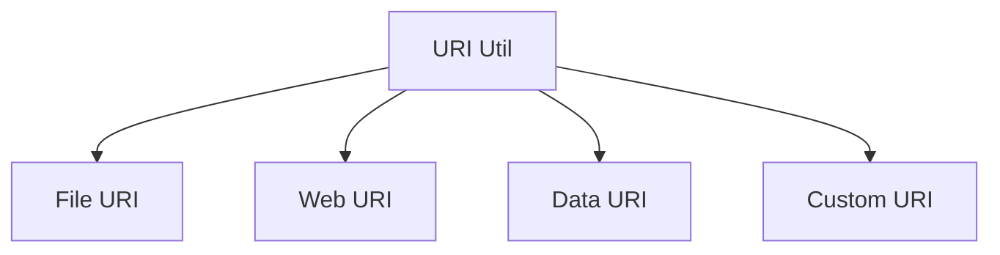

# UI ↔ Storage 흐름 가이드 (URI)

## 1. 개요

이 문서는 Caret의 URI 변환 기능을 설명합니다. 파일 경로, 웹 URL, 데이터 URI 등 다양한 URI 형식 간의 변환과 관리를 위한 기능들을 다룹니다.

## 2. URI 변환 구조

### 2.1 기본 구조


### 2.2 컴포넌트 구조
```
src/
└── core/
    └── storage/
        ├── uriUtil.ts
        └── uriTypes.ts
```

## 3. URI 유틸리티

### 3.1 기본 변환 함수
```typescript
// src/core/storage/uriUtil.ts
export class UriUtil {
  // 파일 경로를 URI로 변환
  static pathToUri(path: string): vscode.Uri {
    return vscode.Uri.file(path);
  }

  // URI를 파일 경로로 변환
  static uriToPath(uri: vscode.Uri): string {
    return uri.fsPath;
  }

  // 웹 URL을 URI로 변환
  static urlToUri(url: string): vscode.Uri {
    return vscode.Uri.parse(url);
  }

  // URI를 웹 URL로 변환
  static uriToUrl(uri: vscode.Uri): string {
    return uri.toString();
  }
}
```

### 3.2 데이터 URI 변환
```typescript
// src/core/storage/uriUtil.ts
export class UriUtil {
  // ... 기본 변환 함수 ...

  // 데이터를 Data URI로 변환
  static dataToUri(data: Uint8Array, mimeType: string): vscode.Uri {
    const base64 = Buffer.from(data).toString('base64');
    return vscode.Uri.parse(`data:${mimeType};base64,${base64}`);
  }

  // Data URI에서 데이터 추출
  static uriToData(uri: vscode.Uri): { data: Uint8Array; mimeType: string } {
    const [header, base64] = uri.toString().split(',');
    const mimeType = header.split(':')[1].split(';')[0];
    const data = Buffer.from(base64, 'base64');
    return { data, mimeType };
  }
}
```

## 4. URI 타입 관리

### 4.1 타입 정의
```typescript
// src/core/storage/uriTypes.ts
export interface UriInfo {
  scheme: string;
  path: string;
  query?: string;
  fragment?: string;
}

export interface DataUriInfo extends UriInfo {
  mimeType: string;
  data: Uint8Array;
}

export interface WebUriInfo extends UriInfo {
  host: string;
  port?: number;
  protocol: string;
}
```

### 4.2 타입 사용
```typescript
// src/core/storage/uriUtil.ts
export class UriUtil {
  // ... 이전 구현 ...

  // URI 정보 파싱
  static parseUri(uri: vscode.Uri): UriInfo {
    return {
      scheme: uri.scheme,
      path: uri.path,
      query: uri.query,
      fragment: uri.fragment
    };
  }

  // Data URI 정보 파싱
  static parseDataUri(uri: vscode.Uri): DataUriInfo {
    const { data, mimeType } = this.uriToData(uri);
    return {
      ...this.parseUri(uri),
      mimeType,
      data
    };
  }

  // Web URI 정보 파싱
  static parseWebUri(uri: vscode.Uri): WebUriInfo {
    return {
      ...this.parseUri(uri),
      host: uri.authority,
      port: uri.port,
      protocol: uri.scheme
    };
  }
}
```

## 5. URI 검증

### 5.1 기본 검증
```typescript
// src/core/storage/uriUtil.ts
export class UriUtil {
  // ... 이전 구현 ...

  // URI 유효성 검사
  static isValidUri(uri: string): boolean {
    try {
      vscode.Uri.parse(uri);
      return true;
    } catch {
      return false;
    }
  }

  // 파일 URI 검증
  static isValidFileUri(uri: vscode.Uri): boolean {
    return uri.scheme === 'file';
  }

  // 웹 URI 검증
  static isValidWebUri(uri: vscode.Uri): boolean {
    return ['http', 'https'].includes(uri.scheme);
  }
}
```

### 5.2 고급 검증
```typescript
// src/core/storage/uriUtil.ts
export class UriUtil {
  // ... 이전 구현 ...

  // Data URI 검증
  static isValidDataUri(uri: vscode.Uri): boolean {
    if (uri.scheme !== 'data') return false;
    try {
      this.uriToData(uri);
      return true;
    } catch {
      return false;
    }
  }

  // URI 형식 검증
  static validateUriFormat(uri: vscode.Uri, format: UriInfo): boolean {
    const parsed = this.parseUri(uri);
    return Object.entries(format).every(([key, value]) => 
      parsed[key as keyof UriInfo] === value
    );
  }
}
```

## 6. 모범 사례

### 6.1 URI 처리 원칙
- 적절한 URI 스키마 사용
- 상대 경로 처리
- 인코딩/디코딩 처리
- 보안 고려사항

### 6.2 성능 최적화
- URI 캐싱
- 변환 최소화
- 메모리 관리
- 비동기 처리

### 6.3 에러 처리
- 잘못된 URI 형식
- 접근 권한 오류
- 변환 실패
- 오류 로깅

## 7. 업데이트 기록
- 2024-03-21: 초기 문서 작성
- 2024-03-21: 기본 URI 변환 함수 추가
- 2024-03-21: 데이터 URI 변환 추가
- 2024-03-21: 타입 관리 추가
- 2024-03-21: 검증 기능 추가
- 2024-03-21: 모범 사례 추가 