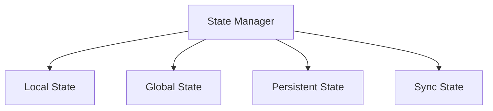

# UI ↔ Storage 흐름 가이드 (Webview UI State)

## 1. 개요

이 문서는 Caret의 Webview UI 상태 관리 기능을 설명합니다. React 기반의 Webview UI에서 상태 관리, 동기화, 지속성 등의 기능을 다룹니다.

## 2. 상태 관리 구조

### 2.1 기본 구조


### 2.2 컴포넌트 구조
```
webview-ui/
└── src/
    ├── state/
    │   ├── stateManager.ts
    │   ├── stateTypes.ts
    │   └── stateHooks.ts
    └── components/
        └── StateProvider.tsx
```

## 3. 상태 관리자

### 3.1 기본 구현
```typescript
// webview-ui/src/state/stateManager.ts
import { create } from 'zustand';
import { persist } from 'zustand/middleware';

interface State {
  data: Record<string, any>;
  ui: {
    theme: string;
    language: string;
    settings: Record<string, any>;
  };
  actions: {
    setData: (key: string, value: any) => void;
    setTheme: (theme: string) => void;
    setLanguage: (language: string) => void;
    setSettings: (settings: Record<string, any>) => void;
  };
}

export const useStore = create<State>()(
  persist(
    (set) => ({
      data: {},
      ui: {
        theme: 'light',
        language: 'ko',
        settings: {}
      },
      actions: {
        setData: (key, value) =>
          set((state) => ({
            data: { ...state.data, [key]: value }
          })),
        setTheme: (theme) =>
          set((state) => ({
            ui: { ...state.ui, theme }
          })),
        setLanguage: (language) =>
          set((state) => ({
            ui: { ...state.ui, language }
          })),
        setSettings: (settings) =>
          set((state) => ({
            ui: { ...state.ui, settings }
          }))
      }
    }),
    {
      name: 'webview-state'
    }
  )
);
```

### 3.2 상태 동기화
```typescript
// webview-ui/src/state/stateManager.ts
export const useStore = create<State>()(
  persist(
    (set, get) => ({
      // ... 이전 구현 ...

      actions: {
        // ... 이전 구현 ...

        // 상태 동기화
        syncState: async () => {
          const response = await vscode.postMessage({
            type: 'syncState',
            payload: get()
          });
          set(response.payload);
        },

        // 상태 초기화
        resetState: () =>
          set({
            data: {},
            ui: {
              theme: 'light',
              language: 'ko',
              settings: {}
            }
          })
      }
    }),
    {
      name: 'webview-state'
    }
  )
);
```

## 4. 상태 타입

### 4.1 타입 정의
```typescript
// webview-ui/src/state/stateTypes.ts
export interface StateData {
  [key: string]: any;
}

export interface UIState {
  theme: string;
  language: string;
  settings: Record<string, any>;
}

export interface State {
  data: StateData;
  ui: UIState;
}

export interface StateActions {
  setData: (key: string, value: any) => void;
  setTheme: (theme: string) => void;
  setLanguage: (language: string) => void;
  setSettings: (settings: Record<string, any>) => void;
  syncState: () => Promise<void>;
  resetState: () => void;
}
```

### 4.2 타입 사용
```typescript
// webview-ui/src/state/stateTypes.ts
export const createStateSlice = <T extends StateData>(
  initialState: T
): {
  data: T;
  setData: (key: keyof T, value: T[keyof T]) => void;
} => ({
  data: initialState,
  setData: (key, value) => {
    useStore.getState().actions.setData(key as string, value);
  }
});
```

## 5. 상태 훅

### 5.1 기본 훅
```typescript
// webview-ui/src/state/stateHooks.ts
import { useStore } from './stateManager';

export const useData = (key: string) => {
  const data = useStore((state) => state.data[key]);
  const setData = useStore((state) => state.actions.setData);
  return [data, (value: any) => setData(key, value)] as const;
};

export const useTheme = () => {
  const theme = useStore((state) => state.ui.theme);
  const setTheme = useStore((state) => state.actions.setTheme);
  return [theme, setTheme] as const;
};

export const useLanguage = () => {
  const language = useStore((state) => state.ui.language);
  const setLanguage = useStore((state) => state.actions.setLanguage);
  return [language, setLanguage] as const;
};
```

### 5.2 고급 훅
```typescript
// webview-ui/src/state/stateHooks.ts
export const useSettings = () => {
  const settings = useStore((state) => state.ui.settings);
  const setSettings = useStore((state) => state.actions.setSettings);
  return [settings, setSettings] as const;
};

export const useStateSync = () => {
  const syncState = useStore((state) => state.actions.syncState);
  const resetState = useStore((state) => state.actions.resetState);

  useEffect(() => {
    syncState();
  }, []);

  return { syncState, resetState };
};
```

## 6. 모범 사례

### 6.1 상태 관리 원칙
- 단일 상태 소스
- 불변성 유지
- 상태 업데이트 최적화
- 에러 처리

### 6.2 성능 최적화
- 불필요한 리렌더링 방지
- 메모이제이션
- 비동기 처리
- 상태 분할

### 6.3 보안 고려사항
- 데이터 검증
- XSS 방지
- CSRF 방지
- 오류 처리

## 7. 업데이트 기록
- 2024-03-21: 초기 문서 작성
- 2024-03-21: 상태 관리자 구현 추가
- 2024-03-21: 상태 타입 추가
- 2024-03-21: 상태 훅 추가
- 2024-03-21: 모범 사례 추가 