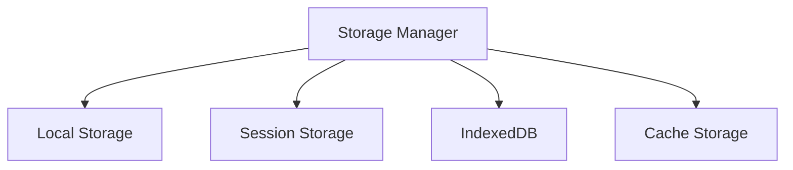

# UI ↔ Storage 흐름 가이드 (Webview UI Storage)

## 1. 개요

이 문서는 Caret의 Webview UI Storage 기능을 설명합니다. React 기반의 Webview UI에서 데이터 저장, 로드, 캐싱 등의 기능을 다룹니다.

## 2. Storage 구조

### 2.1 기본 구조


### 2.2 컴포넌트 구조
```
webview-ui/
└── src/
    ├── storage/
    │   ├── storageManager.ts
    │   ├── storageTypes.ts
    │   └── storageHooks.ts
    └── components/
        └── StorageProvider.tsx
```

## 3. Storage Manager

### 3.1 기본 구현
```typescript
// webview-ui/src/storage/storageManager.ts
export class StorageManager {
  // Local Storage
  static setLocal(key: string, value: any): void {
    localStorage.setItem(key, JSON.stringify(value));
  }

  static getLocal<T>(key: string): T | null {
    const value = localStorage.getItem(key);
    return value ? JSON.parse(value) : null;
  }

  // Session Storage
  static setSession(key: string, value: any): void {
    sessionStorage.setItem(key, JSON.stringify(value));
  }

  static getSession<T>(key: string): T | null {
    const value = sessionStorage.getItem(key);
    return value ? JSON.parse(value) : null;
  }

  // IndexedDB
  static async setIndexed(key: string, value: any): Promise<void> {
    const db = await this.openDB();
    const tx = db.transaction('store', 'readwrite');
    const store = tx.objectStore('store');
    await store.put(value, key);
    await tx.complete;
  }

  static async getIndexed<T>(key: string): Promise<T | null> {
    const db = await this.openDB();
    const tx = db.transaction('store', 'readonly');
    const store = tx.objectStore('store');
    return store.get(key);
  }

  private static async openDB(): Promise<IDBDatabase> {
    return new Promise((resolve, reject) => {
      const request = indexedDB.open('webview-storage', 1);
      request.onerror = () => reject(request.error);
      request.onsuccess = () => resolve(request.result);
      request.onupgradeneeded = (event) => {
        const db = (event.target as IDBOpenDBRequest).result;
        db.createObjectStore('store');
      };
    });
  }
}
```

### 3.2 캐시 관리
```typescript
// webview-ui/src/storage/storageManager.ts
export class StorageManager {
  // ... 이전 구현 ...

  // Cache Storage
  static async setCache(key: string, value: any): Promise<void> {
    const cache = await caches.open('webview-cache');
    const response = new Response(JSON.stringify(value));
    await cache.put(key, response);
  }

  static async getCache<T>(key: string): Promise<T | null> {
    const cache = await caches.open('webview-cache');
    const response = await cache.match(key);
    if (!response) return null;
    return response.json();
  }

  // 캐시 정리
  static async clearCache(): Promise<void> {
    await caches.delete('webview-cache');
  }

  // 캐시 크기 확인
  static async getCacheSize(): Promise<number> {
    const cache = await caches.open('webview-cache');
    const keys = await cache.keys();
    let size = 0;
    for (const key of keys) {
      const response = await cache.match(key);
      if (response) {
        const blob = await response.blob();
        size += blob.size;
      }
    }
    return size;
  }
}
```

## 4. Storage 타입

### 4.1 타입 정의
```typescript
// webview-ui/src/storage/storageTypes.ts
export interface StorageOptions {
  type: 'local' | 'session' | 'indexed' | 'cache';
  ttl?: number;
  compress?: boolean;
}

export interface StorageItem<T> {
  key: string;
  value: T;
  timestamp: number;
  options: StorageOptions;
}

export interface StorageManager {
  set<T>(key: string, value: T, options?: StorageOptions): Promise<void>;
  get<T>(key: string, options?: StorageOptions): Promise<T | null>;
  remove(key: string, options?: StorageOptions): Promise<void>;
  clear(options?: StorageOptions): Promise<void>;
}
```

### 4.2 타입 사용
```typescript
// webview-ui/src/storage/storageTypes.ts
export const createStorageItem = <T>(
  key: string,
  value: T,
  options: StorageOptions
): StorageItem<T> => ({
  key,
  value,
  timestamp: Date.now(),
  options
});

export const isExpired = (item: StorageItem<any>): boolean => {
  if (!item.options.ttl) return false;
  return Date.now() - item.timestamp > item.options.ttl;
};
```

## 5. Storage 훅

### 5.1 기본 훅
```typescript
// webview-ui/src/storage/storageHooks.ts
import { useState, useEffect } from 'react';
import { StorageManager } from './storageManager';

export const useStorage = <T>(
  key: string,
  options: StorageOptions = { type: 'local' }
) => {
  const [value, setValue] = useState<T | null>(null);

  useEffect(() => {
    const loadValue = async () => {
      const stored = await StorageManager.get<T>(key, options);
      setValue(stored);
    };
    loadValue();
  }, [key, options]);

  const setStoredValue = async (newValue: T) => {
    await StorageManager.set(key, newValue, options);
    setValue(newValue);
  };

  return [value, setStoredValue] as const;
};
```

### 5.2 고급 훅
```typescript
// webview-ui/src/storage/storageHooks.ts
export const useCache = <T>(
  key: string,
  fetcher: () => Promise<T>,
  options: StorageOptions = { type: 'cache' }
) => {
  const [value, setValue] = useState<T | null>(null);
  const [loading, setLoading] = useState(true);
  const [error, setError] = useState<Error | null>(null);

  useEffect(() => {
    const loadValue = async () => {
      try {
        setLoading(true);
        const cached = await StorageManager.get<T>(key, options);
        if (cached) {
          setValue(cached);
        } else {
          const fetched = await fetcher();
          await StorageManager.set(key, fetched, options);
          setValue(fetched);
        }
      } catch (err) {
        setError(err as Error);
      } finally {
        setLoading(false);
      }
    };
    loadValue();
  }, [key, fetcher, options]);

  return { value, loading, error };
};
```

## 6. 모범 사례

### 6.1 데이터 관리 원칙
- 적절한 저장소 선택
- 데이터 구조화
- 캐시 전략
- 에러 처리

### 6.2 성능 최적화
- 데이터 압축
- 캐시 관리
- 비동기 처리
- 메모리 관리

### 6.3 보안 고려사항
- 데이터 암호화
- 접근 제어
- 민감 정보 처리
- 오류 로깅

## 7. 업데이트 기록
- 2024-03-21: 초기 문서 작성
- 2024-03-21: Storage Manager 구현 추가
- 2024-03-21: 캐시 관리 추가
- 2024-03-21: Storage 타입 추가
- 2024-03-21: Storage 훅 추가
- 2024-03-21: 모범 사례 추가 