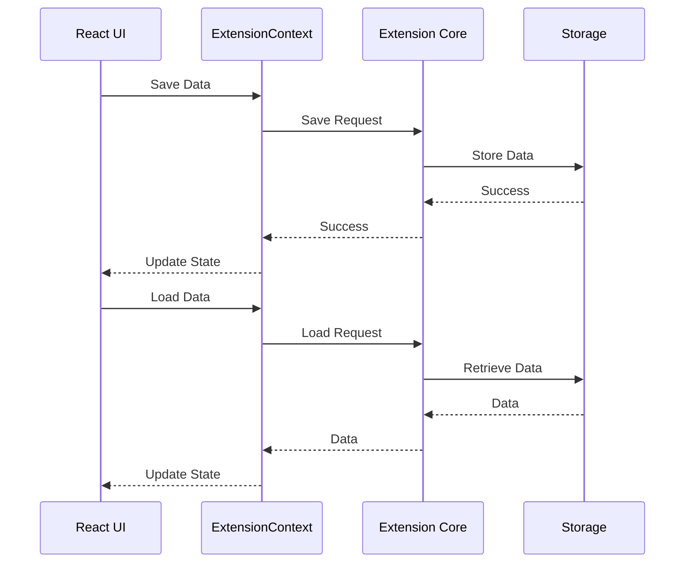

# UI ↔ Storage 흐름 가이드 (Webview UI)

## 1. 개요

이 문서는 Caret의 Webview UI 데이터 흐름을 설명합니다. React 기반의 Webview UI에서 데이터 저장, 로드, 상태 관리 등의 기능을 다룹니다.

## 2. Webview UI 데이터 흐름

### 2.1 기본 흐름


### 2.2 컴포넌트 구조
```
webview-ui/
└── src/
    ├── context/
    │   └── ExtensionContext.tsx
    ├── hooks/
    │   ├── useStorage.ts
    │   └── useExtensionState.ts
    └── components/
        ├── StorageProvider.tsx
        └── StateProvider.tsx
```

## 3. Extension Context

### 3.1 기본 구현
```typescript
// webview-ui/src/context/ExtensionContext.tsx
import React, { createContext, useContext, useState, useEffect } from 'react';

interface ExtensionContextType {
  saveData: (key: string, value: any) => Promise<void>;
  loadData: (key: string) => Promise<any>;
  updateState: (state: any) => Promise<void>;
  state: any;
}

const ExtensionContext = createContext<ExtensionContextType | null>(null);

export const ExtensionProvider: React.FC = ({ children }) => {
  const [state, setState] = useState<any>({});

  // 데이터 저장
  const saveData = async (key: string, value: any): Promise<void> => {
    await vscode.postMessage({
      type: 'saveData',
      payload: { key, value }
    });
  };

  // 데이터 로드
  const loadData = async (key: string): Promise<any> => {
    const response = await vscode.postMessage({
      type: 'loadData',
      payload: { key }
    });
    return response.value;
  };

  // 상태 업데이트
  const updateState = async (newState: any): Promise<void> => {
    await vscode.postMessage({
      type: 'updateState',
      payload: { state: newState }
    });
    setState(newState);
  };

  return (
    <ExtensionContext.Provider value={{ saveData, loadData, updateState, state }}>
      {children}
    </ExtensionContext.Provider>
  );
};
```

### 3.2 메시지 처리
```typescript
// webview-ui/src/context/ExtensionContext.tsx
export const ExtensionProvider: React.FC = ({ children }) => {
  // ... 이전 구현 ...

  // 메시지 수신 처리
  useEffect(() => {
    const handleMessage = (event: MessageEvent) => {
      const message = event.data;
      switch (message.type) {
        case 'stateUpdate':
          setState(message.payload);
          break;
        case 'error':
          console.error('Extension error:', message.error);
          break;
      }
    };

    window.addEventListener('message', handleMessage);
    return () => window.removeEventListener('message', handleMessage);
  }, []);

  // 초기 상태 로드
  useEffect(() => {
    loadData('initialState').then(setState);
  }, []);
};
```

## 4. Storage Hooks

### 4.1 useStorage Hook
```typescript
// webview-ui/src/hooks/useStorage.ts
import { useContext } from 'react';
import { ExtensionContext } from '../context/ExtensionContext';

export const useStorage = () => {
  const context = useContext(ExtensionContext);
  if (!context) {
    throw new Error('useStorage must be used within ExtensionProvider');
  }

  return {
    saveData: context.saveData,
    loadData: context.loadData
  };
};
```

### 4.2 useExtensionState Hook
```typescript
// webview-ui/src/hooks/useExtensionState.ts
import { useContext } from 'react';
import { ExtensionContext } from '../context/ExtensionContext';

export const useExtensionState = () => {
  const context = useContext(ExtensionContext);
  if (!context) {
    throw new Error('useExtensionState must be used within ExtensionProvider');
  }

  return {
    state: context.state,
    updateState: context.updateState
  };
};
```

## 5. 컴포넌트 구현

### 5.1 Storage Provider
```typescript
// webview-ui/src/components/StorageProvider.tsx
import React from 'react';
import { ExtensionProvider } from '../context/ExtensionContext';

export const StorageProvider: React.FC = ({ children }) => {
  return (
    <ExtensionProvider>
      {children}
    </ExtensionProvider>
  );
};
```

### 5.2 State Provider
```typescript
// webview-ui/src/components/StateProvider.tsx
import React from 'react';
import { useExtensionState } from '../hooks/useExtensionState';

export const StateProvider: React.FC = ({ children }) => {
  const { state, updateState } = useExtensionState();

  return (
    <div className="state-provider">
      {React.Children.map(children, child => {
        if (React.isValidElement(child)) {
          return React.cloneElement(child, {
            state,
            updateState
          });
        }
        return child;
      })}
    </div>
  );
};
```

## 6. 모범 사례

### 6.1 상태 관리 원칙
- 단일 상태 소스
- 불변성 유지
- 상태 업데이트 최적화
- 에러 처리

### 6.2 성능 최적화
- 불필요한 리렌더링 방지
- 메모이제이션
- 비동기 처리
- 상태 분할

### 6.3 보안 고려사항
- 데이터 검증
- XSS 방지
- CSRF 방지
- 오류 처리

## 7. 업데이트 기록
- 2024-03-21: 초기 문서 작성
- 2024-03-21: Extension Context 구현 추가
- 2024-03-21: Storage Hooks 추가
- 2024-03-21: 컴포넌트 구현 추가
- 2024-03-21: 모범 사례 추가 