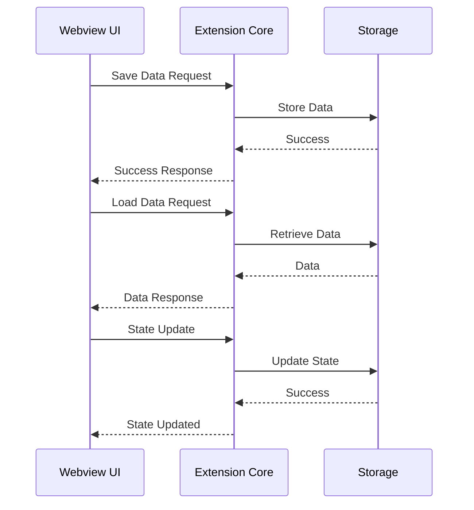

# UI ↔ Storage 흐름 가이드 (Webview)

## 1. 개요

이 문서는 Caret의 Webview 데이터 흐름을 설명합니다. Webview UI와 Extension Core 간의 데이터 통신, 상태 관리, 이벤트 처리 등의 기능을 다룹니다.

## 2. Webview 데이터 흐름

### 2.1 기본 흐름


### 2.2 컴포넌트 구조
```
src/
└── core/
    └── webview/
        ├── webviewManager.ts
        ├── messageHandler.ts
        └── stateManager.ts
```

## 3. Webview Manager

### 3.1 기본 구현
```typescript
// src/core/webview/webviewManager.ts
export class WebviewManager {
  private panel: vscode.WebviewPanel;
  private disposables: vscode.Disposable[] = [];

  constructor(
    private context: vscode.ExtensionContext,
    private viewType: string,
    private title: string
  ) {
    this.panel = vscode.window.createWebviewPanel(
      viewType,
      title,
      vscode.ViewColumn.One,
      {
        enableScripts: true,
        retainContextWhenHidden: true
      }
    );

    this.setupMessageHandling();
  }

  // 메시지 핸들링 설정
  private setupMessageHandling(): void {
    this.panel.webview.onDidReceiveMessage(
      async (message) => {
        try {
          const response = await this.handleMessage(message);
          this.panel.webview.postMessage(response);
        } catch (error) {
          this.panel.webview.postMessage({
            type: 'error',
            error: error.message
          });
        }
      },
      null,
      this.disposables
    );
  }

  // 메시지 처리
  private async handleMessage(message: any): Promise<any> {
    switch (message.type) {
      case 'saveData':
        return this.handleSaveData(message);
      case 'loadData':
        return this.handleLoadData(message);
      case 'updateState':
        return this.handleUpdateState(message);
      default:
        throw new Error(`Unknown message type: ${message.type}`);
    }
  }
}
```

### 3.2 데이터 처리
```typescript
// src/core/webview/webviewManager.ts
export class WebviewManager {
  // ... 이전 구현 ...

  // 데이터 저장 처리
  private async handleSaveData(message: any): Promise<any> {
    const { key, value } = message;
    await this.context.globalState.update(key, value);
    return { type: 'saveDataResponse', success: true };
  }

  // 데이터 로드 처리
  private async handleLoadData(message: any): Promise<any> {
    const { key } = message;
    const value = await this.context.globalState.get(key);
    return { type: 'loadDataResponse', value };
  }

  // 상태 업데이트 처리
  private async handleUpdateState(message: any): Promise<any> {
    const { state } = message;
    await this.updateState(state);
    return { type: 'updateStateResponse', success: true };
  }
}
```

## 4. 메시지 핸들러

### 4.1 메시지 타입 정의
```typescript
// src/core/webview/messageHandler.ts
export interface WebviewMessage {
  type: string;
  payload?: any;
}

export interface SaveDataMessage extends WebviewMessage {
  type: 'saveData';
  payload: {
    key: string;
    value: any;
  };
}

export interface LoadDataMessage extends WebviewMessage {
  type: 'loadData';
  payload: {
    key: string;
  };
}

export interface UpdateStateMessage extends WebviewMessage {
  type: 'updateState';
  payload: {
    state: any;
  };
}
```

### 4.2 메시지 처리
```typescript
// src/core/webview/messageHandler.ts
export class MessageHandler {
  constructor(private webviewManager: WebviewManager) {}

  // 메시지 전송
  async sendMessage(message: WebviewMessage): Promise<void> {
    await this.webviewManager.panel.webview.postMessage(message);
  }

  // 메시지 수신
  onMessage(callback: (message: WebviewMessage) => void): void {
    this.webviewManager.panel.webview.onDidReceiveMessage(
      callback,
      null,
      this.webviewManager.disposables
    );
  }
}
```

## 5. 상태 관리

### 5.1 상태 정의
```typescript
// src/core/webview/stateManager.ts
export interface WebviewState {
  data: Record<string, any>;
  ui: {
    theme: string;
    language: string;
    settings: Record<string, any>;
  };
}

export class StateManager {
  private state: WebviewState = {
    data: {},
    ui: {
      theme: 'light',
      language: 'ko',
      settings: {}
    }
  };

  // 상태 업데이트
  async updateState(newState: Partial<WebviewState>): Promise<void> {
    this.state = { ...this.state, ...newState };
    await this.saveState();
  }

  // 상태 저장
  private async saveState(): Promise<void> {
    await this.context.globalState.update('webviewState', this.state);
  }

  // 상태 로드
  async loadState(): Promise<WebviewState> {
    const savedState = await this.context.globalState.get<WebviewState>('webviewState');
    if (savedState) {
      this.state = savedState;
    }
    return this.state;
  }
}
```

### 5.2 상태 동기화
```typescript
// src/core/webview/stateManager.ts
export class StateManager {
  // ... 이전 구현 ...

  // 상태 변경 구독
  onStateChange(callback: (state: WebviewState) => void): void {
    this.stateChangeCallbacks.push(callback);
  }

  // 상태 변경 알림
  private notifyStateChange(): void {
    for (const callback of this.stateChangeCallbacks) {
      callback(this.state);
    }
  }

  // 상태 초기화
  async resetState(): Promise<void> {
    this.state = {
      data: {},
      ui: {
        theme: 'light',
        language: 'ko',
        settings: {}
      }
    };
    await this.saveState();
    this.notifyStateChange();
  }
}
```

## 6. 모범 사례

### 6.1 데이터 통신 원칙
- 메시지 타입 명확화
- 에러 처리
- 비동기 처리
- 상태 동기화

### 6.2 성능 최적화
- 메시지 최소화
- 상태 캐싱
- 메모리 관리
- 이벤트 디바운싱

### 6.3 보안 고려사항
- 메시지 검증
- 데이터 암호화
- 접근 제어
- 오류 로깅

## 7. 업데이트 기록
- 2024-03-21: 초기 문서 작성
- 2024-03-21: Webview Manager 구현 추가
- 2024-03-21: 메시지 핸들러 추가
- 2024-03-21: 상태 관리 추가
- 2024-03-21: 모범 사례 추가 