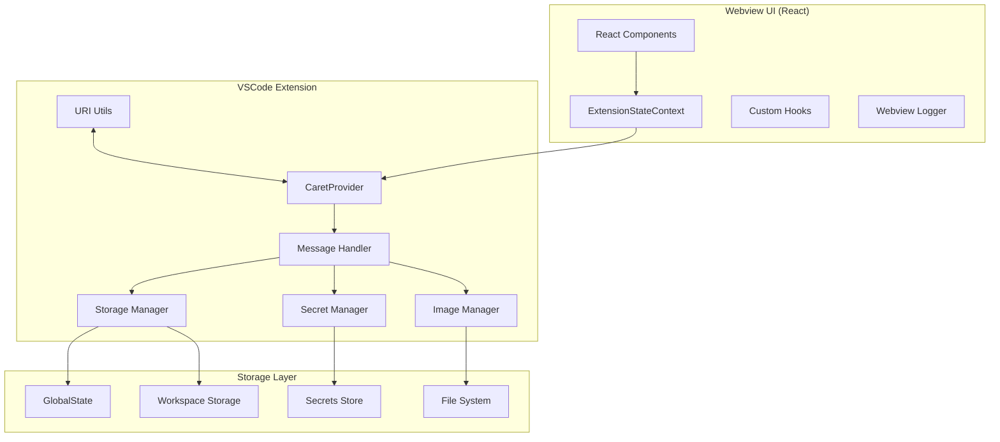
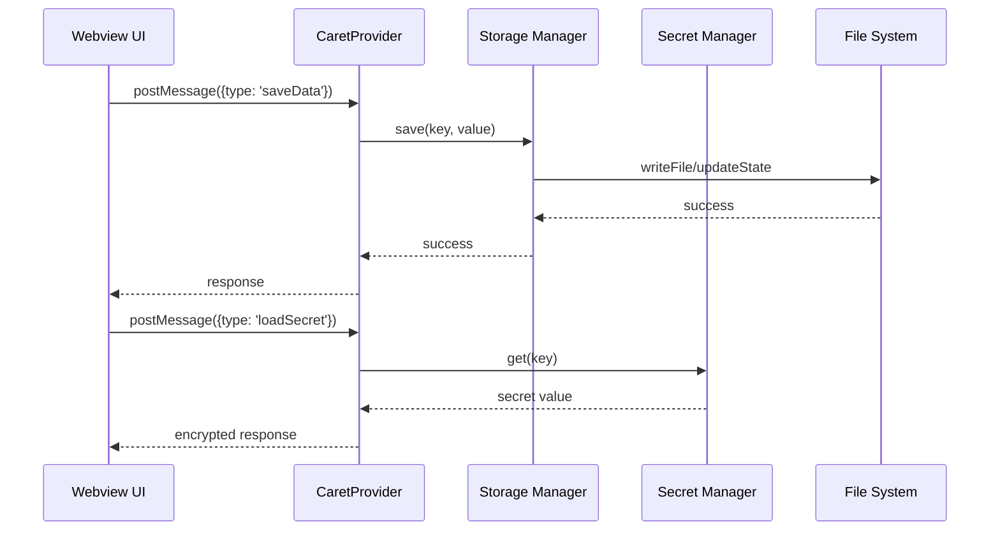

# UI ↔ Storage Flow Integration Guide

## 1. Overview

This document explains the complete data flow between Caret's UI and Storage. It covers all interactions between the frontend (React Webview) and the backend (VSCode Extension), including data storage, loading, secret management, image processing, and URI conversion.

## 2. Overall Architecture

### 2.1 System Architecture Diagram



### 2.2 Data Flow



## 3. Webview UI Layer

### 3.1 ExtensionStateContext Implementation

Actual implementation location: `webview-ui/src/context/ExtensionStateContext.tsx`

```typescript
interface ExtensionStateContextType {
  // Data state
  data: Record<string, any>;
  isReady: boolean;

  // Action functions
  saveData: (key: string, value: any) => Promise<void>;
  loadData: (key: string) => Promise<any>;
  saveSecret: (key: string, value: string) => Promise<void>;
  loadSecret: (key: string) => Promise<string | undefined>;
  saveImage: (imageData: string) => Promise<string>;

  // UI state
  theme: string;
  language: string;
  settings: Record<string, any>;
}

export const ExtensionStateContext = createContext<ExtensionStateContextType | null>(null);

const ExtensionStateProvider: React.FC<{ children: React.ReactNode }> = ({ children }) => {
  const [data, setData] = useState<Record<string, any>>({});
  const [isReady, setIsReady] = useState(false);

  // Save data
  const saveData = useCallback(async (key: string, value: any) => {
    try {
      await vscode.postMessage({
        type: 'saveData',
        key,
        value
      });
      setData(prev => ({ ...prev, [key]: value }));
    } catch (error) {
      console.error('Data save failed:', error);
      throw error;
    }
  }, []);

  // Load data
  const loadData = useCallback(async (key: string) => {
    try {
      const response = await vscode.postMessage({
        type: 'loadData',
        key
      });
      return response.value;
    } catch (error) {
      console.error('Data load failed:', error);
      throw error;
    }
  }, []);

  // Save secret
  const saveSecret = useCallback(async (key: string, value: string) => {
    try {
      await vscode.postMessage({
        type: 'saveSecret',
        key,
        value
      });
    } catch (error) {
      console.error('Secret save failed:', error);
      throw error;
    }
  }, []);

  // Load secret
  const loadSecret = useCallback(async (key: string): Promise<string | undefined> => {
    try {
      const response = await vscode.postMessage({
        type: 'loadSecret',
        key
      });
      return response.value;
    } catch (error) {
      console.error('Secret load failed:', error);
      return undefined;
    }
  }, []);

  // Save image
  const saveImage = useCallback(async (imageData: string): Promise<string> => {
    try {
      const response = await vscode.postMessage({
        type: 'saveImage',
        data: imageData
      });
      return response.path;
    } catch (error) {
      console.error('Image save failed:', error);
      throw error;
    }
  }, []);

  return (
    <ExtensionStateContext.Provider value={{
      data,
      isReady,
      saveData,
      loadData,
      saveSecret,
      loadSecret,
      saveImage,
      theme: 'dark',
      language: 'ko',
      settings: {}
    }}>
      {children}
    </ExtensionStateContext.Provider>
  );
};
```

### 3.2 Custom Hooks

```typescript
// webview-ui/src/caret/hooks/useStorage.ts
export const useStorage = () => {
	const context = useContext(ExtensionStateContext)
	if (!context) {
		throw new Error("useStorage must be used within ExtensionStateProvider")
	}

	return {
		saveData: context.saveData,
		loadData: context.loadData,
		data: context.data,
	}
}

// webview-ui/src/caret/hooks/useSecrets.ts
export const useSecrets = () => {
	const context = useContext(ExtensionStateContext)
	if (!context) {
		throw new Error("useSecrets must be used within ExtensionStateProvider")
	}

	return {
		saveSecret: context.saveSecret,
		loadSecret: context.loadSecret,
	}
}

// webview-ui/src/caret/hooks/useImages.ts
export const useImages = () => {
	const context = useContext(ExtensionStateContext)
	if (!context) {
		throw new Error("useImages must be used within ExtensionStateProvider")
	}

	return {
		saveImage: context.saveImage,
	}
}
```

## 4. Extension Layer

### 4.1 CaretProvider Message Handling

Actual implementation location: `caret-src/core/webview/CaretProvider.ts`

```typescript
export class CaretProvider extends WebviewProvider {
	private storageManager: StorageManager
	private secretManager: SecretManager
	private imageManager: ImageManager
	private uriUtils: UriUtils

	constructor(context: vscode.ExtensionContext) {
		super(context)
		this.storageManager = new StorageManager(context)
		this.secretManager = new SecretManager(context)
		this.imageManager = new ImageManager(context)
		this.uriUtils = new UriUtils(context)
	}

	protected async handleWebviewMessage(message: any): Promise<any> {
		try {
			switch (message.type) {
				case "saveData":
					return await this.handleSaveData(message)
				case "loadData":
					return await this.handleLoadData(message)
				case "saveSecret":
					return await this.handleSaveSecret(message)
				case "loadSecret":
					return await this.handleLoadSecret(message)
				case "saveImage":
					return await this.handleSaveImage(message)
				case "convertUri":
					return await this.handleConvertUri(message)
				default:
					throw new Error(`Unknown message type: ${message.type}`)
			}
		} catch (error) {
			caretLogger.error(`Message handling failed: ${error.message}`, "CaretProvider")
			return { type: "error", error: error.message }
		}
	}

	private async handleSaveData(message: any): Promise<any> {
		const { key, value } = message
		await this.storageManager.save(key, value)
		caretLogger.info(`Data saved: ${key}`, "Storage")
		return { type: "saveDataResponse", success: true }
	}

	private async handleLoadData(message: any): Promise<any> {
		const { key } = message
		const value = await this.storageManager.load(key)
		caretLogger.info(`Data loaded: ${key}`, "Storage")
		return { type: "loadDataResponse", value }
	}

	private async handleSaveSecret(message: any): Promise<any> {
		const { key, value } = message
		await this.secretManager.store(key, value)
		caretLogger.info(`Secret saved: ${key}`, "Secrets")
		return { type: "saveSecretResponse", success: true }
	}

	private async handleLoadSecret(message: any): Promise<any> {
		const { key } = message
		const value = await this.secretManager.get(key)
		caretLogger.info(`Secret loaded: ${key}`, "Secrets")
		return { type: "loadSecretResponse", value }
	}

	private async handleSaveImage(message: any): Promise<any> {
		const { data } = message
		const path = await this.imageManager.save(data)
		caretLogger.info(`Image saved: ${path}`, "Images")
		return { type: "saveImageResponse", path }
	}

	private async handleConvertUri(message: any): Promise<any> {
		const { uri, direction } = message
		const convertedUri = direction === "toWebview" ? this.uriUtils.fileToWebview(uri) : this.uriUtils.webviewToFile(uri)
		return { type: "convertUriResponse", uri: convertedUri }
	}
}
```

### 4.2 Storage Manager

```typescript
// caret-src/core/storage/StorageManager.ts
export class StorageManager {
	constructor(private context: vscode.ExtensionContext) {}

	// Save general data
	async save(key: string, value: any): Promise<void> {
		try {
			await this.context.globalState.update(key, value)
			caretLogger.debug(`Saved data for key: ${key}`, "StorageManager")
		} catch (error) {
			caretLogger.error(`Failed to save data for key ${key}: ${error.message}`, "StorageManager")
			throw error
		}
	}

	// Load general data
	async load(key: string): Promise<any> {
		try {
			const value = this.context.globalState.get(key)
			caretLogger.debug(`Loaded data for key: ${key}`, "StorageManager")
			return value
		} catch (error) {
			caretLogger.error(`Failed to load data for key ${key}: ${error.message}`, "StorageManager")
			throw error
		}
	}

	// Save workspace data
	async saveWorkspace(key: string, value: any): Promise<void> {
		try {
			await this.context.workspaceState.update(key, value)
			caretLogger.debug(`Saved workspace data for key: ${key}`, "StorageManager")
		} catch (error) {
			caretLogger.error(`Failed to save workspace data for key ${key}: ${error.message}`, "StorageManager")
			throw error
		}
	}

	// Load workspace data
	async loadWorkspace(key: string): Promise<any> {
		try {
			const value = this.context.workspaceState.get(key)
			caretLogger.debug(`Loaded workspace data for key: ${key}`, "StorageManager")
			return value
		} catch (error) {
			caretLogger.error(`Failed to load workspace data for key ${key}: ${error.message}`, "StorageManager")
			throw error
		}
	}

	// Clear all data
	async clear(): Promise<void> {
		try {
			const keys = this.context.globalState.keys()
			for (const key of keys) {
				await this.context.globalState.update(key, undefined)
			}
			caretLogger.info("All data cleared", "StorageManager")
		} catch (error) {
			caretLogger.error(`Failed to clear data: ${error.message}`, "StorageManager")
			throw error
		}
	}
}
```

### 4.3 Secret Manager

```typescript
// caret-src/core/storage/SecretManager.ts
export class SecretManager {
	constructor(private context: vscode.ExtensionContext) {}

	// Store secret
	async store(key: string, value: string): Promise<void> {
		try {
			await this.context.secrets.store(key, value)
			caretLogger.debug(`Secret stored for key: ${key}`, "SecretManager")
		} catch (error) {
			caretLogger.error(`Failed to store secret for key ${key}: ${error.message}`, "SecretManager")
			throw error
		}
	}

	// Get secret
	async get(key: string): Promise<string | undefined> {
		try {
			const value = await this.context.secrets.get(key)
			caretLogger.debug(`Secret retrieved for key: ${key}`, "SecretManager")
			return value
		} catch (error) {
			caretLogger.error(`Failed to get secret for key ${key}: ${error.message}`, "SecretManager")
			throw error
		}
	}

	// Delete secret
	async delete(key: string): Promise<void> {
		try {
			await this.context.secrets.delete(key)
			caretLogger.debug(`Secret deleted for key: ${key}`, "SecretManager")
		} catch (error) {
			caretLogger.error(`Failed to delete secret for key ${key}: ${error.message}`, "SecretManager")
			throw error
		}
	}

	// List all secrets
	async listKeys(): Promise<readonly string[]> {
		try {
			// VSCode API doesn't provide a direct way to list secret keys
			// This would need to be implemented with a separate index
			caretLogger.warn("Secret key listing not supported by VSCode API", "SecretManager")
			return []
		} catch (error) {
			caretLogger.error(`Failed to list secret keys: ${error.message}`, "SecretManager")
			throw error
		}
	}
}
```

### 4.4 Image Manager

```typescript
// caret-src/core/storage/ImageManager.ts
import * as fs from "fs/promises"
import * as path from "path"

export class ImageManager {
	private imageDir: string

	constructor(private context: vscode.ExtensionContext) {
		this.imageDir = path.join(context.globalStorageUri.fsPath, "images")
		this.ensureImageDir()
	}

	private async ensureImageDir(): Promise<void> {
		try {
			await fs.mkdir(this.imageDir, { recursive: true })
		} catch (error) {
			caretLogger.error(`Failed to create image directory: ${error.message}`, "ImageManager")
		}
	}

	// Save image (Base64)
	async save(imageData: string): Promise<string> {
		try {
			const fileName = `image_${Date.now()}.png`
			const filePath = path.join(this.imageDir, fileName)

			// Remove header from Base64 data (e.g., data:image/png;base64,)
			const base64Data = imageData.replace(/^data:image\/[a-z]+;base64,/, "")

			await fs.writeFile(filePath, base64Data, "base64")
			caretLogger.info(`Image saved: ${fileName}`, "ImageManager")

			return filePath
		} catch (error) {
			caretLogger.error(`Failed to save image: ${error.message}`, "ImageManager")
			throw error
		}
	}

	// Delete image
	async delete(filePath: string): Promise<void> {
		try {
			await fs.unlink(filePath)
			caretLogger.info(`Image deleted: ${filePath}`, "ImageManager")
		} catch (error) {
			caretLogger.error(`Failed to delete image: ${error.message}`, "ImageManager")
			throw error
		}
	}

	// List all images
	async listImages(): Promise<string[]> {
		try {
			const files = await fs.readdir(this.imageDir)
			const imageFiles = files.filter((file) => file.endsWith(".png") || file.endsWith(".jpg") || file.endsWith(".jpeg"))
			return imageFiles.map((file) => path.join(this.imageDir, file))
		} catch (error) {
			caretLogger.error(`Failed to list images: ${error.message}`, "ImageManager")
			throw error
		}
	}
}
```

### 4.5 URI Utils

```typescript
// caret-src/utils/UriUtils.ts
import * as vscode from "vscode"

export class UriUtils {
	constructor(private context: vscode.ExtensionContext) {}

	// Convert file URI to webview URI
	fileToWebview(fileUri: string): string {
		try {
			const uri = vscode.Uri.parse(fileUri)
			const webviewUri = this.context.extensionUri.with({
				scheme: "vscode-webview",
				path: uri.path,
			})
			caretLogger.debug(`Converted file URI to webview URI: ${fileUri} -> ${webviewUri.toString()}`, "UriUtils")
			return webviewUri.toString()
		} catch (error) {
			caretLogger.error(`Failed to convert file URI to webview URI: ${error.message}`, "UriUtils")
			throw error
		}
	}

	// Convert webview URI to file URI
	webviewToFile(webviewUri: string): string {
		try {
			const uri = vscode.Uri.parse(webviewUri)
			const fileUri = uri.with({
				scheme: "file",
			})
			caretLogger.debug(`Converted webview URI to file URI: ${webviewUri} -> ${fileUri.toString()}`, "UriUtils")
			return fileUri.toString()
		} catch (error) {
			caretLogger.error(`Failed to convert webview URI to file URI: ${error.message}`, "UriUtils")
			throw error
		}
	}

	// Resolve relative path to absolute path
	resolveRelativePath(relativePath: string): string {
		try {
			const workspaceFolder = vscode.workspace.workspaceFolders?.[0]
			if (!workspaceFolder) {
				throw new Error("No workspace folder found")
			}

			const absolutePath = vscode.Uri.joinPath(workspaceFolder.uri, relativePath)
			caretLogger.debug(`Resolved relative path: ${relativePath} -> ${absolutePath.toString()}`, "UriUtils")
			return absolutePath.toString()
		} catch (error) {
			caretLogger.error(`Failed to resolve relative path: ${error.message}`, "UriUtils")
			throw error
		}
	}

	// Validate URI
	validateUri(uri: string): boolean {
		try {
			vscode.Uri.parse(uri)
			return true
		} catch (error) {
			caretLogger.warn(`Invalid URI: ${uri}`, "UriUtils")
			return false
		}
	}
}
```

## 5. Message Type Definitions

### 5.1 Message Interfaces

```typescript
// caret-src/shared/types/messages.ts
export interface BaseMessage {
	type: string
	timestamp?: string
}

export interface SaveDataMessage extends BaseMessage {
	type: "saveData"
	key: string
	value: any
}

export interface LoadDataMessage extends BaseMessage {
	type: "loadData"
	key: string
}

export interface SaveSecretMessage extends BaseMessage {
	type: "saveSecret"
	key: string
	value: string
}

export interface LoadSecretMessage extends BaseMessage {
	type: "loadSecret"
	key: string
}

export interface SaveImageMessage extends BaseMessage {
	type: "saveImage"
	data: string // Base64 encoded image
}

export interface ConvertUriMessage extends BaseMessage {
	type: "convertUri"
	uri: string
	direction: "toWebview" | "toFile"
}

// Response messages
export interface ResponseMessage extends BaseMessage {
	success: boolean
	error?: string
}

export interface SaveDataResponse extends ResponseMessage {
	type: "saveDataResponse"
}

export interface LoadDataResponse extends ResponseMessage {
	type: "loadDataResponse"
	value?: any
}

export interface SaveSecretResponse extends ResponseMessage {
	type: "saveSecretResponse"
}

export interface LoadSecretResponse extends ResponseMessage {
	type: "loadSecretResponse"
	value?: string
}

export interface SaveImageResponse extends ResponseMessage {
	type: "saveImageResponse"
	path?: string
}

export interface ConvertUriResponse extends ResponseMessage {
	type: "convertUriResponse"
	uri?: string
}
```

## 6. Error Handling and Recovery

### 6.1 Error Handling Strategy

```typescript
// caret-src/core/errors/StorageError.ts
export class StorageError extends Error {
	constructor(
		message: string,
		public readonly code: string,
		public readonly recoverable: boolean = true,
	) {
		super(message)
		this.name = "StorageError"
	}
}

export class SecretError extends Error {
	constructor(
		message: string,
		public readonly code: string,
		public readonly recoverable: boolean = false,
	) {
		super(message)
		this.name = "SecretError"
	}
}

// Error recovery helper
export class ErrorRecovery {
	static async retryOperation<T>(operation: () => Promise<T>, maxRetries: number = 3, delay: number = 1000): Promise<T> {
		let lastError: Error

		for (let i = 0; i < maxRetries; i++) {
			try {
				return await operation()
			} catch (error) {
				lastError = error as Error
				caretLogger.warn(`Operation failed, retry ${i + 1}/${maxRetries}: ${error.message}`, "ErrorRecovery")

				if (i < maxRetries - 1) {
					await new Promise((resolve) => setTimeout(resolve, delay))
				}
			}
		}

		throw lastError!
	}
}
```

### 6.2 Data Backup and Recovery

```typescript
// caret-src/core/storage/BackupManager.ts
export class BackupManager {
	constructor(private context: vscode.ExtensionContext) {}

	// Data backup
	async backup(): Promise<void> {
		try {
			const allData = {}
			const keys = this.context.globalState.keys()

			for (const key of keys) {
				const value = this.context.globalState.get(key)
				allData[key] = value
			}

			const backupPath = path.join(this.context.globalStorageUri.fsPath, `backup_${Date.now()}.json`)

			await fs.writeFile(backupPath, JSON.stringify(allData, null, 2))
			caretLogger.info(`Data backed up to: ${backupPath}`, "BackupManager")
		} catch (error) {
			caretLogger.error(`Backup failed: ${error.message}`, "BackupManager")
			throw error
		}
	}

	// Data recovery
	async restore(backupPath: string): Promise<void> {
		try {
			const backupData = await fs.readFile(backupPath, "utf-8")
			const data = JSON.parse(backupData)

			for (const [key, value] of Object.entries(data)) {
				await this.context.globalState.update(key, value)
			}

			caretLogger.info(`Data restored from: ${backupPath}`, "BackupManager")
		} catch (error) {
			caretLogger.error(`Restore failed: ${error.message}`, "BackupManager")
			throw error
		}
	}
}
```

## 7. Performance Optimization

### 7.1 Data Caching

```typescript
// caret-src/core/storage/CacheManager.ts
export class CacheManager {
	private cache = new Map<string, { value: any; timestamp: number; ttl: number }>()

	// Get data from cache
	get(key: string): any | null {
		const cached = this.cache.get(key)
		if (!cached) return null

		if (Date.now() > cached.timestamp + cached.ttl) {
			this.cache.delete(key)
			return null
		}

		return cached.value
	}

	// Save data to cache
	set(key: string, value: any, ttl: number = 300000): void {
		// Default 5 minutes
		this.cache.set(key, {
			value,
			timestamp: Date.now(),
			ttl,
		})
	}

	// Invalidate cache
	invalidate(key: string): void {
		this.cache.delete(key)
	}

	// Clear entire cache
	clear(): void {
		this.cache.clear()
	}
}
```

### 7.2 Batch Processing

```typescript
// caret-src/core/storage/BatchProcessor.ts
export class BatchProcessor {
	private queue: Array<() => Promise<any>> = []
	private processing = false

	// Add task to batch
	add<T>(operation: () => Promise<T>): Promise<T> {
		return new Promise((resolve, reject) => {
			this.queue.push(async () => {
				try {
					const result = await operation()
					resolve(result)
				} catch (error) {
					reject(error)
				}
			})

			this.process()
		})
	}

	// Execute batch processing
	private async process(): Promise<void> {
		if (this.processing || this.queue.length === 0) return

		this.processing = true

		while (this.queue.length > 0) {
			const operation = this.queue.shift()!
			try {
				await operation()
			} catch (error) {
				caretLogger.error(`Batch operation failed: ${error.message}`, "BatchProcessor")
			}
		}

		this.processing = false
	}
}
```

## 8. Security Considerations

### 8.1 Data Encryption

```typescript
// caret-src/core/security/Encryption.ts
import * as crypto from "crypto"

export class Encryption {
	private static readonly ALGORITHM = "aes-256-gcm"

	// Encrypt data
	static encrypt(text: string, key: string): { encrypted: string; iv: string; tag: string } {
		const iv = crypto.randomBytes(16)
		const cipher = crypto.createCipher(this.ALGORITHM, key)
		cipher.setAAD(Buffer.from("caret-data"))

		let encrypted = cipher.update(text, "utf8", "hex")
		encrypted += cipher.final("hex")

		const tag = cipher.getAuthTag()

		return {
			encrypted,
			iv: iv.toString("hex"),
			tag: tag.toString("hex"),
		}
	}

	// Decrypt data
	static decrypt(encrypted: string, key: string, iv: string, tag: string): string {
		const decipher = crypto.createDecipher(this.ALGORITHM, key)
		decipher.setAAD(Buffer.from("caret-data"))
		decipher.setAuthTag(Buffer.from(tag, "hex"))

		let decrypted = decipher.update(encrypted, "hex", "utf8")
		decrypted += decipher.final("utf8")

		return decrypted
	}
}
```

### 8.2 Access Control

```typescript
// caret-src/core/security/AccessControl.ts
export class AccessControl {
	private static readonly ALLOWED_PATHS = ["userData", "settings", "cache", "images"]

	// Validate path
	static validatePath(path: string): boolean {
		const normalizedPath = path.toLowerCase()
		return this.ALLOWED_PATHS.some((allowedPath) => normalizedPath.startsWith(allowedPath))
	}

	// Mask sensitive data
	static maskSensitiveData(data: any): any {
		if (typeof data === "string") {
			// Mask API keys, tokens, etc.
			return data.replace(/([a-zA-Z0-9]{8})[a-zA-Z0-9]+/g, "$1***")
		}

		if (typeof data === "object" && data !== null) {
			const masked = { ...data }
			const sensitiveKeys = ["password", "token", "apiKey", "secret"]

			for (const key of sensitiveKeys) {
				if (key in masked) {
					masked[key] = "***"
				}
			}

			return masked
		}

		return data
	}
}
```

## 9. Testing

### 9.1 Storage Manager Tests

```typescript
// caret-src/core/storage/__tests__/StorageManager.test.ts
import { describe, it, expect, vi, beforeEach, afterEach } from "vitest"
import { StorageManager } from "../StorageManager"

describe("StorageManager", () => {
	let storageManager: StorageManager
	let mockContext: any

	beforeEach(() => {
		mockContext = {
			globalState: {
				get: vi.fn(),
				update: vi.fn(),
				keys: vi.fn().mockReturnValue([]),
			},
			workspaceState: {
				get: vi.fn(),
				update: vi.fn(),
			},
		}
		storageManager = new StorageManager(mockContext)
	})

	afterEach(() => {
		vi.clearAllMocks()
	})

	describe("save and load", () => {
		it("should save and load data successfully", async () => {
			const key = "testKey"
			const value = { test: "data" }

			mockContext.globalState.get.mockReturnValue(value)

			await storageManager.save(key, value)
			const result = await storageManager.load(key)

			expect(mockContext.globalState.update).toHaveBeenCalledWith(key, value)
			expect(result).toEqual(value)
		})

		it("should handle save errors", async () => {
			const error = new Error("Save failed")
			mockContext.globalState.update.mockRejectedValue(error)

			await expect(storageManager.save("key", "value")).rejects.toThrow("Save failed")
		})
	})
})
```

### 9.2 UI Integration Tests

```typescript
// webview-ui/src/caret/context/__tests__/ExtensionStateContext.test.tsx
import { render, screen, fireEvent, waitFor } from '@testing-library/react';
import { describe, it, expect, vi } from 'vitest';
import { ExtensionStateProvider, useExtensionState } from '../ExtensionStateContext';

// Mock vscode
vi.mock('../../../utils/vscode', () => ({
  vscode: {
    postMessage: vi.fn().mockResolvedValue({ success: true })
  }
}));

const TestComponent = () => {
  const { saveData, loadData, data } = useExtensionState();

  return (
    <div>
      <button onClick={() => saveData('test', 'value')}>Save</button>
      <button onClick={() => loadData('test')}>Load</button>
      <div data-testid="data">{JSON.stringify(data)}</div>
    </div>
  );
};

describe('ExtensionStateContext', () => {
  it('should handle data operations', async () => {
    render(
      <ExtensionStateProvider>
        <TestComponent />
      </ExtensionStateProvider>
    );

    const saveButton = screen.getByText('Save');
    const loadButton = screen.getByText('Load');

    fireEvent.click(saveButton);

    await waitFor(() => {
      expect(screen.getByTestId('data')).toHaveTextContent('test');
    });
  });
});
```

## 10. Best Practices

### 10.1 Data Storage

-   Split large data into chunks for storage.
-   Validate data and check serializability before saving.
-   Implement rollback and user notification on save failure.
-   Optimize repetitive access through caching.

### 10.2 Secret Management

-   Always use VSCode Secrets Store for sensitive information.
-   Encrypt API keys, tokens, etc., before storing.
-   Prohibit sensitive information from being outputted to logs.
-   Provide safe default values on secret access failure.

### 10.3 Error Handling

-   Provide user-friendly error messages.
-   Implement automatic retries for recoverable errors.
-   Report critical errors to developers with detailed logs.
-   Implement backup mechanisms to prevent data loss.

### 10.4 Performance Optimization

-   Cache frequently accessed data in memory.
-   Optimize I/O operations through batch processing.
-   Minimize unnecessary message sending.
-   Compress large images before storing.

## 11. Update History

-   2024-03-21: Initial creation of split documents
-   2025-06-21: Rewrote all UI-to-storage-flow documents into a complete guide by integrating them (.md → .mdx conversion)
-   2025-06-21: Updated paths and implementation examples to match actual code structure
-   2025-06-21: Added Vitest test examples, performance optimization, and security sections
