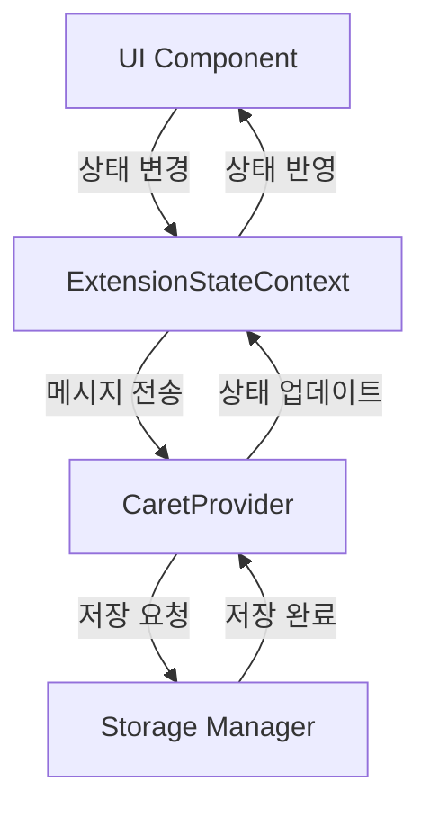

# UI ↔ Storage 흐름 가이드

## 1. 개요

이 문서는 Caret의 UI와 Storage 간의 데이터 흐름을 설명합니다. 프론트엔드(React)와 백엔드(VSCode Extension) 간의 데이터 저장, 로드, 시크릿 관리 등의 상호작용을 다룹니다.

## 2. 핵심 흐름

### 2.1 기본 데이터 흐름


### 2.2 주요 컴포넌트
1. **UI Layer**
   - React 컴포넌트
   - ExtensionStateContext
   - 메시지 핸들러

2. **Extension Layer**
   - CaretProvider
   - Storage Manager
   - API 핸들러

3. **Storage Layer**
   - VSCode Extension Storage
   - 파일 시스템
   - 시크릿 저장소

## 3. 데이터 저장/로드

### 3.1 일반 데이터
```typescript
// UI에서 저장 요청
const saveData = async (key: string, value: any) => {
  await vscode.postMessage({
    type: 'saveData',
    key,
    value
  });
};

// Extension에서 처리
case 'saveData':
  await storageManager.save(message.key, message.value);
  break;
```

### 3.2 이미지 데이터
```typescript
// UI에서 이미지 저장
const saveImage = async (imageData: string) => {
  await vscode.postMessage({
    type: 'saveImage',
    data: imageData
  });
};

// Extension에서 처리
case 'saveImage':
  await storageManager.saveImage(message.data);
  break;
```

### 3.3 시크릿 데이터
```typescript
// UI에서 시크릿 저장
const saveSecret = async (key: string, value: string) => {
  await vscode.postMessage({
    type: 'saveSecret',
    key,
    value
  });
};

// Extension에서 처리
case 'saveSecret':
  await storageManager.saveSecret(message.key, message.value);
  break;
```

## 4. 유틸리티 함수

### 4.1 Storage Manager
```typescript
class StorageManager {
  // 일반 데이터 저장
  async save(key: string, value: any): Promise<void> {
    await this.context.globalState.update(key, value);
  }

  // 일반 데이터 로드
  async load(key: string): Promise<any> {
    return this.context.globalState.get(key);
  }

  // 이미지 저장
  async saveImage(data: string): Promise<string> {
    const path = await this.getImagePath();
    await fs.writeFile(path, data, 'base64');
    return path;
  }

  // 시크릿 저장
  async saveSecret(key: string, value: string): Promise<void> {
    await this.context.secrets.store(key, value);
  }

  // 시크릿 로드
  async loadSecret(key: string): Promise<string | undefined> {
    return this.context.secrets.get(key);
  }
}
```

### 4.2 URI 변환
```typescript
// 웹뷰 URI를 파일 시스템 URI로 변환
function webviewUriToFileUri(uri: string): string {
  return uri.replace('vscode-webview://', 'file://');
}

// 파일 시스템 URI를 웹뷰 URI로 변환
function fileUriToWebviewUri(uri: string): string {
  return uri.replace('file://', 'vscode-webview://');
}
```

## 5. 보안 고려사항

### 5.1 데이터 보안
- 시크릿 데이터는 반드시 VSCode의 시크릿 저장소 사용
- 민감한 정보는 암호화하여 저장
- 파일 시스템 접근 권한 검증

### 5.2 URI 보안
- 웹뷰 URI와 파일 시스템 URI 변환 시 검증
- 허용된 경로만 접근 가능하도록 제한
- 상대 경로 사용 시 보안 검증

## 6. 에러 처리

### 6.1 저장 실패
```typescript
try {
  await storageManager.save(key, value);
} catch (error) {
  vscode.postMessage({
    type: 'error',
    message: '저장 실패: ' + error.message
  });
}
```

### 6.2 로드 실패
```typescript
try {
  const value = await storageManager.load(key);
  if (!value) {
    throw new Error('데이터를 찾을 수 없음');
  }
} catch (error) {
  vscode.postMessage({
    type: 'error',
    message: '로드 실패: ' + error.message
  });
}
```

## 7. 모범 사례

### 7.1 데이터 저장
- 큰 데이터는 청크 단위로 분할하여 저장
- 저장 전 데이터 유효성 검증
- 저장 실패 시 롤백 처리

### 7.2 데이터 로드
- 필요한 데이터만 선택적으로 로드
- 캐싱을 통한 성능 최적화
- 로드 실패 시 기본값 제공

### 7.3 에러 처리
- 사용자 친화적인 에러 메시지
- 자동 복구 시도
- 상세한 에러 로깅

## 8. 업데이트 기록
- 2024-03-21: 초기 문서 작성
- 2024-03-21: 이미지 저장/로드 섹션 추가
- 2024-03-21: 시크릿 관리 섹션 추가
- 2024-03-21: 보안 고려사항 추가
