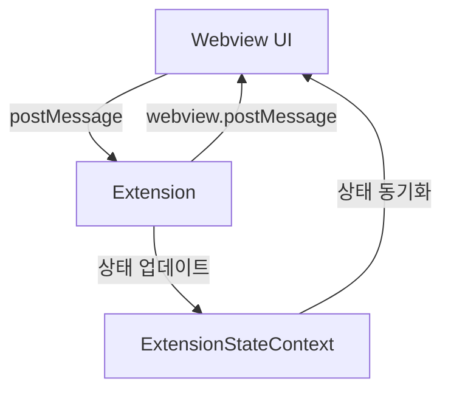

# Webview ↔ Extension 통신 가이드

## 1. 개요

이 문서는 Caret의 Webview(React)와 VSCode Extension 간의 통신 방식을 설명합니다. 양방향 메시지 전달, 상태 동기화, 이벤트 처리 등의 상호작용을 다룹니다.

## 2. 통신 구조

### 2.1 기본 흐름


### 2.2 주요 컴포넌트
1. **Webview Layer**
   - React 컴포넌트
   - ExtensionStateContext
   - 메시지 핸들러

2. **Extension Layer**
   - CaretProvider
   - WebviewPanel
   - 메시지 핸들러

## 3. 메시지 타입

### 3.1 UI → Extension
```typescript
// 데이터 저장 요청
interface SaveDataMessage {
  type: 'saveData';
  key: string;
  value: any;
}

// 데이터 로드 요청
interface LoadDataMessage {
  type: 'loadData';
  key: string;
}

// 설정 변경 요청
interface UpdateConfigMessage {
  type: 'updateConfig';
  config: any;
}
```

### 3.2 Extension → UI
```typescript
// 상태 업데이트
interface StateUpdateMessage {
  type: 'stateUpdate';
  state: any;
}

// 에러 메시지
interface ErrorMessage {
  type: 'error';
  message: string;
}

// 작업 완료
interface CompleteMessage {
  type: 'complete';
  result: any;
}
```

## 4. 상태 관리

### 4.1 ExtensionStateContext
```typescript
// 상태 컨텍스트 정의
interface ExtensionState {
  config: any;
  data: any;
  status: 'idle' | 'loading' | 'error';
}

// 컨텍스트 생성
const ExtensionStateContext = React.createContext<ExtensionState>({
  config: {},
  data: {},
  status: 'idle'
});
```

### 4.2 상태 동기화
```typescript
// Extension에서 상태 업데이트
function updateState(webview: vscode.Webview, state: any): void {
  webview.postMessage({
    type: 'stateUpdate',
    state
  });
}

// Webview에서 상태 수신
useEffect(() => {
  const handleMessage = (event: MessageEvent) => {
    const message = event.data;
    if (message.type === 'stateUpdate') {
      setState(message.state);
    }
  };

  window.addEventListener('message', handleMessage);
  return () => window.removeEventListener('message', handleMessage);
}, []);
```

## 5. 메시지 처리

### 5.1 Extension 측
```typescript
// 메시지 핸들러 등록
webviewPanel.webview.onDidReceiveMessage(
  async (message) => {
    switch (message.type) {
      case 'saveData':
        await handleSaveData(message);
        break;
      case 'loadData':
        await handleLoadData(message);
        break;
      case 'updateConfig':
        await handleUpdateConfig(message);
        break;
    }
  },
  undefined,
  context.subscriptions
);
```

### 5.2 Webview 측
```typescript
// 메시지 전송
const sendMessage = (message: any): void => {
  vscode.postMessage(message);
};

// 메시지 핸들러
useEffect(() => {
  const handleMessage = (event: MessageEvent) => {
    const message = event.data;
    switch (message.type) {
      case 'stateUpdate':
        setState(message.state);
        break;
      case 'error':
        showError(message.message);
        break;
      case 'complete':
        handleComplete(message.result);
        break;
    }
  };

  window.addEventListener('message', handleMessage);
  return () => window.removeEventListener('message', handleMessage);
}, []);
```

## 6. 에러 처리

### 6.1 Extension 측
```typescript
// 에러 전송
function sendError(webview: vscode.Webview, message: string): void {
  webview.postMessage({
    type: 'error',
    message
  });
}

// 에러 핸들링
try {
  await handleMessage(message);
} catch (error) {
  sendError(webview, error.message);
}
```

### 6.2 Webview 측
```typescript
// 에러 표시
function showError(message: string): void {
  // 에러 UI 표시
  console.error(message);
}

// 에러 핸들링
useEffect(() => {
  const handleMessage = (event: MessageEvent) => {
    const message = event.data;
    if (message.type === 'error') {
      showError(message.message);
    }
  };

  window.addEventListener('message', handleMessage);
  return () => window.removeEventListener('message', handleMessage);
}, []);
```

## 7. 모범 사례

### 7.1 메시지 전송
- 메시지 타입 명확히 정의
- 필요한 데이터만 전송
- 에러 처리 포함

### 7.2 상태 관리
- 단일 진실 공급원(Single Source of Truth)
- 불필요한 상태 업데이트 방지
- 상태 변경 추적

### 7.3 에러 처리
- 사용자 친화적인 에러 메시지
- 에러 복구 메커니즘
- 상세한 에러 로깅

## 8. 업데이트 기록
- 2024-03-21: 초기 문서 작성
- 2024-03-21: 메시지 타입 정의 추가
- 2024-03-21: 상태 관리 섹션 추가
- 2024-03-21: 에러 처리 섹션 추가
