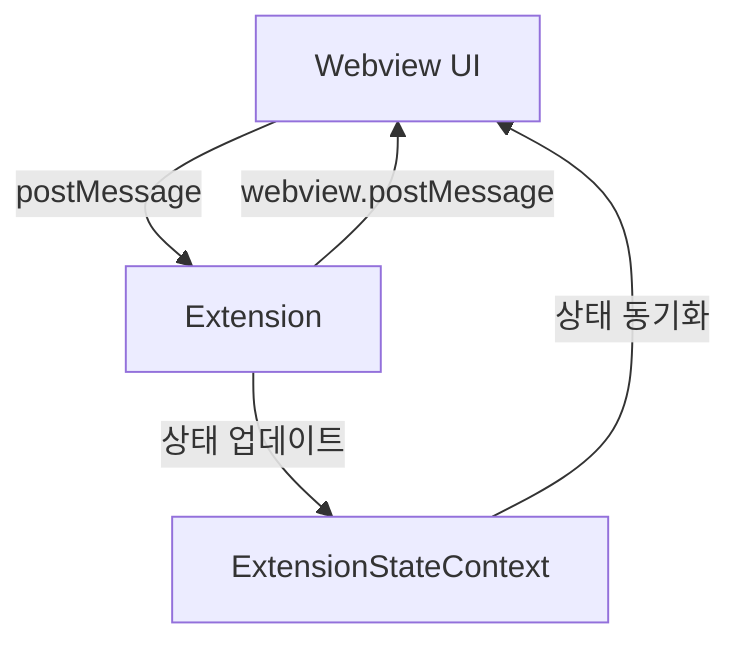

# Webview ↔ Extension 통신 가이드

## 1. 개요

이 문서는 Caret의 Webview(React)와 VSCode Extension 간의 통신 방식을 설명합니다. 양방향 메시지 전달, 상태 동기화, 이벤트 처리 등의 상호작용을 다룹니다.

## 2. 통신 구조

### 2.1 기본 흐름



### 2.2 주요 컴포넌트

1. **Webview Layer**

    - React 컴포넌트
    - ExtensionStateContext
    - 메시지 핸들러

2. **Extension Layer**
    - CaretProvider
    - WebviewPanel
    - 메시지 핸들러

## 3. 메시지 타입 정의

### 3.1 UI → Extension 메시지

실제 타입 정의 위치: `caret-src/shared/types/messages.ts`

```typescript
export interface BaseMessage {
	type: string
	timestamp?: string
}

// 데이터 저장 요청
export interface SaveDataMessage extends BaseMessage {
	type: "saveData"
	key: string
	value: any
}

// 데이터 로드 요청
export interface LoadDataMessage extends BaseMessage {
	type: "loadData"
	key: string
}

// 시크릿 저장 요청
export interface SaveSecretMessage extends BaseMessage {
	type: "saveSecret"
	key: string
	value: string
}

// 시크릿 로드 요청
export interface LoadSecretMessage extends BaseMessage {
	type: "loadSecret"
	key: string
}

// 이미지 저장 요청
export interface SaveImageMessage extends BaseMessage {
	type: "saveImage"
	data: string // Base64 encoded image
}

// 설정 변경 요청
export interface UpdateConfigMessage extends BaseMessage {
	type: "updateConfig"
	config: any
}
```

### 3.2 Extension → UI 메시지

```typescript
// Response 메시지들
export interface ResponseMessage extends BaseMessage {
	success: boolean
	error?: string
}

// 상태 업데이트
export interface StateUpdateMessage extends BaseMessage {
	type: "stateUpdate"
	state: any
}

// 에러 메시지
export interface ErrorMessage extends BaseMessage {
	type: "error"
	message: string
	code?: string
}

// 데이터 로드 응답
export interface LoadDataResponse extends ResponseMessage {
	type: "loadDataResponse"
	value?: any
}

// 시크릿 로드 응답
export interface LoadSecretResponse extends ResponseMessage {
	type: "loadSecretResponse"
	value?: string
}

// 이미지 저장 응답
export interface SaveImageResponse extends ResponseMessage {
	type: "saveImageResponse"
	path?: string
}

// 작업 완료
export interface CompleteMessage extends BaseMessage {
	type: "complete"
	result: any
}
```

## 4. 상태 관리

### 4.1 ExtensionStateContext

실제 구현 위치: `webview-ui/src/context/ExtensionStateContext.tsx`

```typescript
// 상태 컨텍스트 정의
interface ExtensionState {
	// 데이터 상태
	data: Record<string, any>
	secrets: Record<string, string>
	config: any

	// UI 상태
	theme: string
	language: string
	isReady: boolean
	status: "idle" | "loading" | "error"

	// 에러 상태
	lastError?: string
}

// 초기 상태
const initialState: ExtensionState = {
	data: {},
	secrets: {},
	config: {},
	theme: "dark",
	language: "ko",
	isReady: false,
	status: "idle",
}

// 컨텍스트 생성
export const ExtensionStateContext = createContext<{
	state: ExtensionState
	dispatch: React.Dispatch<ExtensionStateAction>
} | null>(null)

// 상태 업데이트 액션
type ExtensionStateAction =
	| { type: "SET_DATA"; key: string; value: any }
	| { type: "SET_SECRET"; key: string; value: string }
	| { type: "SET_CONFIG"; config: any }
	| { type: "SET_READY"; isReady: boolean }
	| { type: "SET_STATUS"; status: ExtensionState["status"] }
	| { type: "SET_ERROR"; error: string }
	| { type: "CLEAR_ERROR" }
	| { type: "RESET_STATE" }

// 리듀서 함수
function extensionStateReducer(state: ExtensionState, action: ExtensionStateAction): ExtensionState {
	switch (action.type) {
		case "SET_DATA":
			return {
				...state,
				data: { ...state.data, [action.key]: action.value },
			}
		case "SET_SECRET":
			return {
				...state,
				secrets: { ...state.secrets, [action.key]: action.value },
			}
		case "SET_CONFIG":
			return {
				...state,
				config: action.config,
			}
		case "SET_READY":
			return {
				...state,
				isReady: action.isReady,
			}
		case "SET_STATUS":
			return {
				...state,
				status: action.status,
			}
		case "SET_ERROR":
			return {
				...state,
				lastError: action.error,
				status: "error",
			}
		case "CLEAR_ERROR":
			return {
				...state,
				lastError: undefined,
				status: "idle",
			}
		case "RESET_STATE":
			return initialState
		default:
			return state
	}
}
```

### 4.2 상태 동기화

```typescript
// Extension에서 상태 업데이트
export class CaretProvider extends WebviewProvider {
  updateWebviewState(state: Partial<ExtensionState>): void {
    try {
      this.postMessage({
        type: 'stateUpdate',
        state
      });
      caretLogger.debug('State updated in webview', 'CaretProvider');
    } catch (error) {
      caretLogger.error(`Failed to update webview state: ${error.message}`, 'CaretProvider');
    }
  }
}

// Webview에서 상태 수신
const ExtensionStateProvider: React.FC<{ children: React.ReactNode }> = ({ children }) => {
  const [state, dispatch] = useReducer(extensionStateReducer, initialState);

  useEffect(() => {
    const handleMessage = (event: MessageEvent) => {
      const message = event.data;

      switch (message.type) {
        case 'stateUpdate':
          // 상태 업데이트 처리
          Object.entries(message.state).forEach(([key, value]) => {
            if (key === 'data') {
              Object.entries(value as Record<string, any>).forEach(([dataKey, dataValue]) => {
                dispatch({ type: 'SET_DATA', key: dataKey, value: dataValue });
              });
            } else if (key === 'config') {
              dispatch({ type: 'SET_CONFIG', config: value });
            } else if (key === 'isReady') {
              dispatch({ type: 'SET_READY', isReady: value as boolean });
            }
          });
          break;
        case 'error':
          dispatch({ type: 'SET_ERROR', error: message.message });
          break;
        case 'complete':
          dispatch({ type: 'SET_STATUS', status: 'idle' });
          break;
      }
    };

    window.addEventListener('message', handleMessage);
    return () => window.removeEventListener('message', handleMessage);
  }, []);

  return (
    <ExtensionStateContext.Provider value={{ state, dispatch }}>
      {children}
    </ExtensionStateContext.Provider>
  );
};
```

## 5. 메시지 처리

### 5.1 Extension 측 메시지 핸들러

실제 구현 위치: `caret-src/core/webview/CaretProvider.ts`

```typescript
export class CaretProvider extends WebviewProvider {
	// 메시지 핸들러 등록
	protected initializeMessageHandling(): void {
		this.webviewPanel?.webview.onDidReceiveMessage(
			async (message) => {
				try {
					caretLogger.debug(`Received message: ${message.type}`, "CaretProvider")

					const response = await this.handleWebviewMessage(message)

					if (response) {
						this.postMessage(response)
					}
				} catch (error) {
					caretLogger.error(`Message handling failed: ${error.message}`, "CaretProvider")
					this.postMessage({
						type: "error",
						message: error.message,
						code: "MESSAGE_HANDLING_FAILED",
					})
				}
			},
			undefined,
			this.context.subscriptions,
		)
	}

	// 메시지 타입별 처리
	protected async handleWebviewMessage(message: any): Promise<any> {
		switch (message.type) {
			case "saveData":
				return await this.handleSaveData(message)
			case "loadData":
				return await this.handleLoadData(message)
			case "saveSecret":
				return await this.handleSaveSecret(message)
			case "loadSecret":
				return await this.handleLoadSecret(message)
			case "saveImage":
				return await this.handleSaveImage(message)
			case "updateConfig":
				return await this.handleUpdateConfig(message)
			case "ping":
				return { type: "pong", timestamp: Date.now() }
			default:
				throw new Error(`Unknown message type: ${message.type}`)
		}
	}

	// 개별 메시지 핸들러들
	private async handleSaveData(message: SaveDataMessage): Promise<ResponseMessage> {
		await this.storageManager.save(message.key, message.value)
		this.updateWebviewState({
			data: { [message.key]: message.value },
		})
		return { type: "saveDataResponse", success: true }
	}

	private async handleLoadData(message: LoadDataMessage): Promise<LoadDataResponse> {
		const value = await this.storageManager.load(message.key)
		return {
			type: "loadDataResponse",
			success: true,
			value,
		}
	}

	private async handleSaveSecret(message: SaveSecretMessage): Promise<ResponseMessage> {
		await this.secretManager.store(message.key, message.value)
		return { type: "saveSecretResponse", success: true }
	}

	private async handleLoadSecret(message: LoadSecretMessage): Promise<LoadSecretResponse> {
		const value = await this.secretManager.get(message.key)
		return {
			type: "loadSecretResponse",
			success: true,
			value,
		}
	}
}
```

### 5.2 Webview 측 메시지 처리

실제 구현 위치: `webview-ui/src/utils/vscode.ts`

```typescript
// VSCode API 래퍼
class VSCodeAPI {
	private messageId = 0
	private pendingMessages = new Map<number, { resolve: Function; reject: Function }>()

	constructor() {
		// 응답 메시지 리스너 설정
		window.addEventListener("message", this.handleMessage.bind(this))
	}

	// 메시지 전송 (Promise 기반)
	async postMessage<T = any>(message: any): Promise<T> {
		return new Promise((resolve, reject) => {
			const id = ++this.messageId
			const messageWithId = { ...message, id }

			this.pendingMessages.set(id, { resolve, reject })

			// 타임아웃 설정 (30초)
			setTimeout(() => {
				if (this.pendingMessages.has(id)) {
					this.pendingMessages.delete(id)
					reject(new Error(`Message timeout: ${message.type}`))
				}
			}, 30000)

			// VSCode로 메시지 전송
			window.parent.postMessage(messageWithId, "*")
		})
	}

	// 즉시 메시지 전송 (응답 불필요)
	postMessageSync(message: any): void {
		window.parent.postMessage(message, "*")
	}

	// 응답 메시지 처리
	private handleMessage(event: MessageEvent): void {
		const message = event.data

		if (message.id && this.pendingMessages.has(message.id)) {
			const { resolve, reject } = this.pendingMessages.get(message.id)!
			this.pendingMessages.delete(message.id)

			if (message.success === false || message.type === "error") {
				reject(new Error(message.error || message.message || "Unknown error"))
			} else {
				resolve(message)
			}
		}
	}
}

export const vscode = new VSCodeAPI()
```

### 5.3 React 컴포넌트에서의 사용

```typescript
// Custom Hook for Storage Operations
export const useStorage = () => {
  const { state, dispatch } = useContext(ExtensionStateContext)!;

  const saveData = useCallback(async (key: string, value: any) => {
    try {
      dispatch({ type: 'SET_STATUS', status: 'loading' });

      await vscode.postMessage({
        type: 'saveData',
        key,
        value
      });

      dispatch({ type: 'SET_DATA', key, value });
      dispatch({ type: 'SET_STATUS', status: 'idle' });
    } catch (error) {
      dispatch({ type: 'SET_ERROR', error: error.message });
      throw error;
    }
  }, [dispatch]);

  const loadData = useCallback(async (key: string) => {
    try {
      dispatch({ type: 'SET_STATUS', status: 'loading' });

      const response = await vscode.postMessage({
        type: 'loadData',
        key
      });

      dispatch({ type: 'SET_DATA', key, value: response.value });
      dispatch({ type: 'SET_STATUS', status: 'idle' });

      return response.value;
    } catch (error) {
      dispatch({ type: 'SET_ERROR', error: error.message });
      throw error;
    }
  }, [dispatch]);

  return {
    saveData,
    loadData,
    data: state.data,
    status: state.status,
    error: state.lastError
  };
};

// React 컴포넌트에서 사용
const MyComponent: React.FC = () => {
  const { saveData, loadData, data, status, error } = useStorage();

  const handleSave = async () => {
    try {
      await saveData('userPreferences', { theme: 'dark', language: 'ko' });
      console.log('Data saved successfully');
    } catch (error) {
      console.error('Failed to save data:', error);
    }
  };

  const handleLoad = async () => {
    try {
      const preferences = await loadData('userPreferences');
      console.log('Loaded preferences:', preferences);
    } catch (error) {
      console.error('Failed to load data:', error);
    }
  };

  return (
    <div>
      <button onClick={handleSave} disabled={status === 'loading'}>
        Save Preferences
      </button>
      <button onClick={handleLoad} disabled={status === 'loading'}>
        Load Preferences
      </button>
      {error && <div className="error">Error: {error}</div>}
      {status === 'loading' && <div>Loading...</div>}
    </div>
  );
};
```

## 6. 에러 처리 및 복구

### 6.1 Extension 측 에러 처리

```typescript
export class CaretProvider extends WebviewProvider {
	// 전역 에러 핸들러
	private setupErrorHandling(): void {
		process.on("unhandledRejection", (reason, promise) => {
			caretLogger.error(`Unhandled rejection: ${reason}`, "CaretProvider")
			this.postMessage({
				type: "error",
				message: "An unexpected error occurred",
				code: "UNHANDLED_REJECTION",
			})
		})

		process.on("uncaughtException", (error) => {
			caretLogger.error(`Uncaught exception: ${error.message}`, "CaretProvider")
			this.postMessage({
				type: "error",
				message: "A critical error occurred",
				code: "UNCAUGHT_EXCEPTION",
			})
		})
	}

	// 메시지 처리 에러 핸들링
	protected async handleWebviewMessage(message: any): Promise<any> {
		const startTime = Date.now()

		try {
			const result = await super.handleWebviewMessage(message)

			caretLogger.debug(`Message ${message.type} processed in ${Date.now() - startTime}ms`, "CaretProvider")

			return result
		} catch (error) {
			caretLogger.error(
				`Message ${message.type} failed after ${Date.now() - startTime}ms: ${error.message}`,
				"CaretProvider",
			)

			return {
				type: "error",
				message: error.message,
				code: error.code || "MESSAGE_PROCESSING_ERROR",
				originalMessageType: message.type,
			}
		}
	}
}
```

### 6.2 Webview 측 에러 처리

```typescript
// 에러 경계 컴포넌트
class ErrorBoundary extends React.Component<
  { children: React.ReactNode },
  { hasError: boolean; error?: Error }
> {
  constructor(props: { children: React.ReactNode }) {
    super(props);
    this.state = { hasError: false };
  }

  static getDerivedStateFromError(error: Error) {
    return { hasError: true, error };
  }

  componentDidCatch(error: Error, errorInfo: React.ErrorInfo) {
    caretWebviewLogger.error('React error boundary caught error', {
      error: error.message,
      errorInfo
    });

    // Extension에 에러 보고
    vscode.postMessageSync({
      type: 'reportError',
      error: {
        message: error.message,
        stack: error.stack,
        componentStack: errorInfo.componentStack
      }
    });
  }

  render() {
    if (this.state.hasError) {
      return (
        <div className="error-boundary">
          <h2>Something went wrong</h2>
          <p>An error occurred in the application. Please try refreshing.</p>
          <button onClick={() => this.setState({ hasError: false })}>
            Try Again
          </button>
        </div>
      );
    }

    return this.props.children;
  }
}

// 메시지 전송 에러 처리
export class VSCodeAPI {
  async postMessage<T = any>(message: any): Promise<T> {
    const maxRetries = 3;
    let lastError: Error;

    for (let i = 0; i < maxRetries; i++) {
      try {
        return await this.sendMessage<T>(message);
      } catch (error) {
        lastError = error as Error;
        caretWebviewLogger.warn(`Message failed, retry ${i + 1}/${maxRetries}`, error);

        if (i < maxRetries - 1) {
          await new Promise(resolve => setTimeout(resolve, 1000 * (i + 1)));
        }
      }
    }

    throw lastError!;
  }
}
```

## 7. 성능 최적화

### 7.1 메시지 배치 처리

```typescript
// 메시지 배치 처리 클래스
class MessageBatcher {
	private queue: any[] = []
	private timer: NodeJS.Timeout | null = null
	private readonly batchSize = 10
	private readonly batchDelay = 100 // ms

	addMessage(message: any): void {
		this.queue.push(message)

		if (this.queue.length >= this.batchSize) {
			this.flush()
		} else if (!this.timer) {
			this.timer = setTimeout(() => this.flush(), this.batchDelay)
		}
	}

	private flush(): void {
		if (this.queue.length === 0) return

		const messages = this.queue.splice(0)

		vscode.postMessageSync({
			type: "batchMessages",
			messages,
		})

		if (this.timer) {
			clearTimeout(this.timer)
			this.timer = null
		}
	}
}

const messageBatcher = new MessageBatcher()
```

### 7.2 상태 변경 최적화

```typescript
// 상태 변경 디바운싱
const debouncedStateUpdate = useMemo(
  () => debounce((state: Partial<ExtensionState>) => {
    vscode.postMessageSync({
      type: 'stateUpdate',
      state
    });
  }, 300),
  []
);

// 메모이제이션을 통한 불필요한 렌더링 방지
const MemoizedComponent = React.memo<Props>(({ data }) => {
  return <div>{JSON.stringify(data)}</div>;
}, (prevProps, nextProps) => {
  return JSON.stringify(prevProps.data) === JSON.stringify(nextProps.data);
});
```

## 8. 업데이트 기록

-   2024-03-21: 초기 문서 작성
-   2024-03-21: 메시지 타입 정의 추가
-   2024-03-21: 상태 관리 섹션 보강
-   2024-03-21: 에러 처리 가이드라인 추가
-   2025-06-21: .mdx로 변환하고 실제 코드 구조에 맞게 업데이트
-   2025-06-21: Promise 기반 메시지 시스템, React 에러 경계, 성능 최적화 추가
-   2025-06-21: 메시지 배치 처리 추가
-   2025-06-21: 상태 변경 디바운싱 추가
-   2025-06-21: 메모이제이션을 통한 불필요한 렌더링 방지 추가
-   2025-06-21: 업데이트 기록 추가
