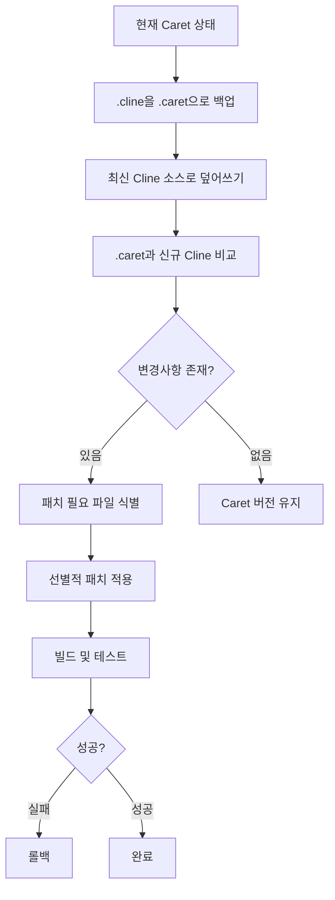

# Cline 업스트림 병합 가이드

Caret은 Cline 프로젝트의 **Fork**로, Cline의 최신 변경사항을 지속적으로 통합하여 안정성과 기능 개선을 유지해야 합니다. 이 문서는 Cline upstream의 변경사항을 Caret으로 안전하게 병합하는 절차와 충돌 해결 방법을 안내합니다.

## Fork 기반 업스트림 동기화 원칙

### 핵심 원칙
- **Cline 코드 보존**: `src/`, `webview-ui/` 디렉토리의 Cline 원본 코드는 가능한 한 수정하지 않고 보존
- **Git merge 활용**: 오버레이 방식이 아닌 Git의 표준 merge 워크플로우 사용
- **최소한의 충돌**: Caret 확장 코드를 `caret-src/`에 분리하여 충돌 최소화
- **체계적 테스트**: 병합 후 전체 시스템 동작 검증

## 업스트림 동기화 절차

### 1. 업스트림 Remote 설정 (최초 1회)

```bash
# Cline 원본 저장소를 upstream으로 추가
git remote add upstream https://github.com/cline/cline.git

# upstream 확인
git remote -v
```

### 2. 업스트림 변경사항 확인

```bash
# upstream 최신 정보 가져오기
git fetch upstream

# 변경사항 확인
git log --oneline main..upstream/main

# 변경된 파일 확인
git diff --name-only main upstream/main
```

### 3. 병합 전 준비작업

```bash
# 현재 작업 상태 확인 및 정리
git status
git stash  # 필요시 작업 중인 변경사항 임시 저장

# main 브랜치로 이동
git checkout main

# 로컬 main 브랜치 최신화
git pull origin main
```

### 4. 업스트림 병합 실행

```bash
# upstream/main을 현재 브랜치로 병합
git merge upstream/main

# 또는 rebase 방식 (선형 히스토리 유지 시)
# git rebase upstream/main
```

## 충돌 해결 전략

### 일반적인 충돌 유형과 해결 방법

#### 1. **Cline 원본 파일 충돌** (`src/`, `webview-ui/`)
- **원칙**: Cline 원본을 우선으로 하되, Caret 호환성 검토
- **해결**: 대부분의 경우 upstream 변경사항 수용
```bash
# upstream 변경사항 수용
git checkout --theirs <충돌파일>
```

#### 2. **빌드 설정 파일 충돌** (`package.json`, `tsconfig.json` 등)
- **원칙**: Fork 특성을 유지하면서 upstream 개선사항 적용
- **해결**: 수동으로 병합하여 Caret 설정과 Cline 개선사항 모두 반영

#### 3. **문서 파일 충돌** (`README.md`, `CHANGELOG.md` 등)
- **원칙**: Caret 고유 내용 유지
- **해결**: Caret 버전 우선, 필요시 Cline 개선사항 선별 적용

### 충돌 해결 예시

```bash
# 충돌 발생 시
git status  # 충돌 파일 확인

# 각 파일별로 해결
git mergetool  # GUI 도구 사용
# 또는 수동 편집

# 해결 완료 후 커밋
git add .
git commit -m "merge: integrate upstream changes from Cline"
```

## 병합 후 검증 절차

### 1. 빌드 시스템 검증
```bash
# 의존성 설치
npm install
cd webview-ui && npm install && cd ..

# 빌드 테스트
npm run compile
npm run build:webview
```

### 2. 기능 테스트
```bash
# 테스트 실행
npm run test

# VSCode Extension Development Host 테스트
# F5로 디버그 모드 실행하여 기본 기능 확인
```

### 3. Caret 고유 기능 확인
- CaretProvider 정상 동작 확인
- 웹뷰 UI 렌더링 확인
- 로깅 시스템 동작 확인

## 버전 호환성 관리

### VSCode API 호환성 유지

Caret의 `package.json`에서 관리하는 주요 버전들:
- `@types/vscode`: Cline과의 호환성을 위해 신중하게 관리
- `engines.vscode`: 최소 VSCode 버전 요구사항

**업그레이드 시 주의사항**:
1. Cline의 VSCode API 사용 패턴 확인
2. 타입 충돌 가능성 검토  
3. 전체 빌드 및 테스트 실행

### 의존성 충돌 해결

```bash
# package-lock.json 충돌 시
rm package-lock.json
npm install

# webview-ui 의존성 충돌 시
cd webview-ui
rm package-lock.json  
npm install
cd ..
```

## 문제 발생 시 복구 방법

### 병합 취소
```bash
# 병합 커밋 취소 (병합 직후)
git reset --hard HEAD~1

# 특정 커밋으로 되돌리기
git reset --hard <커밋해시>
```

### 안전한 병합을 위한 브랜치 전략
```bash
# 별도 브랜치에서 병합 테스트
git checkout -b upstream-merge-test
git merge upstream/main

# 테스트 완료 후 main에 적용
git checkout main
git merge upstream-merge-test
git branch -d upstream-merge-test
```

## 🚧 [검증 필요] 고급 백업 기반 머징 전략

> ⚠️ **주의**: 아래 전략은 아직 **검증되지 않은 계획 단계**입니다. 실제 적용 전 충분한 테스트가 필요합니다.

### 새로운 백업 기반 머징 접근법

기존 `.cline` 백업 시스템을 활용한 안전한 업스트림 머징 전략:

#### 핵심 아이디어
1. **`.cline` → `.caret` 확장**: 기존 백업을 머징 시 임시 저장소로 활용
2. **단계별 복원**: 새 Cline 코드로 덮어쓰기 → 차이점 분석 → 선별적 패치
3. **자동화된 검증**: 각 단계별 빌드/테스트를 통한 안전성 확보

#### 프로세스 플로우


#### 장점
- **안전성**: 단계별 롤백 포인트 제공
- **선택성**: 필요한 변경사항만 적용 가능
- **자동화**: 대부분 과정의 스크립트 자동화 가능

#### 잠재적 위험점
- **3-Way Merge 부재**: 원본 Cline vs 신규 Cline vs 현재 Caret 간 복잡한 비교
- **의존성 체인**: package.json 변경 시 연쇄 효과
- **부분 실패**: 중간 단계 실패 시 일관성 보장 어려움

### 머징 자동화 스크립트

아래 스크립트들이 `caret-scripts/`에 준비되어 있습니다:

- **`upstream-merge-prepare.js`**: 머징 전 준비 작업 (백업, 검증)
- **`upstream-merge-execute.js`**: 실제 머징 수행 (덮어쓰기, 패치)
- **`upstream-merge-verify.js`**: 머징 후 검증 (빌드, 테스트)

#### 사용법

> ⚠️ **주의**: 이 스크립트들은 프로젝트 메인테이너 전용이며, 매우 신중하게 사용해야 합니다.

```bash
# 1. 머징 준비 (백업 생성, 환경 검증)
node caret-scripts/upstream-merge-prepare.js

# 2. 실제 머징 수행 (위험! 되돌리기 어려움)
node caret-scripts/upstream-merge-execute.js

# 3. 머징 후 검증 (빌드, 테스트, 기능 확인)
node caret-scripts/upstream-merge-verify.js
```

> 💡 **권장**: 각 단계를 개별적으로 실행하고 결과를 확인한 후 다음 단계로 진행하세요.

---

## 정기적인 업스트림 동기화 권장사항

- **주기**: 월 1-2회 정기적인 업스트림 확인
- **타이밍**: 주요 기능 개발 완료 후, 안정적인 상태에서 진행
- **문서화**: 병합 내용과 변경사항을 `CHANGELOG-caret.md`에 기록
- **팀 공유**: 병합 결과와 주요 변경사항을 팀에 공유

---

**참고 문서**:
- [Caret Fork 기반 아키텍처 가이드](../development/caret-architecture-and-implementation-guide.mdx)
- [개발 환경 설정 가이드](../development/index.mdx) 