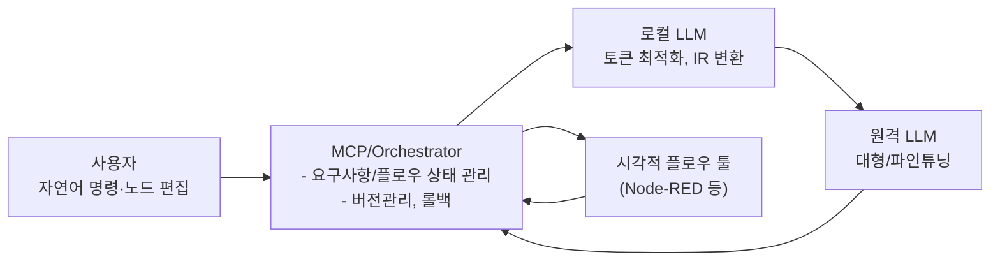

# 보고서: LLM기반의 비쥬얼 코딩 및 토큰 최적화된 개발 도구 개발 전략
**– 그래픽 노드 기반, LLM 오케스트레이션, 토큰 비용 최적화 –**

---

## 1. 배경 및 문제 인식

### 1.1 기존 코딩 방식의 한계
- 텍스트 기반 프로그래밍 언어와 IDE는 오랜 기간 표준적 방법으로 자리해 왔으나, 아래와 같은 문제점을 드러내고 있습니다.  
  1) **높은 진입장벽**  
     - 프로그래밍 언어 문법 학습이 필수이며, 비개발자가 접근하기 어렵습니다.  
  2) **협업·요구사항 전달의 비효율**  
     - PRD(기획 문서)와 실제 코드 간 불일치가 잦고, 디버깅 시 팀간 소통 비용이 큽니다.  
  3) **AI 시대에의 부적합**  
     - LLM과 코드를 연동할 때 토큰 비용이 높으며, 맥락 관리(컨텍스트 윈도우)에도 어려움이 많습니다.

### 1.2 새로운 패러다임의 부상
- **시각적 프로그래밍(Visual Scripting)**, **플로우 기반 개발(Flow-based Development)**, 그리고 **LLM(대형 언어 모델)과의 자동화 연계**가 결합되어,  
  “코드를 직접 작성하기보다 **그래픽 노드**나 **자연어**로 로직을 표현하고, 나머지는 AI가 처리·코드화하는” 방법이 주목받고 있습니다.  
- Node-RED, NoFlo 등 오픈소스 비주얼 플로우 툴과 ChatGPT/LLM의 결합 시도가 늘어나면서, **차세대 코딩 도구**로 발전할 가능성이 커지고 있습니다.

---

## 2. 제안 개요

### 2.1 그래픽 노드(Visual Flow) 중심의 로직 구성
- 기존 “PRD 문서 → 텍스트 코딩” 과정을 **노드 기반** 시각적 에디터로 대체·보완합니다.  
- 사용자(개발자·비개발자 모두)는 기능 블록(노드)을 배치·연결하여 **데이터 흐름**과 **제어 흐름**을 직관적으로 구성합니다.  
- 복잡한 로직은 **서브그래프**나 **모듈** 단위로 추상화하여, 대규모 프로젝트에서도 무리 없이 적용 가능합니다.

### 2.2 LLM 오케스트레이션(AI↔AI 통신) 구조
1. **로컬(소규모) LLM**  
   - 프로젝트 요구사항·노드 그래프를 **요약/압축**해 **원격 LLM**으로 전송할 토큰을 줄여줍니다.  
   - 1차 디버깅 분석, 중복 제거, IR(중간표현) 변환 등을 담당합니다.

2. **원격(대형/파인튜닝된) LLM**  
   - 로컬 LLM이 넘긴 IR을 토대로, **정교한 코드 생성** 또는 **고급 로직 보완**을 수행합니다.  
   - 큰 모델 특유의 맥락 처리 능력과 도메인 파인튜닝을 활용해, 효율적인 결과를 반환합니다.

### 2.3 시나리오 예시
1. **사용자**가 노드 에디터에서 몇 개 노드를 배치하고, 자연어로 “이 API를 DB와 연동해 CRUD 기능을 만들어줘”라고 명령합니다.  
2. **로컬 LLM**이 노드 그래프 상태와 사용자 요구사항을 종합, **중간표현(예: JSON 스키마)**으로 요약하고 **최소 토큰화**합니다.  
3. **원격 LLM**이 이를 받아 실제 코드를 생성하거나, 노드 간 연결을 최적화한 결과를 반환합니다.  
4. 노드 에디터는 반환된 정보를 반영해 흐름을 갱신하고, 필요 시 반복적으로 디버깅 및 테스트를 진행합니다.

---

## 3. 아키텍처 개요

아래는 본 제안의 전반적 아키텍처를 간단히 나타낸 **Mermaid** 다이어그램입니다.

## 4. 기대 효과

### 4.1 코딩 진입장벽 완화
- **비개발자**도 노드 연결만으로 기능을 설계할 수 있고, 코드 작성은 AI가 담당함으로써 사용자층이 넓어집니다.  
- 기존의 텍스트 기반 설계를 시각적 방식으로 바꾸어, 팀 내 협업 효율이 크게 향상됩니다.

### 4.2 디버깅·유지보수 효율 상승
- 노드 기반 시각화로 전체 로직 흐름을 한눈에 파악할 수 있고, **LLM이 자동으로 디버깅 분석**과 수정 제안을 해줍니다.  
- 실행 로그를 로컬 LLM이 요약, 원격 LLM이 해결책 제공 → 플로우 자동 갱신 등 빠른 문제 해결 프로세스를 구축할 수 있습니다.

### 4.3 개발 비용·시간 절감
- **로컬 LLM**으로 토큰을 줄임으로써, 원격 LLM 호출 비용을 대폭 감소시킵니다.  
- 반복적이고 보일러플레이트성 코드를 AI가 생성해주어, 개발자들은 핵심 설계·아키텍처에 집중 가능합니다.

### 4.4 생태계 확장성
- Node-RED 등 시각적 플로우 툴의 방대한 노드(플러그인) 생태계를 그대로 활용할 수 있어, 다양한 도메인(클라우드, DB, IoT 등)에 쉽게 적용 가능합니다.  
- 자체 MCP 기능을 통해 새 노드를 추가하거나 기업 내부 도메인 맞춤형 기능을 제공함으로써, 확장성과 차별화를 모두 확보할 수 있습니다.

---

## 5. 구현 시 고려 사항

1. **IR(Intermediate Representation) 설계**  
   - 로컬 LLM이 노드 그래프와 사용자 요구사항을 어떤 **중간표현**으로 변환해 원격 LLM에 전달할지, 체계적인 데이터 구조 설계가 필수입니다.  
   - JSON Schema, DSL, AST 등 여러 접근 방식을 비교 분석해야 합니다.

2. **버전 관리 및 충돌 처리**  
   - MCP가 Node-RED 플로우 버전을 스냅샷하거나 Git 등 VCS와 연동함으로써, 롤백·충돌 해결 시나리오를 지원해야 합니다.  
   - AI가 제안한 수정안이 기존 로직과 충돌할 경우, 자동·수동 머지 과정을 거치는 UI/UX가 필요합니다.

3. **로컬 LLM 모델 선정**  
   - 용량, 성능, 라이선스, 추론 속도 등 종합 요건에 맞춰 모델을 결정합니다.  
   - 규모가 큰 프로젝트일수록 로컬 LLM이 처리해야 할 맥락도 늘어나므로, 최적화 전략을 사전에 마련해야 합니다.

4. **사용자 경험(UX) 설계**  
   - 사용자에게 자연어 대화, 노드 편집, AI의 수정 제안이 **원활히 통합**된 환경을 제공해야 합니다.  
   - 오랜 시간이 걸리는 AI 호출은 비동기로 처리하고, 진행 상황을 시각적으로 안내하는 등 세심한 UX가 중요합니다.

5. **보안·권한 관리**  
   - 원격 LLM 호출 시, 민감 정보(소스, 환경 변수 등)가 노출되지 않도록 **마스킹·필터링** 방안을 마련합니다.  
   - 사내망/프라이빗 클라우드 등 엔터프라이즈 시나리오를 고려해 보안 요건을 충족시켜야 합니다.

---

## 6. 추진 전략

1. **1단계: 프로토타입 구축**  
   - Node-RED와 MCP, 로컬 LLM, 원격 LLM을 연동한 기본 흐름(로직 생성, 수정)을 PoC로 구현.  
   - 간단한 CRUD 예제, REST API 연동 테스트로 사용자 반응과 기능 적합성 검증.

2. **2단계: 디버깅 자동화·버전 관리 강화**  
   - 실행 로그/에러를 로컬 LLM이 요약하고 원격 LLM이 수정 제안 → 플로우 자동 업데이트 흐름을 고도화.  
   - MCP가 버전별 변경 이력을 관리, 충돌 발생 시 대처할 수 있는 UI/UX를 제공.

3. **3단계: 커스텀 노드 생태계 확장**  
   - DB, 클라우드, AI 인퍼런스, 메시징, CI/CD 등 핵심 노드를 빠르게 추가해 실무 적용 범위를 늘린다.  
   - 기업 내 도메인별 맞춤형 노드 개발로 실제 비즈니스 시나리오와의 접점을 강화한다.

4. **4단계: 상용화·오픈소스화**  
   - 충분한 안정성과 기능이 확보되면 상용 솔루션, 오픈소스 프로젝트 등으로 출시.  
   - 대규모 사용자·개발자 커뮤니티를 유치하여, 자체 생태계를 발전시킬 수 있습니다.

---

## 7. 기대 성과

- **혁신적 개발 생산성**  
  그래픽 편집 + AI 자동화로 개발 기간을 단축하고, 인력 효율을 극대화할 수 있습니다.  
- **Low-code/No-code 시장 경쟁력**  
  단순 폼 빌더를 넘어선 **LLM 통합** 구현으로, 차세대 로우코드 플랫폼 경쟁에서 차별화가 가능합니다.  
- **협업 시너지**  
  시각적 로직을 기반으로 기획·디자인·운영·개발자가 동일한 관점에서 소통해 커뮤니케이션 비용이 크게 줄어듭니다.  
- **토큰 비용 절감**  
  로컬 LLM의 전처리로, 원격 LLM 호출 횟수 및 맥락 길이를 줄여 전체 AI 운영비용을 절감합니다.

---

## 8. 결론

본 보고서에서는 “**그래픽 노드 기반 코딩 + LLM 오케스트레이션 + 토큰 비용 최적화**”를 중심으로 하는 **차세대 코딩 도구**를 제안했습니다.

1. **개발 방식 혁신**: 텍스트가 아닌 시각적 노드와 자연어 대화를 통해 로직을 구성함으로써, 비개발자까지도 손쉽게 참여 가능.  
2. **AI 시대에 최적화**: 로컬 LLM ↔ 원격 LLM 구도 덕분에, 토큰 비용·맥락 제한 문제를 효율적으로 해결.  
3. **단계별 성숙**: 프로토타입 → 디버깅 & 버전 관리 강화 → 커스텀 노드 생태계 → 상용화·오픈소스화를 통해 점진적 성장 가능.  
4. **지속적 진화 가능성**: 새 노드·모델·클라우드와 쉽게 연동하여, 미래 기술 변화를 탄력적으로 수용할 수 있음.

이 제안을 토대로 실제 **프로토타입**을 구현하고, 조기에 사용자 피드백을 수렴함으로써 **Caret/Cline**이 추구하는 **AI-First 개발환경**을 구체화할 수 있을 것으로 기대합니다.
