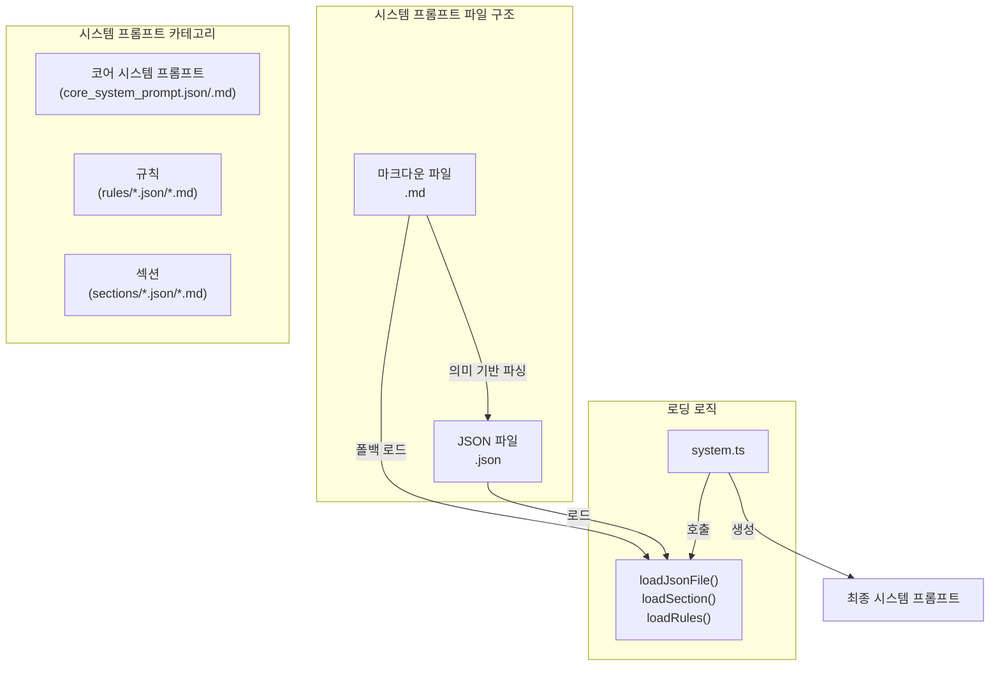

# 시스템 프롬프트 아키텍처

## 개요

Cline의 시스템 프롬프트는 마크다운-JSON 쌍 구조를 기반으로 합니다. 이 구조는 사람이 읽고 편집하기 쉬운 마크다운 형식과 AI가 처리하기 효율적인 JSON 형식을 결합하여 최적의 성능과 관리성을 제공합니다.

## 핵심 구성 요소

시스템 프롬프트 아키텍처는 다음과 같은 주요 구성 요소로 이루어져 있습니다:



### 1. 파일 구조

- **마크다운 파일 (.md)**: 사람이 읽고 관리하기 위한 원본 문서
- **JSON 파일 (.json)**: 마크다운 문서를 의미 기반으로 파싱한 AI 최적화 버전

### 2. 카테고리

- **코어 시스템 프롬프트**: 기본 설정 및 구성 (`core_system_prompt.json` + `.md`)
- **규칙**: 모드별/공통 규칙 (`rules/*.json` + `.md`)
- **섹션**: 섹션별 설명 및 내용 (`sections/*.json` + `.md`)

### 3. 로딩 로직

`system.ts` 파일에서 다음과 같은 함수를 통해 JSON 파일을 로드합니다:

```typescript
// JSON 파일 로드
async function loadJsonFile<T>(filePath: string): Promise<T> {
    // JSON 파일 로드 로직
}

// 섹션 로드 (JSON 또는 마크다운)
async function loadSection(sectionsDir: string, sectionName: string): Promise<string> {
    // 섹션 로드 로직 (JSON 우선, 실패 시 마크다운 폴백)
}

// 규칙 로드 (JSON 또는 마크다운)
async function loadRules(rulesDir: string, ruleName: string): Promise<string[]> {
    // 규칙 로드 로직 (JSON 우선, 실패 시 마크다운 폴백)
}
```

## 로딩 흐름

1. `SYSTEM_PROMPT` 함수 호출
2. 코어 시스템 프롬프트 JSON 로드
3. 현재 모드(ACT/PLAN)에 따른 구성 결정
4. 해당 모드에 필요한 섹션과 규칙 로드
5. 최종 시스템 프롬프트 생성 및 반환

## 성능 이점

마크다운-JSON 쌍 구조는 다음과 같은 성능 이점을 제공합니다:

- **토큰 효율성**: JSON 형식은 마크다운보다 토큰 수가 적어 API 요청 비용 절감
- **로딩 성능**: 구조화된 형식으로 더 빠른 처리 가능
- **모듈성**: 각 부분을 독립적으로 관리 및 업데이트 가능
- **폴백 메커니즘**: JSON 로드 실패 시 마크다운으로 폴백하여 안정성 확보

## 토큰 최적화 성능

토큰 사용량 비교 분석 결과, 마크다운-JSON 쌍 구조는 약 **78.54%**의 토큰 절감 효과를 보였습니다. 이는 `TOOL_DEFINITIONS`(97.19%)와 `MCP_CREATION_GUIDE`(89.01%) 같은 대용량 파일에서 특히 뛰어난 효과를 보였습니다.

## 파일 관리 가이드라인

시스템 프롬프트 파일을 관리할 때는 다음 가이드라인을 준수해야 합니다:

1. 마크다운과 JSON은 항상 쌍으로 존재해야 함
2. 마크다운 파일을 먼저 수정한 후 JSON 파일 업데이트
3. JSON 파일은 마크다운의 의미를 보존하되 토큰 효율적인 형태로 구성
4. 모드별 규칙과 공통 규칙을 적절히 분리하여 관리

## 확장성

이 아키텍처는 다음과 같은 방향으로 확장 가능합니다:

1. **다국어 지원**: 언어별 마크다운-JSON 쌍 추가 (`*.ko.md` + `*.ko.json` 등)
2. **사용자 정의 섹션**: 사용자별 커스텀 섹션 지원
3. **동적 컨텍스트**: 런타임 정보를 기반으로 최적화된 프롬프트 생성
