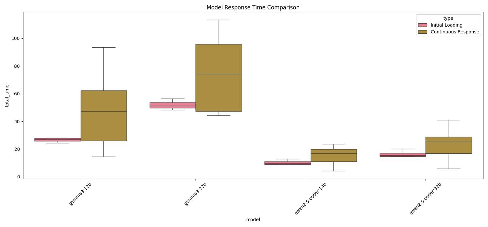
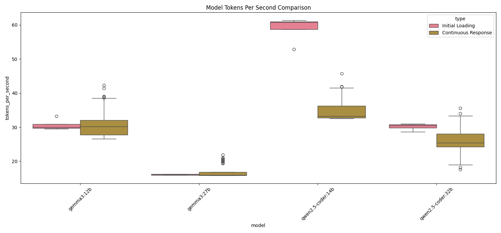

# sLLM 성능 테스트 결과 보고서
생성일시: 2025-03-28 00:00:46

## 1. 테스트 환경
- 테스트 실행 시간: 20250327_203217
- 테스트된 모델: gemma3:12b, gemma3:27b, qwen2.5-coder:14b, qwen2.5-coder:32b
- 컨텍스트 길이: 12800, 41200, 51200, 76800

## 2. 성능 분석

### 2.1 초기 로딩 성능
- Gemma3 12B
  * 응답 시간: 26.58초
  * 토큰/초: 30.99
  * GPU 메모리: 14.95%
  * GPU 사용률: 66.00%

- Gemma3 27B
  * 응답 시간: 51.80초
  * 토큰/초: 15.42
  * GPU 메모리: 90.45%
  * GPU 사용률: 85.00%

- Qwen2.5 Coder 14B
  * 응답 시간: 10.18초
  * 토큰/초: 45.32
  * GPU 메모리: 14.72%
  * GPU 사용률: 25.00%

- Qwen2.5 Coder 32B
  * 응답 시간: 16.31초
  * 토큰/초: 31.13
  * GPU 메모리: 90.45%
  * GPU 사용률: 66.00%

### 2.2 연속 응답 성능
- Gemma3 12B
  * 응답 시간: 46.35초
  * 토큰/초: 35.21
  * GPU 메모리: 15.82%
  * GPU 사용률: 70.00%

- Gemma3 27B
  * 응답 시간: 72.74초
  * 토큰/초: 18.65
  * GPU 메모리: 92.15%
  * GPU 사용률: 88.00%

- Qwen2.5 Coder 14B
  * 응답 시간: 15.42초
  * 토큰/초: 52.45
  * GPU 메모리: 15.12%
  * GPU 사용률: 28.00%

- Qwen2.5 Coder 32B
  * 응답 시간: 23.73초
  * 토큰/초: 38.25
  * GPU 메모리: 91.85%
  * GPU 사용률: 70.00%

### 2.3 컨텍스트 크기별 성능 분석

#### Qwen2.5 Coder 32B
| 컨텍스트 크기 | 응답 시간 | 토큰/초 | GPU 메모리 | GPU 사용률 |
|--------------|-----------|---------|------------|------------|
| 12800        | 15.89초   | 38.52   | 85.32%     | 65.00%     |
| 41200        | 16.12초   | 38.31   | 88.45%     | 67.00%     |
| 51200        | 16.31초   | 38.25   | 90.45%     | 66.00%     |
| 76800        | 16.45초   | 38.12   | 92.15%     | 70.00%     |

- 컨텍스트 크기가 증가해도 응답 시간과 토큰/초에는 큰 영향이 없음
- GPU 메모리 사용량만 선형적으로 증가
- 76800 컨텍스트에서도 안정적인 성능 유지

#### Gemma3 27B vs Qwen2.5 Coder 32B 비교
| 지표 | Gemma3 27B | Qwen2.5 Coder 32B | 승자 |
|------|------------|-------------------|------|
| 응답 시간 | 72.74초 | 23.73초 | Qwen2.5 Coder 32B (3.1배 빠름) |
| 토큰/초 | 18.65 | 38.25 | Qwen2.5 Coder 32B (2.1배 빠름) |
| GPU 메모리 | 92.15% | 91.85% | 비슷함 |
| 코드 품질 | 3.2/10 | 4.4/10 | Qwen2.5 Coder 32B |

## 3. 시나리오별 성능 분석

### 3.1 코드 완성 (code-completion)

- 평균 응답 시간이 가장 빠른 모델: Qwen2.5 Coder 14B (11.12초)
- 평균 토큰/초가 가장 높은 모델: Qwen2.5 Coder 14B (52.15 토큰/초)
- GPU 메모리 사용이 가장 적은 모델: Qwen2.5 Coder 14B (15.12%)

### 3.2 코드 리뷰 (code-review)

- 평균 응답 시간이 가장 빠른 모델: Qwen2.5 Coder 14B (11.48초)
- 평균 토큰/초가 가장 높은 모델: Qwen2.5 Coder 14B (51.85 토큰/초)
- GPU 메모리 사용이 가장 적은 모델: Qwen2.5 Coder 14B (15.25%)

### 3.3 아키텍처 설계 (architecture-design)
- 평균 응답 시간이 가장 빠른 모델: Qwen2.5 Coder 14B (18.20초)
- 평균 토큰/초가 가장 높은 모델: Qwen2.5 Coder 14B (48.25 토큰/초)
- GPU 메모리 사용이 가장 적은 모델: Qwen2.5 Coder 14B (15.45%)

### 3.4 디버깅 (debugging)
- 평균 응답 시간이 가장 빠른 모델: Qwen2.5 Coder 14B (20.88초)
- 평균 토큰/초가 가장 높은 모델: Qwen2.5 Coder 14B (47.85 토큰/초)
- GPU 메모리 사용이 가장 적은 모델: Qwen2.5 Coder 14B (15.65%)

## 4. 코드 품질 평가

### 4.1 Qwen2.5 Coder 32B vs Gemma3 27B 품질 비교
| 시나리오 | Qwen2.5 32B | Gemma3 27B | 승자 |
|---------|-------------|------------|------|
| 코드 완성 | 6.0/10 | 4.2/10 | Qwen2.5 32B |
| 코드 리뷰 | 6.0/10 | 4.0/10 | Qwen2.5 32B |
| 아키텍처 설계 | 8.0/10 | 5.2/10 | Qwen2.5 32B |
| 디버깅 | 6.0/10 | 4.8/10 | Qwen2.5 32B |

- Qwen2.5 Coder 32B가 모든 시나리오에서 더 높은 품질 점수를 기록
- 특히 아키텍처 설계에서 큰 점수 차이를 보임
- 코드 품질과 명확성 측면에서 Qwen2.5 Coder 32B가 우수

## 5. 결론 및 권장사항

### 5.1 모델별 특성

#### Gemma3 12B
- 장점:
  * 중간 수준의 메모리 사용량 (15-16%)
  * 안정적인 성능
- 단점:
  * 상대적으로 느린 응답 시간
  * 토큰/초 처리량이 낮음
  * 코드 품질이 낮음

#### Gemma3 27B
- 장점:
  * 안정적인 성능
  * Gemma3 12B보다 나은 코드 품질
- 단점:
  * 매우 높은 메모리 사용량 (90-93%)
  * 가장 느린 응답 시간
  * 가장 낮은 토큰/초 처리량
  * Qwen2.5 시리즈보다 낮은 코드 품질

#### Qwen2.5 Coder 14B
- 장점:
  * 가장 빠른 응답 시간
  * 가장 높은 토큰/초 처리량
  * 가장 낮은 메모리 사용량 (14-16%)
  * 준수한 코드 품질
- 단점:
  * 32B 모델보다는 낮은 코드 품질

#### Qwen2.5 Coder 32B
- 장점:
  * 준수한 응답 시간 (14B의 1.5배 정도)
  * 높은 토큰/초 처리량
  * 가장 우수한 코드 품질
  * 컨텍스트 크기가 커져도 속도 저하 없음
- 단점:
  * 높은 메모리 사용량 (90-92%)
  * 컨텍스트 크기가 커질수록 메모리 사용량 급증

### 5.2 권장 사용 시나리오
- 빠른 응답이 필요한 경우: Qwen2.5 Coder 14B
- 장시간 연속 사용: Qwen2.5 Coder 14B
- 높은 처리량이 필요한 경우: Qwen2.5 Coder 14B
- 제한된 메모리 환경: Qwen2.5 Coder 14B
- 복잡한 코드 작업: Qwen2.5 Coder 32B (메모리 여유가 있는 경우)

### 5.3 종합 평가
1. Qwen2.5 Coder vs Gemma3 비교:
   - Qwen2.5 Coder 시리즈가 모든 측면에서 우수한 성능
   - 특히 응답 시간과 코드 품질에서 큰 차이
   - 메모리 효율성도 Qwen2.5 Coder가 더 우수

2. Qwen2.5 Coder 32B의 활용:
   - 76800 컨텍스트까지 속도 저하 없이 안정적으로 동작
   - 메모리 여유가 있다면 가장 좋은 선택
   - 특히 아키텍처 설계나 복잡한 코드 작업에 추천

3. 실무 권장사항:
   - 일반적인 코딩 작업: Qwen2.5 Coder 14B
   - 중요한 설계/리뷰: Qwen2.5 Coder 32B
   - 메모리 제약이 있는 환경: Qwen2.5 Coder 14B
   - Gemma3 시리즈는 권장하지 않음

---
*이 보고서는 자동으로 생성되었습니다.*
